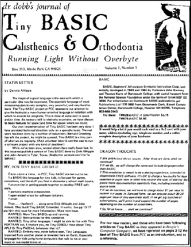
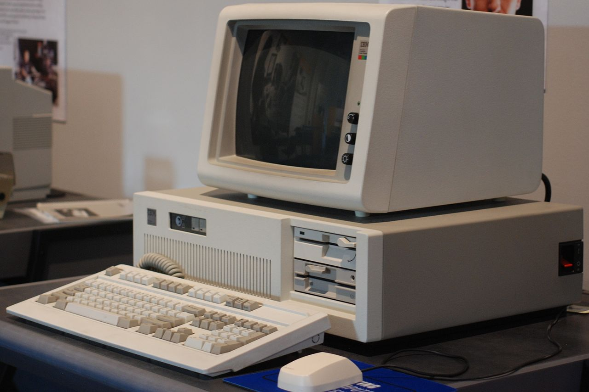
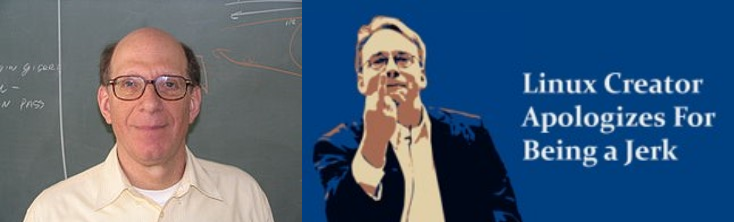
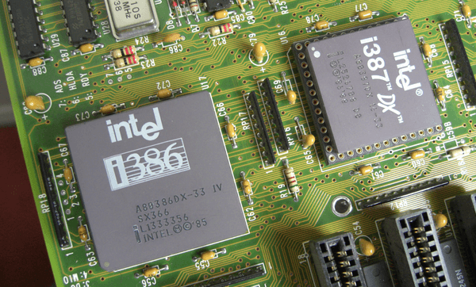
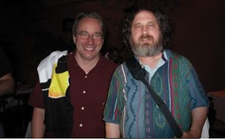
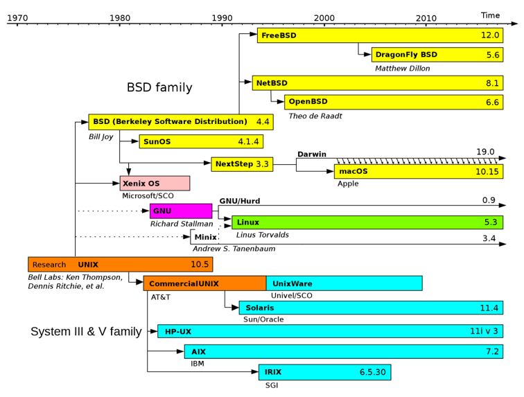
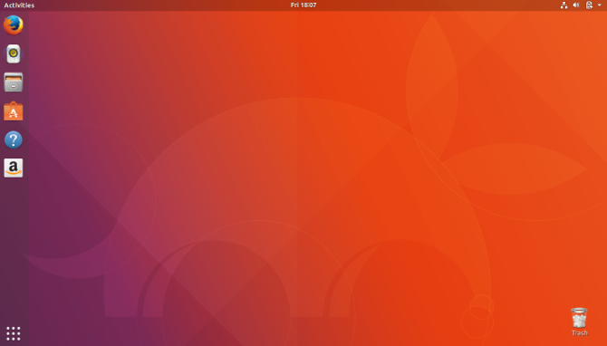

# Chapter 01 - Introduction to Linux

Most youngsters these days have heard of Linux and many of them may know it as an operating system for a computer. But Linux is so much more than that.

Basically Linux is not the operating system itself but rather the heart (kernel) of it. Linux-based operating systems such as Android, Ubuntu, Debian, Fedora, Red Hat ... are bundles of system tools, package managers, libraries, a window manager and so on and the Linux kernel.

## A Brief History

Linux has come a far way since 1991 where it came to life by the hands by Linus Torvalds. To get an idea about the history, the following sections will introduce the most important milestones in its history.

### 1965 - Multics

Multics (Multiplexed Information and Computing Service) was a **mainframe timesharing operating system** that began at MIT (Massachusetts Institute of Technology) as a research project in 1965. It was a cooperation between MIT, Bell Labs and GE (General Electric). While it was a monstrous system, it also was an important influence on operating system development.

Since it was designed to be a utility, such as electricity and telephone services, it had numerous features to provide high availability and security. Both the hardware and software were highly modular so that the system could grow in size by adding more of the appropriate resource even while the service was running.

The **GE 645 mainframe** was the first computer to run the new Multics operating system.


Multics was partly developed by **Ken Thompson** (UTF-8 character encoding and Google GO language) and **Dennis Ritchie** (invented C programming language).


### 1969 - DEC PDP-7

The PDP-7 was a **minicomputer** produced by Digital Equipment Corporation (DEC) as part of the PDP series. With a cost of US$72,000, it was cheap but powerful by the standards of the time. The PDP-7 is the third of Digital's 18-bit machines. The computer I/O includes a keyboard, printer, paper-tape and dual transport DECtape drives. The standard memory capacity is 4K words (9 KB) but expandable up to 64K words (144 KB). The PDP-7 weighed about 500 kg.


**DECsys**, the first operating system for DEC's 18-bit computer family (and DEC’s first operating system for a computer smaller than its 36-bit timesharing systems), was introduced in 1965. It provided an interactive, single user, program development environment for Fortran and assembly language programs.

In 1969, **Ken Thompson and Dennis Ritchie** wrote **Unics** (Uniplexed Information & Computing Service) in assembly language on a PDP-7 as the operating system for **Space Travel**, a game which requires graphics to depict the motion of the planets.

::: tip Unics
The name actually came from **Brian Kernighan**, the co-author of the book "The C Programming Language" with Richie, also knows as the "K" in *awk*. It was meant as a pun on Multics. Its like Multics, but only simpler as it should of been. It also sounds like a eunuch, which he taught was funny because its like Multics but castrated.
:::

<iframe width="560" height="315" src="https://www.youtube.com/embed/de2Hsvxaf8M" frameborder="0" allow="accelerometer; autoplay; encrypted-media; gyroscope; picture-in-picture" allowfullscreen></iframe>

Unics was later renamed to **Unix**, only nobody seems to remember when that happened.

### September 27, 1983 - net.unix-wizards

On *Tue, 27-Sep-83 12:35:59 EST*, **Richard Stallman** wrote the following post on the news group `net.unix-wizards`:

```text
Free Unix!

Starting this Thanksgiving I am going to write a complete
Unix-compatible software system called GNU (for Gnu's Not Unix), and
give it away free(1) to everyone who can use it.
Contributions of time, money, programs and equipment are greatly
needed.

To begin with, GNU will be a kernel plus all the utilities needed to
write and run C programs: editor, shell, C compiler, linker,
assembler, and a few other things.  After this we will add a text
formatter, a YACC, an Empire game, a spreadsheet, and hundreds of
other things.  We hope to supply, eventually, everything useful that
normally comes with a Unix system, and anything else useful, including
on-line and hardcopy documentation.

GNU will be able to run Unix programs, but will not be identical
to Unix.  We will make all improvements that are convenient, based
on our experience with other operating systems.  In particular,
we plan to have longer filenames, file version numbers, a crashproof
file system, filename completion perhaps, ...
  
Who Am I?
  
I am Richard Stallman, inventor of the original much-imitated EMACS
editor, now at the Artificial Intelligence Lab at MIT.  I have worked
extensively on compilers, editors, debuggers, command interpreters, ...

Why I Must Write GNU

I consider that the golden rule requires that if I like a program I
must share it with other people who like it.  I cannot in good
conscience sign a nondisclosure agreement or a software license
agreement.

So that I can continue to use computers without violating my principles,
I have decided to put together a sufficient body of free software so that
I will be able to get along without any software that is not free.

...

One computer manufacturer has already offered to provide a machine.  But
we could use more.  One consequence you can expect if you donate
machines is that GNU will run on them at an early date.  The machine had
better be able to operate in a residential area, and not require
sophisticated cooling or power.

...
```

[Full Post](./free_unix.md)

This first post by Richard started the free software revolution. Historically, most software has been issued under a closed-source license, meaning that you get the right to use the machine code, but cannot see the source code. The open source philosophy is that you have a right to obtain the software, and to modify it for your own use.

**Richard Stallman** (creator of GPL) was looking to create a truly free and open source alternative to the proprietary Unix system. He was working on the utilities and programs under the name **GNU**, a recursive acronym meaning "GNU's not Unix!".


### 1984 - GNU Project

It was when AT&T started to sell copies of Unix without source code that Richard Stallman and one of many students at MIT who had helped to code it, decided that enough was enough. He was convinced that free software was what the world needed and so he **left the MIT Artificial Intelligence Lab in 1984** and founded the **GNU project**, with the intention to create a completely open source version of Unix.  

### March 1985, Dr. Dobbs Journal

[Dr. Dobb's Journal](https://www.drdobbs.com/) (DDJ) was a monthly magazine published in the United States by UBM Technology Group, part of UBM. It covered topics aimed at computer programmers. When launched in 1976, DDJ was the first regular periodical focused on microcomputer software, rather than hardware.



Dr. Dobb's Journal entire purpose was to **distribute Tiny Basic**, a dialect of the BASIC programming language that can fit into as little as 2 or 3 KB of memory. This small size made it invaluable in the early days of microcomputers in the mid-1970s, when typical memory size was only 4 to 8 KB. Tiny BASIC is an example of a free software project that existed before the free software movement.

In 1985 the [GNU Manifesto](https://www.drdobbs.com/open-source/the-gnu-manifesto/222200498) was published in Dr Dobb's Journal and this set out the philosophy:

```text
I consider that the Golden Rule requires that if I like a program I must share it with other people who like it. Software sellers want to divide the users and conquer them, making each user agree not to share with others. I refuse to break solidarity with other users in this way. I cannot in good conscience sign a nondisclosure agreement or a software license agreement.

by Richard Stallman
```

In the same year Stallman set up the **Free Software Foundation**.

### 1987 - First Release of Minix

**Minix** (mini-Unix) is an open source operating system developed by **Andrew S. Tanenbaum**, professor emeritus of computer science at the Vrije Universiteit Amsterdam in the Netherlands, which he created as an example for his book "Operating Systems: Design and Implementation".


Minix is ​​partly based on Unix, but with a microkernel instead of the traditional monolithic kernel. The intention of Minix was that students could understand it in three months of study.

::: tip Microkernel vs Monolithic kernel
Basically a **monolithic kernel** is a single large process running entirely in a single address space. It is a single static binary file. All kernel services exist and execute in the kernel address space. The kernel can invoke functions directly. Examples of monolithic kernel based OSs: Unix, Linux.

With a microkernel, the kernel is broken down into separate processes, known as servers. Some of the servers run in kernel space and some run in user-space. All servers are kept separate and run in different address spaces. Servers invoke "services" from each other by sending messages via IPC (Interprocess Communication). This separation has the advantage that if one server fails, other servers can still work efficiently. Examples of microkernel based OSs: Mac OS X and Windows NT.
:::

Tanenbaum originally developed Minix for compatibility with the IBM PC and IBM PC/AT microcomputers (6 MHz Intel 80286 microprocessor) available at the time.



### Autumn 1990 - Linus Torvalds

In 1988, a young Finnish man entered the **Helsinki University** to study Computer Science. His name was **Linus Torvalds**. It would have been impossible to imagine that the operating system he would create would be eventually used by tens of millions of users across the globe.



Linus Torvalds was at the beginning of his third year of studies, in the autumn of 1990, when he first came in contact with Unix. The university had a short Unix course, which could only take 16 students because the university's MicroVAX hardware couldn't support more users.


::: tip MicroVAX
The MicroVAX was a family of low-cost minicomputers developed and manufactured by Digital Equipment Corporation (DEC). At introduction, the starting price of the MicroVAX 3800 was US$81,000 and that of the MicroVAX 3900 was US$120,200.
:::

Linus was particularly fond of the 80386, regarding it as "a lot better than any of the previous chips". Wanting to work with Minix, he decided to buy his first IBM compatible PC.

The Finnish university system allowed Linus to get a student loan. Since he was living with his mother at the time, Linus didn't have a high cost of living, so he invested part of his student loan for the PC. He also got Christmas money, and on January 5th, 1991, he bought the first PC.



In the time that follows Linus wrote the basic components required for the operating system he wished to build just for fun:

* One of his first experiments was to test the task-switching capabilities of the processor. He created two processes, one that would write the letter A and one that would write the letter B, and a timer that switched tasks.
* a keyboard driver
* a driver for text-mode VGA
* a driver for the serial line, to connect to the University network
* Wanting to download files on his PC, Linus had to write a disk driver and a file system

So, he now had task-switching, a file system, and device drivers. This is an operating system in its simplest form. This was the birth of Linux. But it wasn't yet named so.

One subject that interested Linus on the newsgroups was the POSIX. POSIX stands for Portable Operating System Interface, and it is a set of standards to ensure compatibility between different Unix-like operating systems.

Ari Lemmke, a member of the Helsinki University staff, informed Linus that the POSIX wasn't free online, and Linus wasn't in the position to pay for it. However, Lemmke was also interested in kernels and operating systems. So, he decided to create a directory on the `ftp.funet.fi` server for Linus which he called `/pub/os/linux`.

Linux was Linus's working name. He didn't want to use it for the operating system because he didn't want people to think he was so egomaniac to name it after himself.

Unfortunately, the name he chose was awful. He wanted to call it **Freax** which was a portmanteau of **Free**, **Freak** and **x** (as an allusion to Unix). Fortunately, Ari Lemmke ignored the "Freax" nonsense and used the working name instead.

### August 25, 1991 - Linux goes Public

It was on the 25th of August in 1991 that **Linus Torvalds** posted the following message on the newsgroup `comp.os.minix`:

```text
Hello everybody out there using minix -

I'm doing a (free) operating system (just a hobby, won't be
big and professional like gnu) for 386(486) AT clones.
This has been brewing since april, and is starting to get ready.
I'd like any feedback on things people like/dislike in minix,
as my OS resembles it somewhat (same physical layout of
the file-system (due to practical reasons) among other things).

I've currently ported bash(1.08) and gcc(1.40), and things seem to work.
This implies that I'll get something practical within a few months,
and I'd like to know what features most people would want.
Any suggestions are welcome, but I won't promise I'll implement them :-)

Linus (torvalds@kruuna.helsinki.fi)

PS. Yes - it's free of any minix code, and it has a multi-threaded fs.
It is NOT portable (uses 386 task switching etc),
and it probably never will support anything other than AT-harddisks,
as that's all I have :-(.

- Linus Torvalds
```

::: tip bash
GNU Bash or simply Bash is a Unix shell and command language written by **Brian Fox** for the GNU Project as a free software replacement for the Bourne shell. First released in 1989, it has been used widely as the default login shell for most Linux distributions .[11]
:::

::: tip gcc
When it was first released in 1987, GCC 1.0 was named the **GNU C Compiler** since it only handled the C programming language. It was extended to compile C++ in December of that year. Later it was renamed to the **GNU Compiler Collection** as a compiler system produced by the GNU Project supporting various programming languages. GCC is a key component of the GNU toolchain and the standard compiler for most projects related to GNU and Linux, including the Linux kernel. The Free Software Foundation (FSF) distributes GCC under the GNU General Public License (GNU GPL). GCC has played an important role in the growth of free software, as both a tool and an example.
:::

When Linus Torvalds wanted to make an operating system himself in 1991, he was inspired by Minix, but wrote the code of the operating system itself. With additions from others via the internet, this resulted in the Linux kernel, which is a monolithic kernel and not a microkernel.

Originally, linux came with it's own custom license:

```text
This kernel is (C) 1991 Linus Torvalds, but all or part of it may be
redistributed provided you do the following:

	- Full source must be available (and free), if not with the
	  distribution then at least on asking for it.

	- Copyright notices must be intact. (In fact, if you distribute
	  only parts of it you may have to add copyrights, as there aren't
	  (C)'s in all files.) Small partial excerpts may be copied
	  without bothering with copyrights.

	- You may not distibute this for a fee, not even "handling"
	  costs.

Mail me at "torvalds@kruuna.helsinki.fi" if you have any questions.

Sadly, a kernel by itself gets you nowhere. To get a working system you
need a shell, compilers, a library etc. These are separate parts and may
be under a stricter (or even looser) copyright. Most of the tools used
with linux are GNU software and are under the GNU copyleft. These tools
aren't in the distribution - ask me (or GNU) for more info.
```

Which came with the [original release notes](./original_realease_notes_linux.md).


### UNIX

UNIX was originally an operating system developed at AT&T Bell Labs in the 1970's by **Ken Thompson** (UTF-8 character encoding and Google GO language) and **Dennis Ritchie** (invented C programming language).


AT&T Bell Labs licensed the source code of UNIX.

At 1980 *Unix System V* was being sold as commercial version by AT&T and BSD (Berkeley Software Distribution) was being developed based on the original licensed sources

### HURD

Historically, most software has been issued under a closed-source license, meaning that you get the right to use the machine code, but cannot see the source code. The open source philosophy is that you have a right to obtain the software, and to modify it for your own use.

**Richard Stallman** (creator of GPL) was looking to create a truly free and open source alternative to the proprietary Unix system. He was working on the utilities and programs under the name **GNU**, a recursive acronym meaning "GNU's not Unix!".


Although there was a kernel project underway, it turned out to be difficult going, and without a kernel, the free and open source operating system (HURD) dream could not be realized.

### Linux Kernel

Linus made the project open source and allowed people to freely use and contribute to the Linux kernel.


Currently the official kernel received contributions from over 12000 programmers.

It was Linus Torvald's work - producing a working and viable kernel that he called Linux - that brought the complete operating system to life.

Given that Linus was using several GNU tools (e.g., the GNU Compiler Collection, or GCC), the marriage of the GNU tools and the Linux kernel was a perfect match.



### Timeline



## Linux

Linux was originally developed as a free operating system for personal computers based on the Intel x86 architecture but has since been ported to more computer hardware platforms than any other operating system. This includes desktop PCs, servers, mainframes, supercomputers, smartphones, tablets, TVs, embedded systems, ...

The definition of the word Linux depends on the context in which it is used.

Linux means the kernel of the system, which is the central controller of everything that happens on the computer. People that say their computer "runs Linux" usually refer to the kernel and suite of tools that come with it, called the **distribution**.

### Popular Linux Distributions

A Linux distribution is usually built around a package management system, which puts together the Linux kernel, free and open-source software, and often some proprietary software.

Some popular distributions are listed below.

Red Hat

Suse

Debian

Raspbian

OpenWRT

Fedora

OpenSuse

Ubuntu

Kali

CentOS

Linux Mint


#### Ubuntu



Ubuntu is probable the most popular Linux distribution at the moment. It's both attractive for a beginning Linux user as well as a hardened Linux guru. While popular as a desktop edition for developers it's also often used as a server OS because of it's LTS (Long Time Support) editions.

Like Debian, Ubuntu uses the DEB package manager, while later versions of Ubuntu also include Snap packages so that installing new software is a simple, straightforward process.

Ubuntu also has a massive user base, which means its has a highly active community on which new and advanced users can fall back for support. There are also plenty of derivatives like **Lubuntu** and **Xubuntu**.

#### Red Hat

Red Hat started out as a simple distribution that introduced the Red Hat Package Manager (RPM). The developer eventually formed a company around it, which tried to commercialize a Linux desktop for business. Over time, Red Hat started to focus more on the server applications such as web and file serving, and released Red Hat Enterprise Linux, which was a paid service on a long release cycle.

#### CentOS


Because everything in Red Hat Enterprise Linux is open source, a project called CentOS came to be, that recompiled all the RHEL packages and gave them away for free. CentOS and others like it (such as Scientific Linux) are largely compatible with RHEL and integrate some newer software, but do not offer the paid support that Red Hat does.

**Scientific Linux** is an example of a specific use distribution based on Red Hat. The project is a Fermilab sponsored distribution designed to enable scientific computing. Among its many applications, Scientific Linux is used with particle accelerators including the Large Hadron Collider at CERN.

**Open SUSE** was originally derived from Slackware, yet incorporates many aspects of Red Hat. While Open SUSE is desktop based and available to the general public, SUSE Linux Enterprise contains proprietary code and is sold as a server product.

**Debian** is more of a community effort (promotes the use of open source software and adherence to standards). Debian came up with its own package management system, based on the .deb file format. Red Hat leaves non Intel and AMD platform support to derivative projects, while Debian supports many of these platforms directly.

**Ubuntu** is the most popular Debian derived distribution.

**Linux Mint** was started as a fork of Ubuntu Linux, while still relying upon the Ubuntu repositories. There are various versions, all free of cost, but some include proprietary codecs, which can not be distributed without license restrictions in certain countries. Linux Mint is quickly supplanting Ubuntu as the world's most popular desktop Linux solution.

[Checkout this interactive Timeline](https://futurist.se/gldt/wp-content/uploads/12.10/gldt1210.svg)

## Some Good Videos

<iframe width="560" height="315" src="https://www.youtube.com/embed/aurDHyL7bTA" frameborder="0" allow="accelerometer; autoplay; encrypted-media; gyroscope; picture-in-picture" allowfullscreen></iframe>

<iframe width="560" height="315" src="https://www.youtube.com/embed/jowCUo_UGts" frameborder="0" allow="accelerometer; autoplay; encrypted-media; gyroscope; picture-in-picture" allowfullscreen></iframe>


<!-- Ideas: Maybe we should give an overview here of all the things this course is going to cover. -->
<!-- Short introduction into each and how they are tight together. -->


<!-- This chapter needs a serious refactor. Maybe we should speak about the difference between graphics and non-graphics mode. Then difference between linux for a developer and linux as a server os. Best practices? -->

Linux can be used in one of two ways: Graphically and non-graphically.

<!-- Screenshots here -->

Most servers will be running in non-graphically mode, since people don't log into them directly, which makes a graphical interface a waste of resources.

If you log in through non-graphical mode, you're immediately at the console. If you log in graphically, then you'll need to launch a graphical shell which is just a text console with a window around it so that you can resize and move it around.

Linux doesn't care if you are on the keyboard of a computer or connecting over the Internet, so you'll want to take some basic precautions to make sure your data is safe and secure.

* Use strong passwords or passphrases
* Check for updates on a daily basis
* Use a firewall to block undesired connections
* Use an antivirus tool
* Use SSH (Secure Shell) for remote management


However, UNIX is now both a trademark and a specification, owned by an industry consortium called the Open Group. Only software that has been certified by the Open Group may call itself UNIX. Despite adopting all the requirements of the UNIX specification, Linux has not been certified, so Linux really isn’t UNIX! It’s just… UNIX-like.


<!-- https://www.youtube.com/watch?v=UjDQtNYxtbU -->
<!-- https://www.oreilly.com/library/view/running-linux-third/156592469X/ch01s02.html -->
<!-- https://www.digitalocean.com/community/tutorials/brief-history-of-linux -->

https://www.cs.cmu.edu/~awb/linux.history.html