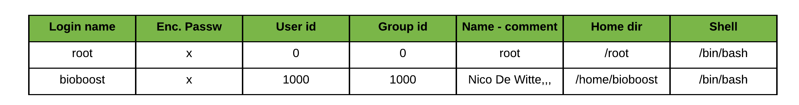

# Chapter 06 - Ownership and Permissions

Linux is a multi-user OS that is based on the Unix concepts of file ownership and permissions to provide security, at the file system level. It is essential that a linux user has a decent understanding of how ownership and permissions work.

## Linux Users

Linux is a multi-user system. A basic understanding of users and groups is required before ownership and permissions can be discussed, because they are the entities that the ownership and permissions apply to.

In Linux, there are two types of users: **system users** and **regular users**. Traditionally, system users are used to run non-interactive or background processes on a system, while regular users are used for logging in and running processes interactively.

An easy way to view all of the users on a system is to look at the contents of the `/etc/passwd` file. Each line in this file contains information about a single user.

Print the `passwd` file with the command:

```bash
cat /etc/passwd
```

Rendering an output equivalent to:

```bash
root:x:0:0:root:/root:/bin/bash
daemon:x:1:1:daemon:/usr/sbin:/usr/sbin/nologin
bin:x:2:2:bin:/bin:/usr/sbin/nologin
...
www-data:x:33:33:www-data:/var/www:/usr/sbin/nologin
nobody:x:65534:65534:nobody:/nonexistent:/usr/sbin/nologin
libuuid:x:100:101::/var/lib/libuuid:
...
syslog:x:101:104::/home/syslog:/bin/false
kernoops:x:106:65534:Kernel Oops Tracking
bioboost:x:1000:1000:Nico De Witte,,,:/home/bioboost:/bin/bash
vboxadd:x:999:1::/var/run/vboxadd:/bin/false
```



### Super user

In addition to the two user types, there is the **superuser**, or **root user**, who has the ability to override any file ownership and permission restrictions. In practice, this means that the superuser has the rights to access anything on his/her own server. This user is used to make system-wide changes, and must be kept secure.

Changing to the superuser can be achieved by executing the command `su`, after which you are required to provide the password of the root user. Once logged in as the root user, notice how the prompt changes from `$` to `#`.

Be carefull because the root user has the ability to do anything on the system. When executing commands as the root user there are some disadvantages that need to be kept in mind:

* no record of system altering commands
* no record of the user that performed the system altering commands
* no access to your user shell environment
* you have to enter the root password, meaning that everyone that requires this type of access, needs to know the password.

It is also possible to configure other user accounts with the ability to assume "superuser rights". Using the `sudo` prefix before the command, the user stays logged in with his/her own user account, but can apply system wide changes. In fact, creating a normal user that has `sudo` (superuser do) privileges for system administration tasks is considered to be best practice, as it counters the previously mentioned disadvantages of switching to the superuser account.

::: warning Switching to root with sudo
Note that in many cases the super user account is disabled for login. In this case, a regular user with `sudo` rights can switch to the root user using the `sudo su` command.
:::

## Linux Groups

Groups are collections of zero or more users. A user belongs to a default group (primary group), and can also be a member of any of the other groups on a server (secondary groups).

An easy way to view all the groups is to look in the `/etc/group` file.

```bash
cat /etc/group
```

Which should output something like:

```bash
root:x:0:
daemon:x:1:
bin:x:2:
sys:x:3:
adm:x:4:
tty:x:5:
...
bluetooth:x:116:
colord:x:117:
pulse:x:118:
pulse-access:x:119:
mdm:x:120:
nopasswdlogin:x:121:
rtkit:x:122:
saned:x:123:
bioboost:x:1000:
...
```

By executing the `id <username>` command a user can also see to which groups his/her account belongs.

For example `id bioboost` would output:

```shell
uid=1000(bioboost) gid=1000(bioboost) groups=1000(bioboost),4(adm),24(cdrom),27(sudo),30(dip),46(plugdev),108(lpadmin),110(sambashare)
```
