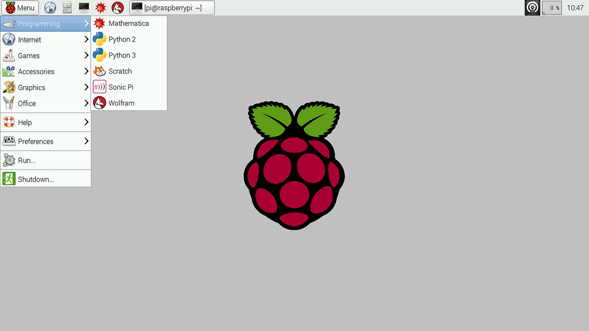
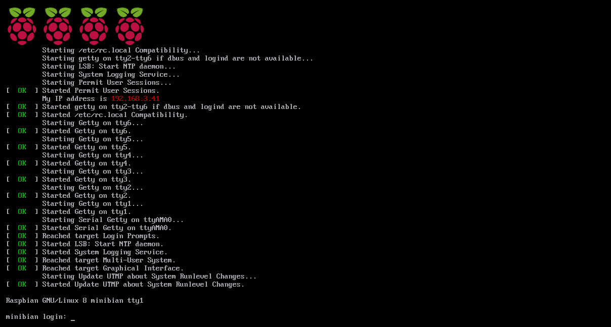
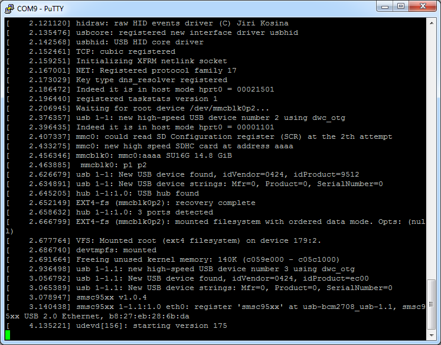
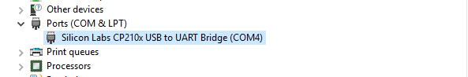
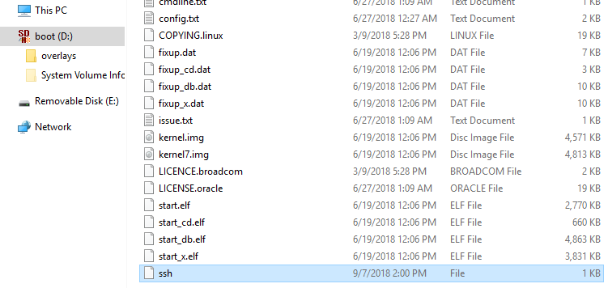
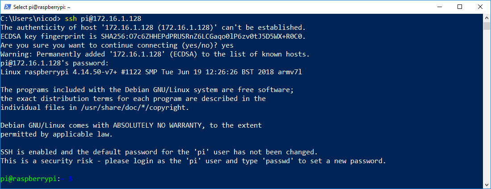

# Chapter 10 - RPi Operating System

The Raspberry Pi is a low cost, credit-card sized computer that plugs into a computer monitor or TV, and uses a standard keyboard and mouse. It is a capable little device that enables people of all ages to explore computing, and to learn how to program in languages like Scratch and Python. It's capable of doing everything you'd expect a desktop computer to do, from browsing the internet and playing high-definition video, to making spreadsheets, word-processing, and playing games.

What's more, the Raspberry Pi  has the ability to interact with the outside world, and has been used in a wide array of digital maker projects, from music machines and parent detectors to weather stations and tweeting birdhouses with infra-red cameras. One of its main goals is to learn kids all over the world to program and understand how computers work.

## Generations

| Family | Model | Form Factor | Connectivity | GPIO | CPU - Instruction Set | Released |
| ---- | ---- | ---- | ---- | ---- | ---- | ---- |
| Raspberry Pi 1 | B | Standard (85.60 × 56.5 mm) | Ethernet | 26-pins | 1x ARM1176JZF-S 700 MHz - ARMv6Z (32-bit) | 2012 |
| Raspberry Pi 1 | A | Standard (85.60 × 56.5 mm) | None | 26-pins | 1x ARM1176JZF-S 700 MHz - ARMv6Z (32-bit) | 2013 |
| Raspberry Pi 1 | B+ | Standard (85.60 × 56.5 mm) | Ethernet | 40-pins | 1x ARM1176JZF-S 700 MHz - ARMv6Z (32-bit) | 2014 |
| Raspberry Pi 1 | A+ | Compact (65 × 56.5 mm) | None | 40-pins | 1x ARM1176JZF-S 700 MHz - ARMv6Z (32-bit) | 2014 |
| Raspberry Pi 2 | B | Standard (85.60 × 56.5 mm) | Ethernet | 40-pins | 4x Cortex-A7 900 MHz - ARMv7-A (32-bit) | 2015 |
| Raspberry Pi 2 | B v1.2 | Standard (85.60 × 56.5 mm) | Ethernet | 40-pins | 4x Cortex-A53 900 MHz - ARMv8-A (64/32-bit) | 2016 |
| Raspberry Pi Zero | Zero | Zero (65 × 30 mm) | None | 40-pins | 1x ARM1176JZF-S 1 GHz - ARMv6Z (32-bit) | 2015 |
| Raspberry Pi Zero | W/WH | Zero (65 × 30 mm) | Wifi, Bluetooth 4.1 BLE | 40-pins | 1x ARM1176JZF-S 1 GHz - ARMv6Z (32-bit) | 2017 |
| Raspberry Pi 3 | B | Standard (85.60 × 56.5 mm) | Ethernet, Wifi, Bluetooth 4.1 BLE | 40-pins | 4x Cortex-A53 1.2 GHz - ARMv8-A (64/32-bit) | 2016 |
| Raspberry Pi 3 | A+ | Compact (65 × 56.5 mm) | Wifi, Bluetooth 4.2 BLE | 40-pins | 4x Cortex-A53 1.4 GHz - ARMv8 (64-bit) | 2018 |
| Raspberry Pi 3 | B+ | Standard (85.60 × 56.5 mm) | Ethernet, Wifi, Bluetooth 4.2 LS BLE | 40-pins | 4x Cortex-A53 1.4 GHz - ARMv8-A (64/32-bit) | 2018 |
| Raspberry Pi 4 | B (1GB) | Standard (85.60 × 56.5 mm) | Ethernet, Wifi, Bluetooth 5 | 40-pins | 4x Cortex-A72 1.5 GHz - ARMv8-A (64/32-bit) | 2019 |
| Raspberry Pi 4 | B (2GB) | Standard (85.60 × 56.5 mm) | Ethernet, Wifi, Bluetooth 5 | 40-pins | 4x Cortex-A72 1.5 GHz - ARMv8-A (64/32-bit) | 2019 |
| Raspberry Pi 4 | B (4GB) | Standard (85.60 × 56.5 mm) | Ethernet, Wifi, Bluetooth 5 | 40-pins | 4x Cortex-A72 1.5 GHz - ARMv8-A (64/32-bit) | 2019 |

## Operating Systems

The Raspberry Pi foundation provides several ready to use operating system images for the Pi. At the moment of this writing the following are available:

* **Raspbian** - The Foundation's official supported operating system (Debian Jessie)
* **Ubuntu Mate** - Official Ubuntu flavor featuring the MATE desktop
* **Snappy Ubuntu Core** - A new, transactionally-updated Ubuntu for IoT devices, clouds and more
* **OSMC** - Open Source Media Centre
* **OPENELEC** - Open Embedded Linux Entertainment Centre
* **PINET** - Raspberry Pi Classroom Management Solution
* **Windows 10 IoT Core**
* **RISC OS** - A non-Linux distribution


Many other operating systems can also run on the Raspberry Pi. Other third-party operating systems available via the official website include Ubuntu MATE, Windows 10 IoT Core, RISC OS and specialized distributions for the Kodi media centre and classroom management.

**Other operating systems (not Linux-based):**

* Broadcom VCOS – Proprietary operating system which includes an abstraction layer designed to integrate with existing kernels, such as ThreadX (which is used on the VideoCore4 processor), providing drivers and middleware for application development. In case of Raspberry Pi this includes an application to start the ARM processor(s) and provide the publicly documented API over a mailbox interface, serving as its firmware. An incomplete source of a Linux port of VCOS is available as part of the reference graphics driver published by Broadcom.
* RISC OS Pi (a special cut down version RISC OS Pico, for 16 MB cards and larger for all models of Pi 1 & 2, has also been made available.)
* FreeBSD
* NetBSD
* OpenBSD (only on 64-bit platforms, such as Raspberry Pi 3)
* Plan 9 from Bell Labs and Inferno (in beta)
* Windows 10 IoT Core – a zero-price edition of Windows 10 offered by Microsoft that runs natively on the Raspberry Pi 2.
* Haiku – an open source BeOS clone that has been compiled for the Raspberry Pi and several other ARM boards. Work on Pi 1 began in 2011, but only the Pi 2 will be supported.
* HelenOS – a portable microkernel-based multiserver operating system; has basic Raspberry Pi support since version 0.6.0

**Other operating systems (Linux-based):**

* Android Things – an embedded version of the Android operating system designed for IoT device development.
* Arch Linux ARM – a port of Arch Linux for ARM processors.
* openSUSE
* SUSE Linux Enterprise Server 12 SP2
* SUSE Linux Enterprise Server 12 SP3 (Commercial support)
* Gentoo Linux
* Lubuntu
* Xubuntu
* Devuan
* CentOS for Raspberry Pi 2 and later
* RedSleeve (a RHEL port) for Raspberry Pi 1
* Slackware ARM – version 13.37 and later runs on the Raspberry Pi without modification. The 128–496 MB of available memory on the Raspberry Pi is at least twice the minimum requirement of 64 MB needed to run Slackware Linux on an ARM or i386 system. (Whereas the majority of Linux systems boot into a graphical user interface, Slackware's default user environment is the textual shell / command line interface.) The Fluxbox window manager running under the X Window System requires an additional 48 MB of RAM.
* Kali Linux – a Debian-derived distro designed for digital forensics and penetration testing.
* SolydXK – a light Debian-derived distro with Xfce.
* Ark OS – designed for website and email self-hosting.
* Sailfish OS with Raspberry Pi 2 (due to use ARM Cortex-A7 CPU; Raspberry Pi 1 uses different ARMv6 architecture and Sailfish requires ARMv7.)
* Tiny Core Linux – a minimal Linux operating system focused on providing a base system using BusyBox and FLTK. Designed to run primarily in RAM.
* Alpine Linux – a Linux distribution based on musl and BusyBox, primarily designed for "power users who appreciate security, simplicity and resource efficiency".
* Void Linux – a rolling release Linux distribution which was designed and implemented from scratch, provides images based on musl or glibc.
* Fedora – supports Pi 2 and later since Fedora 25 (Pi 1 is supported by some unofficial derivatives, e.g. listed here.).

For this course we will be using the Raspbian image. While Ubuntu Mate features a nicer graphical environment it does however not currently offer a headless installation.

::: tip Headless Installation
A headless machine is a machine without a keyboard, mouse or monitor. This means you need to be able to boot the machine to a state where you can remotely access it to finish the installation/configuration process.
:::

While the instructions further on are based on how to equip the Raspberry Pi with Raspbian, they are very similar for most other distributions.

## Creating a bootable SD card

You can download the latest image of Raspbian via the Raspberry Pi website ([https://www.raspberrypi.org/downloads/](https://www.raspberrypi.org/downloads/)). Make sure to pick the "Raspbian Buster with desktop" edition. You do not need to extract the archive as this will be done by the flash tool.

The current Raspbian version at the moment of this writing is of September with a Linux kernel version of 4.19. You can always check out the release notes on [http://downloads.raspberrypi.org/raspbian/release_notes.txt](http://downloads.raspberrypi.org/raspbian/release_notes.txt).

The Raspberry website also offers a lite edition of Raspbian. This is the same distro but without a graphical desktop environment. If you were to attach a display to the Raspberry Pi, all you would see would be a TTY with a login prompt. If you require a GUI, you will need to download the normal desktop image.

To boot the Linux distribution, the image needs to be written to an SD card of at least 4GB. A popular tool to write an image to an SD card is **Etcher**, which can be downloaded at [https://etcher.io/](https://etcher.io/).

::: tip Other host operating systems
Check out [http://www.raspberrypi.org/documentation/installation/installing-images/README.md](http://www.raspberrypi.org/documentation/installation/installing-images/README.md) for instructions on deploying the image to an SD card when using a different host operating system such as Linux or Mac.
:::

Make sure to select the correct device letter as a target and load the Linux image from your local drive as shown in the image below. If you're ready, hit the flash button and grab a cup of coffee.


Once the write process is finished, you can remove the SD card from the computer. Do not plug it into the Raspberry Pi just yet.

::: tip SD Card Backups
You can also create a backup of your current SD card by reading from the SD card to an image file. For this you will need another tool such as *Win32 Disk Imager*, which can be downloaded at [https://sourceforge.net/projects/win32diskimager](https://sourceforge.net/projects/win32diskimager). Just make sure to select a new image file name. Do take note that the image file will have the size of your SD card. So using an SD card of 32GB will result in a backup image of 32GB. When using MAC or Linux, `dd` can also be used to write and read images to and from the SD card.
:::

## Connecting to the the Raspberry Pi

Booting the Raspberry Pi is really simple. All you have to do is fit in the SD card and plug in the power supply adapter. It automatically boots from the SD card. Interacting with the Linux operating system from that point on can be a bit harder in certain situations. Before actually booting the Raspberry Pi, read through this chapter first because some necessary configurations can only be made once and that is before the SD card is used for the first time.

### A Graphical Desktop Environment

If you deployed an OS such as Raspbian than you can attach an HDMI display or RCA Video compatible device (yellow connector on the older Raspberry Pi boards). You will also have to connect a USB keyboard to the RPi to be able to control it. Depending on the operating system and the edition (normal or lite), you will get a graphical desktop environment or a tty terminal.



A tty is a terminal (it stands for teletype - the original terminals used a line printer for output and a keyboard for input). A terminal is basically just a user interface device that uses text for input and output.



### A UART Connection

An other option that can be used to connect to the Raspberry Pi is using a serial connection. This is often used for **debugging embedded systems** because it is a very basic connection type. Because of this the kernel will also output its **kernel messages** (debugging information and errors) to this connection.



Most computers these days lack an external serial interface. Therefore a simple RS232 to USB converter can be used. An example is the PL-2303HX (see https://www.adafruit.com/datasheets/PL2303HX.pdf for datasheet). In our case an even easier option is to use the PiUART of AdaFruit [https://www.adafruit.com/product/3589](https://www.adafruit.com/product/3589).

This device allows a computer to be connected to the Raspberry Pi using a simple USB connection. The PiUART bridges both interfaces and acts as a simple COM device for the computer.


Before starting make sure that the power switch of the PiUART is in the **off mode**. This is only for low-power devices such as the Raspberry Pi Zero. **The Raspberry Pi 3 needs to be externally powered.** Attach the module to the computer and if needed install the driver for the COM device from [https://www.silabs.com/products/development-tools/software/usb-to-uart-bridge-vcp-drivers](https://www.silabs.com/products/development-tools/software/usb-to-uart-bridge-vcp-drivers).



Next the RPi UART needs to be enabled and the Bluetooth module needs to be disabled because the Bluetooth module is currently connected via the serial interface. To configure this open `/boot/config.txt` for editing (just plug the SD card back into your computer), and add the lines `enable_uart=1` and `dtoverlay=pi3-disable-bt` to the bottom of the file. Ensure that neither of the lines are already present. This enables the ttyS0 serial port on the GPIO pins 8 and 10. It also disables the Bluetooth module thereby also fixing the Pi 3's problem of the changing baud rates on the port.

```text
# Enable the serial port
enable_uart=1

# Disable bluetooth
dtoverlay=pi3-disable-bt
```

::: tip Disable the serial TTY
If you wish to disable the serial tty and not allow logins via this interface you will need to undo the previous steps. To remove the tty from the serial port you also need to edit `/boot/cmdline.txt` and remove the `console=serial0,115200` section from the file. This prevents Linux from outputting the boot messages on the serial port, and expecting a log in on the serial port. Do not split the line when editing, the file must only contain one line. The line should still contain `console=tty1`. Disabling tty's on serial interfaces is a good security feature when deploying devices in the fields so the user cannot gain access to the terminal.
:::

#### Terminal Emulator

Next a terminal emulator that supports serial port connections, such as Putty, is required.

::: tip Putty
PuTTY is a free implementation of Telnet and SSH for Windows and Unix platforms, along with an xterm terminal emulator. It can be downloaded from [http://www.chiark.greenend.org.uk/~sgtatham/putty](http://www.chiark.greenend.org.uk/~sgtatham/putty).
:::

Just select "serial" as connection type, "COMx" (where x is an integer number) as serial line and "115200" as the speed. An example is shown in the image below. Choose open and you will a get a command line interface.


::: tip Determining the COM device
You can find the COM port number in the device manager. Select the "Ports (COM & LPT)" category and look for a "Silicon Labs CP210x USB to UART Bridge (COMx)" device. When using a different USB to serial port bridge adapter, the name might differ but it will always show up as a device in that category with a specific COM-port id.
:::

Now connect the shield to the Raspberry Pi, plug in the SD card and an Ethernet cable (RPi is configured to use DHCP by default) and the power supply and watch the kernel messages flash by. You will be served a login prompt requesting a username and password. The default username and password can be found on the Raspberry Pi website. For Raspbian it is `pi` as username and `raspberry` as password. Once you login with these credentials you are presented with the command line interface. From this point on you can start to execute commands on the Pi.

::: warning Default Logins
Default logins should always be changed. Remember the news item on a bot network consisting of 100th of thousands of IoT devices. They were all equipped with default usernames and passwords. The default password can be changed using the Linux `passwd` command.
:::

One of the most useful commands you should remember is the `ifconfig` command which displays the current network interfaces and their configuration parameters. If you execute the command you should get a similar output to the one shown below. Try to identify the IPv4, IPv6 address and MAC (Media Access Control) address of the primary Ethernet interface (eth0).

```bash
pi@raspberrypi:~$ ifconfig
eth0: flags=4163<UP,BROADCAST,RUNNING,MULTICAST>  mtu 1500
        inet 10.0.0.172  netmask 255.255.255.0  broadcast 10.0.0.255
        inet6 fe80::7047:2de2:fdfa:656a  prefixlen 64  scopeid 0x20<link>
        inet6 2a02:a03f:5cca:4700:6886:16ab:1fec:2525  prefixlen 64  scopeid 0x0<global>
        ether b8:27:eb:b0:1c:5e  txqueuelen 1000  (Ethernet)
        RX packets 16227  bytes 17904422 (17.0 MiB)
        RX errors 0  dropped 25  overruns 0  frame 0
        TX packets 6526  bytes 612947 (598.5 KiB)
        TX errors 0  dropped 0 overruns 0  carrier 0  collisions 0

lo: flags=73<UP,LOOPBACK,RUNNING>  mtu 65536
        inet 127.0.0.1  netmask 255.0.0.0
        inet6 ::1  prefixlen 128  scopeid 0x10<host>
        loop  txqueuelen 1000  (Local Loopback)
        RX packets 0  bytes 0 (0.0 B)
        RX errors 0  dropped 0  overruns 0  frame 0
        TX packets 0  bytes 0 (0.0 B)
        TX errors 0  dropped 0 overruns 0  carrier 0  collisions 0

wlan0: flags=4099<UP,BROADCAST,MULTICAST>  mtu 1500
        ether b8:27:eb:e5:49:0b  txqueuelen 1000  (Ethernet)
        RX packets 0  bytes 0 (0.0 B)
        RX errors 0  dropped 0  overruns 0  frame 0
        TX packets 0  bytes 0 (0.0 B)
        TX errors 0  dropped 0 overruns 0  carrier 0  collisions 0
```

The other interfaces are the local loopback interface (lo) and the wireless interface (wlan0).

### SSH Connection

SSH or **Secure SHell** is a secure way to connect to a device and execute commands from a remote host. In the old days **Telnet** was the way to go but it sends all commands and login information as **clear text**. With **SSH everything is encrypted**. An SSH daemon listens by default on port 22.

Raspbian used to come with the SSH daemon enabled by default. However, because of security reasons the **SSH daemon is now disabled by default**. To enable SSH on a headless setup, a file called `ssh` (without any extension) has to be created onto the boot partition of the SD card. This needs to be done prior to the first time you boot the RPi. Once the SD card has been booted, this approach will not work anymore.



When using the serial connection to connect to the RPi, the SSH daemon can also be activated via `raspi-config` or by enabling the SystemD service.

To enable the SSH daemon using raspi-config, start the configuration tool by executing `sudo raspi-config`. Navigate to `Interfacing Options => SSH` and enable it by selecting `Yes`. The status of the daemon can be verified by requesting the status from SystemD:

```bash
pi@raspberrypi:~$ sudo service ssh status
● ssh.service - OpenBSD Secure Shell server
   Loaded: loaded (/lib/systemd/system/ssh.service; enabled; vendor preset: enab
   Active: active (running) since Mon 2018-09-10 18:37:49 UTC; 23s ago
  Process: 1869 ExecStartPre=/usr/sbin/sshd -t (code=exited, status=0/SUCCESS)
 Main PID: 1872 (sshd)
   CGroup: /system.slice/ssh.service
           └─1872 /usr/sbin/sshd -D
```

The SSD daemon should be `active (running)`.

::: tip Raspi Config Tool
The `raspi-config` tool helps you to configure your Raspberry Pi; several settings can be changed with this tool without having to know the correct commands to use. It is written as a bash script, run in a terminal window, and uses whiptail (whiptail is a "dialog" replacement using *newt* instead of *ncurses*, see "man whiptail") to create the windows, menus and messages. Some changes require "administrator" permissions, so the tool must be run using `sudo`.
:::

Feel free to explore the options in `rasp-config`. It also allows you to configure the keyboard layout, WiFi settings, ...

The SSH daemon can also be started by requesting a start from SystemD: `sudo service ssh start`.

#### Connecting to the RPi via SSH

Connecting to a device using the SSH protocol can be easily achieved using a terminal tool such as Putty. All you have to do is start Putty and select the SSH connection option and specify the IP address of the device. Once the connection is configured you can open it.


The first time you connect to your RPi, Putty will warn you that the host you are connecting to is unknown. This is a safety measure build into SSH.


Once connected, you will be presented with the command line interface (CLI) of the Linux operating system running on your device.

Nice to know is that compared to a serial connection, multiple SSH connections to the same host can be made. Just launch Putty again or even simpler, right click on an existing session and hit `Duplicate Session`.

If you have the full git toolkit installed on Windows, you can also use the `ssh` command from powershell.

```bash
ssh pi@<ip_address>
```



#### Network Scanning

When connecting to the Raspberry Pi via SSH we need it's IP address. However, it is not always possible or practical to connect a serial console bridge to the Raspberry PI every time you need to know it's IP address. Depending on the situation, some of the following options are available:

* **Setup a static IP address**: this is perfectly possible for a production device or for a home device. However here in the LAB it is sure to provide conflicts between students choosing the same IP address.
* **DHCP combined with MAC-reservation**: basically the router is configured to give certain IP address to hosts with a given MAC address. This means that the same host (same MAC) will always get the same IP address. Not really an option for the LAB as we do not have access to the router supplying the IP addresses.
* **Sniffing traffic**: a sniffer such as WireShark can be used to monitor the traffic on the local network, especially the DHCP traffic which distributes IP addresses to the connected client devices. This way you can also identify what IP address is given to your device (if you know the MAC address of your device).
* **DHCP logs**: in case of a home network you can log on to your router and look for the last IP address that was given by your DHCP server running on the router.
* **Network scanner**: a network scan tool such as SoftPerfect Network Scanner (can be downloaded from [http://www.softperfect.com/products/networkscanner/](http://www.softperfect.com/products/networkscanner/)) allows you to scan a range of IP addresses and display some basic information about them such as the MAC address and the hostname.
* **Network mapper**: using nmap to perform a network scan of the local network. This is similar to the previous option, except for the fact that `nmap` is a linux command line tool that is also available for windows.
* **Network broadcast**: one could also inject a script into the original image of Raspbian with a unique id that identifies itself on the network. More on this option later.
* ...

Most of the previous approaches are not feasible in a LAB environment with many RPi's running. For now the best option is to use a network scanner such as `nmap`. To be able to identify your Raspberry Pi, you will need to know the physical layer address, aka the MAC address.

::: tip nmap
Nmap (Network Mapper) is a free and open-source security scanner, originally written by Gordon Lyon (also known by his pseudonym Fyodor Vaskovich), used to discover hosts and services on a computer network, thus building a "map" of the network. To accomplish its goal, Nmap sends specially crafted packets to the target host(s) and then analyzes the responses. For Windows it can be downloaded at [https://nmap.org/](https://nmap.org/).
:::

Nmap is quite an extensive tool. However the syntax for a simple network scan is very straightforward:

```bash
nmap -sn 10.0.0.0/24
...
Nmap scan report for 10.0.0.106
Host is up (0.046s latency).
MAC Address: B8:27:EB:A8:49:FF (Raspberry Pi Foundation)
...
Nmap scan report for 10.0.0.108
Host is up (0.13s latency).
MAC Address: B8:27:EB:A7:81:28 (Raspberry Pi Foundation)
...
Nmap scan report for 10.0.0.172
Host is up (0.00s latency).
MAC Address: B8:27:EB:B0:1C:5E (Raspberry Pi Foundation)
...
```

Where `sn` indicates a ping scan with port scan disabled, `10.0.0.0` is the network address and `24` is the subnet mask. Keep your eyes open for `Raspberry Pi Foundation` devices.

If you are using a Windows host and have git installed with the most common linux tools, than you should also be able to `grep`. Try the following command:

```bash
nmap -sn 10.0.0.0/24 | grep -B 2 -i 'raspberry'

Nmap scan report for 10.0.0.106
Host is up (0.11s latency).
MAC Address: B8:27:EB:A8:49:FF (Raspberry Pi Foundation)
--
Nmap scan report for 10.0.0.108
Host is up (0.094s latency).
MAC Address: B8:27:EB:A7:81:28 (Raspberry Pi Foundation)
--
Nmap scan report for 10.0.0.172
Host is up (0.00s latency).
MAC Address: B8:27:EB:B0:1C:5E (Raspberry Pi Foundation)
```

This command will execute a network scan and pipe the result to grep, which will filter out the lines containing `raspberry` - matching case insensitive. If a match is found, the match is printed with 2 lines leading before the match.

## Checking the Kernel Messages

While the RS232 connection will automatically show the kernel messages while booting, you can also retrieve the output from an SSH connection by using the `dmesg` (display messages) command below:

```bash
pi@raspberrypi:~ $ dmesg
[    0.000000] Booting Linux on physical CPU 0xf00
[    0.000000] Linux version 4.14.50-v7+ (dc4@dc4-XPS13-9333) (gcc version 4.9.3 (crosstool-NG crosstool-ng-1.22.0-88-g8460611)) #1122 SMP Tue Jun 19 12:2
6:26 BST 2018
[    0.000000] CPU: ARMv7 Processor [410fc075] revision 5 (ARMv7), cr=10c5387d
[    0.000000] CPU: div instructions available: patching division code
[    0.000000] CPU: PIPT / VIPT nonaliasing data cache, VIPT aliasing instruction cache
[    0.000000] OF: fdt: Machine model: Raspberry Pi 2 Model B Rev 1.1
[    0.000000] Memory policy: Data cache writealloc
[    0.000000] cma: Reserved 8 MiB at 0x3ac00000
[    0.000000] On node 0 totalpages: 242688
[    0.000000] free_area_init_node: node 0, pgdat 80c85000, node_mem_map ba3a1000
[    0.000000]   Normal zone: 2133 pages used for memmap
[    0.000000]   Normal zone: 0 pages reserved
[    0.000000]   Normal zone: 242688 pages, LIFO batch:31
```

This outputs the kernel messages to your current terminal.

When initially booted, a computer system loads its kernel into memory. At this stage device drivers present in the kernel are set up to drive relevant hardware. Such drivers, as well as other elements within the kernel, may produce output ("messages") reporting both the presence of modules and the values of any parameters adopted. (It may be possible to specify boot parameters which control the level of detail in the messages.) The booting process typically happens at a speed where individual messages scroll off the top of the screen before an operator can read/digest them. The `dmesg` command allows the review of such messages in a controlled manner after the system has started.

Even after the system has fully booted, the kernel may occasionally produce further diagnostic messages. Common examples of when this might happen are when I/O devices encounter errors, or USB devices are hot-plugged.

The output of dmesg can amount to many complete screens. For this reason, this output is normally reviewed using standard text-manipulation tools such as more, tail, less or grep. The output is often captured in a permanent system logfile via a logging daemon, such as syslog.

You can try using the `dmesg` command piped to the `more` command:

```bash
dmesg | more
```

You can advance line per line using `ENTER` or block per block by using `SPACEBAR`.

::: tip Piping
By using the pipe operator `|`, data can be send from one program to another. What this operator does is feed the output from the program on the left as input to the program on the right.
:::

## Update the System

It is important to keep your systems up-to-date, especially security related updates should be deployed periodically. To update your RPi to the latest version run the commands below:

```bash
sudo apt-get update
sudo apt-get upgrade
```
