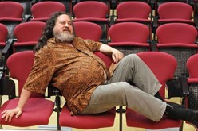
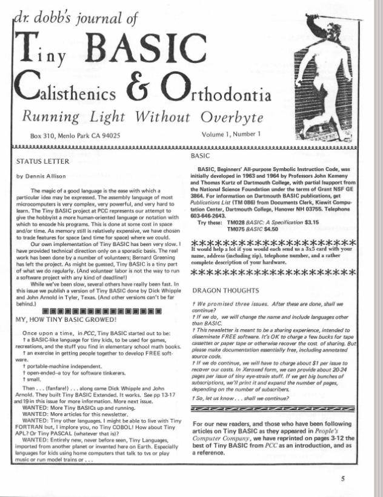
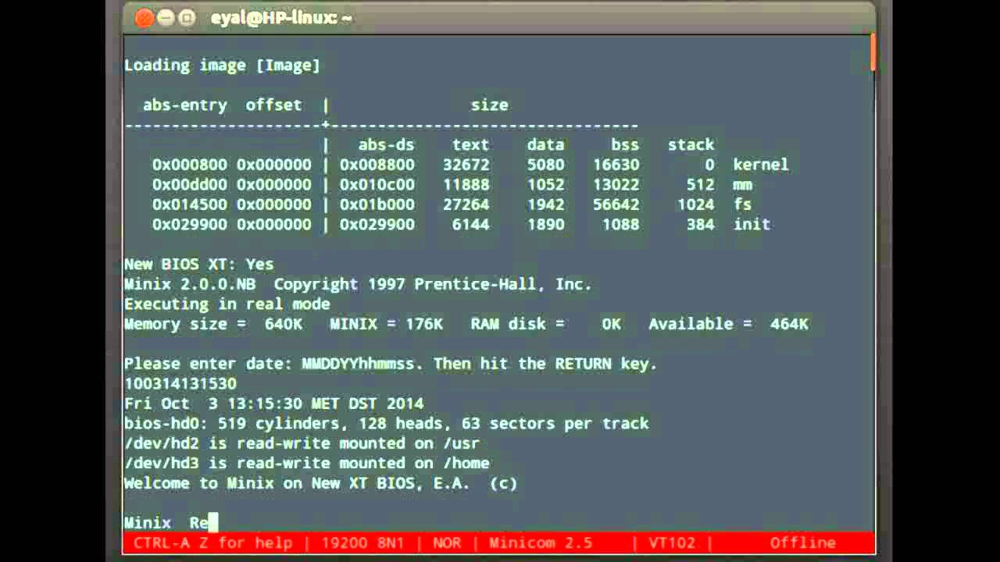

# **Linux Essentials**

## Chapter 01

### Introduction to Linux

---

- Most people think Linux is an operating system
  - Actually Linux is the kernel
- Many operating systems have a Linux kernel
  - Ubuntu
  - Android
  - Debian
  - Red Hat
  - ...
- OS = kernel + system tools + package managers + libraries + window manager + ...

---

## A Brief History

- Linux has a far way
  - 1991, Linus Torvalds
- Following is a brief history


---

### 1965 - Multics

- Multics (Multiplexed Information and Computing Service)
  - **mainframe timesharing operating system**
  - began at **MIT** (Massachusetts Institute of Technology)
    - research project
  - cooperation between MIT, Bell Labs and GE (General Electric)
  - monstrous system
    - important influence on OS development

---

### 1965 - Multics

- designed to be a utility
  - such as electricity and telephone services
- numerous features to provide **high availability and security.**
- **Highly modular**
  - System could grow by adding appropriate resource
  - Even while service was running

---

### 1965 - Multics

- **GE 645 mainframe**
  - first computer to run Multics


---

### 1965 - Multics

- Multics was partly developed by
  - **Ken Thompson** (UTF-8 character encoding and Google GO language)
  - **Dennis Ritchie** (invented C programming language).


---

### 1969 - DEC PDP-7

- A **minicomputer**
- produced by Digital Equipment Corporation (DEC)
- US$72,000, **cheap but powerful** by the standards of the time.
- The PDP-7 is the third of Digital's **18-bit machines**.
- Computer I/O includes keyboard, printer, paper-tape and dual transport DECtape drives.
- Standard **memory capacity** is 4K words (**9 KB**) but expandable up to 64K words (144 KB).
- The PDP-7 weighed about **500 kg.**

---


---

### 1965 - DECsys

- **DECsys**, the first operating system for DEC's 18-bit computer family
  - Introduced in 1965.
  - Provided interactive, single user, program development environment for Fortran and assembly language programs.

---

### 1969 - Unics

- 1969, **Ken Thompson and Dennis Ritchie** write **Unics**
  - Uniplexed Information & Computing Service
  - In assembly language on a PDP-7 as the operating system 
    - for **Space Travel**, a game which requires graphics to depict the motion of the planets.


---

### 1969 - Unics

- Name came from **Brian Kernighan**
  - co-author of the book "The C Programming Language" with Richie
  - also knows as the "K" in *awk*
- Means as a pun on Multics
  - Its like Multics, but only simpler as it should of been.
  - Also sounds like a **eunuch**, which he taught was funny because its like **Multics but castrated**.
- Unics was later renamed to **Unix**
  - nobody seems to remember when that happened

---

### August 12, 1981 - MSDOS

- MS-DOS
- Microsoft Disk Operating System
- OS for x86-based personal computers
- Mostly developed by Microsoft.
- **DOS = disk operating system**
  - MS-DOS
  - MS-DOS rebranding as IBM PC DOS
  - and some operating systems attempting to be compatible with MS-DOS


---

### August 12, 1981 - MSDOS

- MS-DOS was the main operating system for IBM PC compatible personal computers during the 1980s.


---

### September 27, 1983 - net.unix-wizards

- On *Tue, 27-Sep-83 12:35:59 EST*, **Richard Stallman** wrote the following post on the news group `net.unix-wizards`:

```text
Free Unix!

Starting this Thanksgiving I am going to write a complete
Unix-compatible software system called GNU (for Gnu's Not Unix), and
give it away free(1) to everyone who can use it.
Contributions of time, money, programs and equipment are greatly
needed.
```

---

### September 27, 1983 - net.unix-wizards


```
To begin with, GNU will be a kernel plus all the utilities needed to
write and run C programs: editor, shell, C compiler, linker,
assembler, and a few other things.  After this we will add a text
formatter, a YACC, an Empire game, a spreadsheet, and hundreds of
other things.  We hope to supply, eventually, everything useful that
normally comes with a Unix system, and anything else useful, including
on-line and hardcopy documentation.
```

---

### September 27, 1983 - net.unix-wizards


```
GNU will be able to run Unix programs, but will not be identical
to Unix.  We will make all improvements that are convenient, based
on our experience with other operating systems.  In particular,
we plan to have longer filenames, file version numbers, a crashproof
file system, filename completion perhaps, ...
  
Who Am I?
  
I am Richard Stallman, inventor of the original much-imitated EMACS
editor, now at the Artificial Intelligence Lab at MIT.  I have worked
extensively on compilers, editors, debuggers, command interpreters, ...
```

---

### September 27, 1983 - net.unix-wizards

```
Why I Must Write GNU

I consider that the golden rule requires that if I like a program I
must share it with other people who like it.  I cannot in good
conscience sign a nondisclosure agreement or a software license
agreement.

So that I can continue to use computers
without violating my principles,
I have decided to put together a sufficient body of
free software so that I will be able to get along
without any software that is not free.
```

---

### September 27, 1983 - net.unix-wizards


```
...

One computer manufacturer has already offered to provide a machine.
But we could use more. One consequence you can expect if you donate
machines is that GNU will run on them at an early date.
The machine had better be able to operate in a residential area,
and not require sophisticated cooling or power.

...
```

---

### September 27, 1983 - net.unix-wizards

- Started the free software revolution
- Historically, most software has been issued under a closed-source license.
- The open source philosophy 
  - you have a right to obtain the software, 
  - and to modify it for your own use.

---

### September 27, 1983 - net.unix-wizards

- Creator of GPL
- Was looking to create a **truly free and open source alternative** to the proprietary Unix system.
- Was working on the utilities and programs under the name **GNU**
  - a recursive acronym meaning "GNU's not Unix!".



---

### 1984 - GNU Project

- AT&T started to sell copies of Unix
  - Without source code
  - Richard Stallman was one of many students at MIT who had helped code it
- Enough is enough
  - **left the MIT Artificial Intelligence Lab in 1984** 
  - Founded the **GNU project**
    - Wanted to create a completely open source version of Unix.

---

### 1984 - GNU Project

- GNU kernel project was underway
  - Turned out to be difficult going
  - Without a kernel, named **HURD**, the free and open source operating system dream could not be realized.

---

### March 1985, Dr. Dobbs Journal

- Monthly magazine published in the United States 
- Covered topics aimed at computer programmers.
- When launched in 1976, DDJ was the first regular periodical focused on microcomputer software, rather than hardware.

---



---

### March 1985, Dr. Dobbs Journal

- It's purpose was to **distribute Tiny Basic**
  - A dialect of the BASIC programming language that can fit into as little as 2 or 3 KB of memory.
- This small size made it invaluable in the early days of microcomputers
- Tiny BASIC is an example of a **free software** project that existed before the free software movement.

---

### March 1985, Dr. Dobbs Journal

- In 1985 the GNU Manifesto was published in Dr Dobb's Journal

```text
I consider that the Golden Rule requires that
if I like a program I must share it
with other people who like it.
Software sellers want to divide the users and conquer them,
making each user agree not to share with others.
I refuse to break solidarity with other users in this way.
I cannot in good conscience sign a nondisclosure
agreement or a software license agreement.

by Richard Stallman
```

- In the same year Stallman set up the **Free Software Foundation**.

---

### 1987 - First Release of Minix

- **Minix** (mini-Unix) is an **open source operating system** developed by **Andrew S. Tanenbaum**
  - Professor emeritus of computer science at the Vrije Universiteit Amsterdam in the Netherlands
  - Created as an example for his book "Operating Systems: Design and Implementation".

---



---

### 1987 - First Release of Minix

- ​Partly based on Unix
- But with a microkernel instead of the traditional monolithic kernel
- The intention of Minix was that students could understand it in three months of study.

---


---

#### Microkernel vs monolithic kernel

- Basically a **monolithic kernel** is a single large process running entirely in a single address space.
- It is a single static binary file.
- All kernel services exist and execute in the kernel address space.
- Examples of monolithic kernel based OSs: Unix, Linux.

---

#### Microkernel vs monolithic kernel

- With a microkernel, the kernel is broken down into separate processes, known as **servers**.
- Some of the servers run in kernel space and some run in user-space.
- All servers are kept **separate** and run in different address spaces.
- Servers invoke "services" from each other by sending **messages** via IPC.
- This separation has the advantage that if one server fails, other servers can still work efficiently.
- Examples of microkernel based OSs: Mac OS X and Windows NT.

---

### 1987 - First Release of Minix

- Tanenbaum originally developed Minix for compatibility with the IBM PC and IBM PC/AT microcomputers (6 MHz Intel 80286 microprocessor) available at the time.


---

