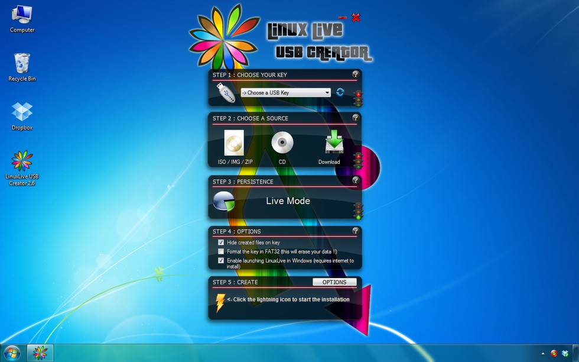
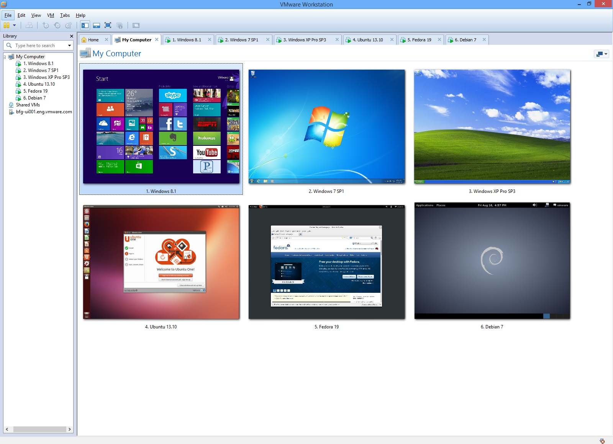
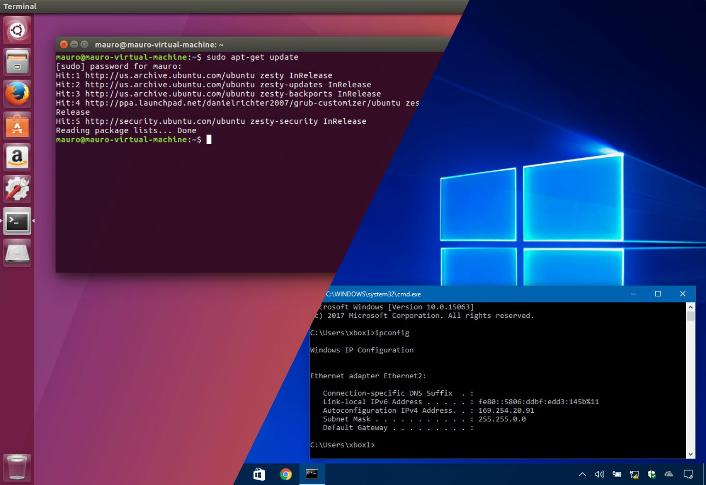
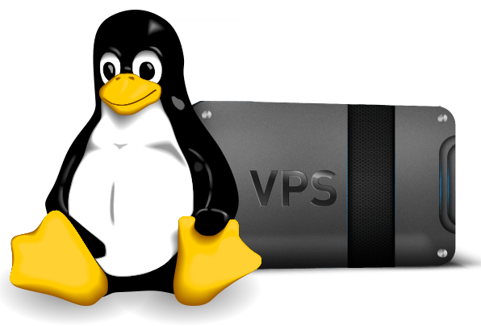
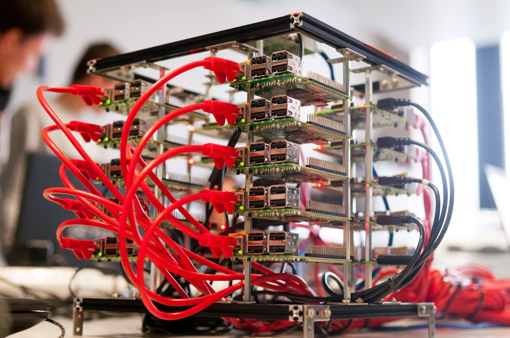

# Chapter 02 - Start Using Linux

<!-- TODO - Add links to the guides where applicable -->

Starting with Linux has neven been easier than the last few years. Several Linux operating systems have become extremely user friendly and approachable the last decade. Even the installation process of many distributions have become ridiculously easy.

Only a couple years back, the most obvious choice was to install it on a "older" computer system when one wanted to start with Linux. The last few years however several options became available.

## Boot Live USB flash drive

This is a really cool option as it does not require you to install anything. You deploy a Linux distribution to an USB flash drive and boot directly from it. This is also a great way to test Linux distributions on the hardware you wish to use.

It used to be a bit slow, but these days if you can use USB3 it's a perfect viable option. Some Linux distro's such as Mint and Pop!_os even come standard as a Live version from wish the installer can be launched.

If you wish to try this, all you need is a tool such as [balenaEtcher](https://www.balena.io/etcher/) to write the image to the flash drive if the distro already comes as a Live boot version. In the other case, you will need to create a live USB flash drive using a tool such as [Linux Live USB Creator](https://www.linuxliveusb.com/).

## Create Virtual Machines

A virtual machine is a computer program that simulates a computer on which other programs can be run. It allows us to install all kinds of operating systems on this general emulated hardware. On top of that we can create multiple virtual machines, each with their own configuration and operating system.

## Use a Physical Machine

A more permanent solution for switching or using Linux is installing it on a **laptop/desktop** or even **dual boot** the system. While this is probable the most difficult option of all, its still very doable if you are in luck with your hardware. Some wireless adapters and video cards can give some problems.

This is probable a good approach once you are out of the newbie shoes and are serious about using Linux as an operating system. Dual booting a system is a perfect approach to using both Linux and and your current operating system.

## Running a VPS in the Cloud

Nowadays you can use the cloud to start experimenting with Linux. You can use/buy a VPS (Virtual Private Server) with a Linux distro on it or you can use an existing open system.

A virtual private server (VPS) is a virtual machine sold as a service by an Internet hosting service.

A VPS runs its own copy of an operating system (OS), and customers may have superuser-level access to that operating system instance, so they can install almost any software that runs on that OS. For many purposes they are functionally equivalent to a dedicated physical server, and being software-defined, are able to be much more easily created and configured. They are priced much lower than an equivalent physical server. However, as they share the underlying physical hardware with other VPSes, performance may be lower, depending on the workload of any other executing virtual machines.

Some companies/websites offer access to existing machines to experiment with. VPS providers often also have trial accounts that allow you to use a VPS for a limited time.

<!-- Probable needs a better image -->

## Setup an Embedded Systems

Many embedded systems are running Linux these days. Even the router at your home from your internet server provider most likely is running Linux.

An embedded system such as the Raspberry Pi is perfect beginners choice. It even allows you to boot a graphical Linux distro such as [Raspian](https://www.raspberrypi.org/downloads/). All you need is the embedded system, a monitor, a keyboard and a mouse and you are all set.

The Raspberry Pi has become so popular and accessible that you can even buy SDCards with Linux pre-installed for the Raspberry Pi. Its that easy.

<!-- Don't we have a photo of a single screen setup -->

## Use Docker

Docker is a tool for running software in an isolated environment. Docker uses a technique called containerization to create separate environments. Docker in its self is nothing new. Docker is just a collection of readily available features that are present in Linux.

Containers provide similar features as virtualization, but with less overhead. Containers share the same Linux kernel, removing the need to provide an OS for every instance. Containers don't add an extra layer. The applications run directly on the hosts system.

The reduced overhead, and the fact that containers run directly on the host system, result in the fact that containers start up in seconds. Use less resources, and less memory. They are very light weight.

## Install Windows Subsystem for Linux

The Windows Subsystem for Linux lets developers run a GNU/Linux environment -- including most command-line tools, utilities, and applications -- directly on Windows, unmodified, without the overhead of a virtual machine.

You can:

* Choose your favorite GNU/Linux distributions from the Microsoft Store.
* Run common command-line free software such as grep, sed, awk, or other ELF-64 binaries.
* Run Bash shell scripts and GNU/Linux command-line applications including:
  * Tools: vim, emacs, tmux
  * Languages: Javascript/node.js, Ruby, Python, C/C++, C# & F#, Rust, Go, etc.
  * Services: sshd, MySQL, Apache, lighttpd
* Install additional software using own GNU/Linux distribution package manager.
* Invoke Windows applications using a Unix-like command-line shell.
* Invoke GNU/Linux applications on Windows.

More info about this can be found at [Windows Subsystem for Linux Installation Guide for Windows 10](https://docs.microsoft.com/en-us/windows/wsl/install-win10).

## So now what

For this course we'll be taking two approaches:

* Initially we'll be deploying a Linux distribution as a Virtual Machine. This allows us to experiment, backup and restore very easily.
* Later in the course we will install a Linux distribution on the Raspberry Pi, a user-friendly and affordable embedded system with a huge community and out of the box Linux support.
