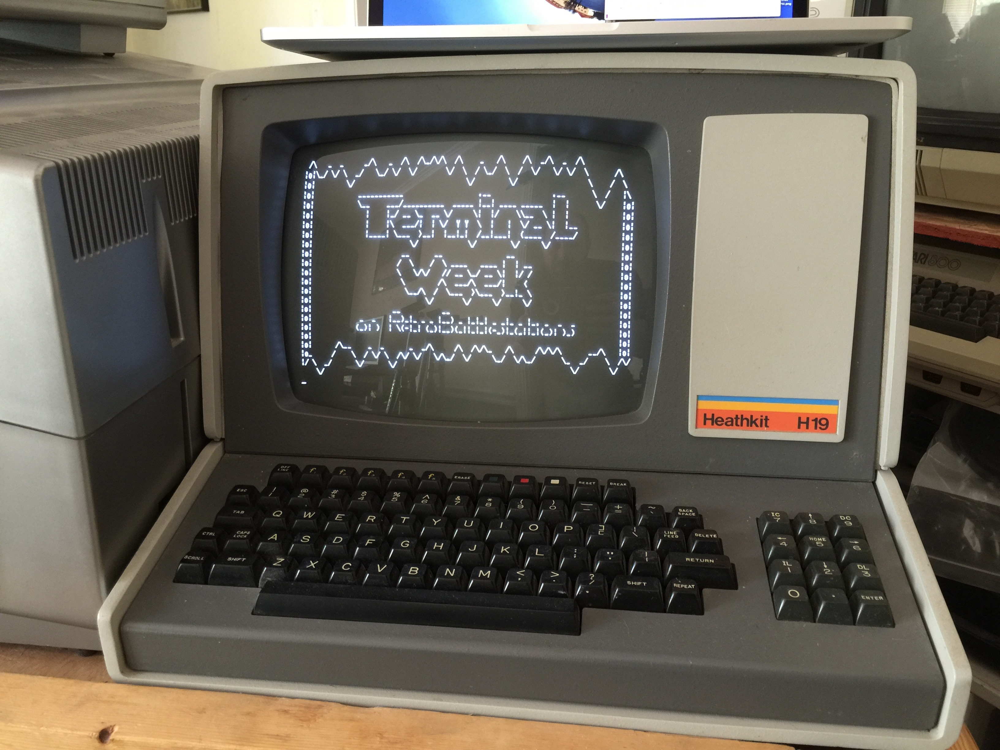
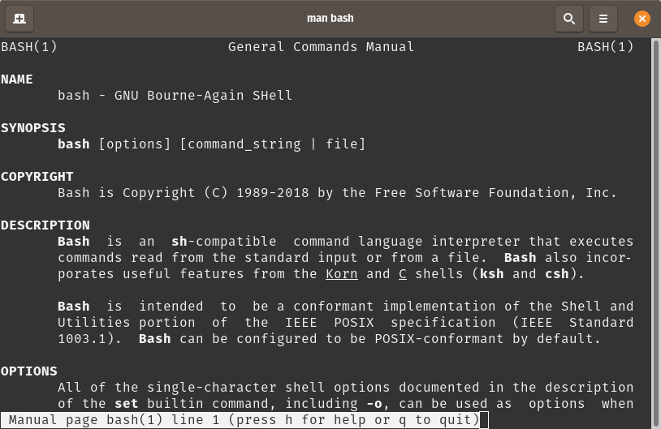
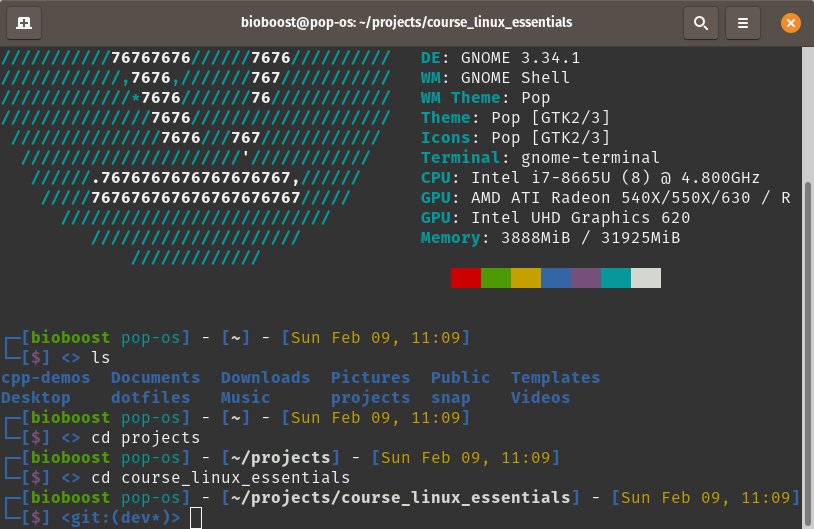
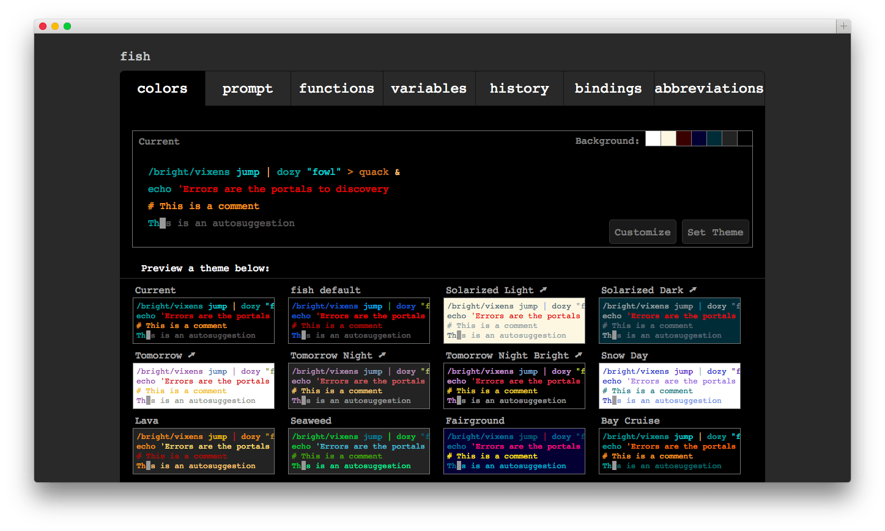
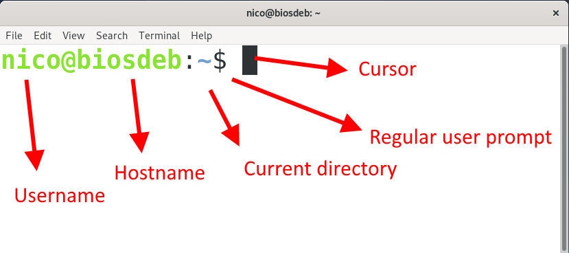

# Chapter 03 - The Command Line

<!-- TODO - Needs a nice intro -->

## The CLI

<!-- TODO: Refactor -->

As most people use an OS with a graphical user interface (GUI) for their day-to-day computer needs, the use of the CLI is a necessity for most Linux server users.

* A CLI (Command Line Interface) provides
  * more precise control
  * greater speed
  * and the ability to easily automate tasks through scripting
* Although Linux does have many GUI environments, you will be able to control Linux much more effectively by using the CLI.

## The Terminal

In the olden days, when computers were room-sized multi-user computer systems owned by companies and universities, the machines are placed inside secured rooms that were inaccessible by normal users. These normal users could however **interact with the system remotely using a terminal**, which used to be a printer for output, called a TeleTYpewriter (TTY), and a punch card system for input.


Later the terminal evolved to a display and keyboard which could be used to interact with the computer.



These days the terminal is nothing but a software application that emulates the old physical terminals. That's why the actual correct name of this application is **terminal emulator**, but most people will talk about the terminal.

This terminal application, provides an interface that allows interaction with the user. It can read commands from the user and it can output text to the screen. The terminal application is however a very basic program that can provide the CLI but does not actually do anything more. The application that actually executes the commands from the user is called the **shell**.

So in short, the terminal emulator is an application accepts what the user types and passes to a shell. THe output from the shell is then redirected back to the terminal and displayed to the user.

Some free and commonly-used terminal emulators are:

* Putty for Windows
* Terminal and iTerm 2 for Mac OS X
* Terminal, KDE Konsole, XTerm and Terminator for Linux

## The Shell

The shell is an application that **interprets** the commands coming from the user (this can be from the terminal or from a shell script) and translates them into instructions that can be executed by the operating system.

If output is produced by the command, then this output is redirected back to the terminal and displayed for the user. If problems with the command are encountered, then an error message is displayed instead.

For example, when you type `ls` into a terminal, you are asking the shell to run the `ls` program and to print out a list of files in the current directory to your terminal.

A shell also acts as a scripting environment making it easier for the user to automate tasks using shell scripts. Below is a simple example of a bash script that output the message "Hello World from Bash" to the terminal.

```bash
#!/usr/bin/env bash

echo "Hello World from Bash"
```

### Different shells

There are quitte a lot of different shells available. Each shell has its own feature set and intricacies, regarding how commands are interpreted, but they all feature input and output redirection, variables, and condition-testing, among other things.

Each shell basically does the same job, but each understands different command syntax and provides different built-in functions.

#### The sh shell

Most shells derive their features from the original Unix shell program **sh** - **The Bourne Shell**. It was written by **Stephen Richard "Steve" Bourne** at AT&T Bell Labs in 1977 and since then it has been shipped with most earlier Unix systems.


Sh set the bar for many popular future shells with features like redirection, scripting abilities, and robust language constructs.

::: tip .sh extension
The Bourne Shell requires users to use the `.sh` extension for their scripts. However, often linux users will do the same for scripts for other shells. This is a bad habit as most scripts these days are not `sh`-compatible scripts.
:::

#### The Bash shell

On most Linux systems (standard Linux distribution such as Ubuntu or Arch) a program called **bash** (an open source shell which stands for **Bourne Again SHell**, an enhanced version of the original `sh`) acts as the default shell program.

This open source Linux shell is well-known in the community for its robust feature set and usability. Most Linux users thus run Bash at one point or another in their life.



Some excellent features of bash are

* unlimited command history
* aliases
* Unicode support
* auto-completion support for command names, paths, wildcards
* allows colored directory listings alongside text highlighting

#### The Korn shell

The **Korn Shell** (ksh) is probable one of the most popular open source shells for Linux at this time. It was developed by **David Korn** at Bell Labs. It combines the interactivity of the C shell and productivity of the Bash shell. The Korn Shell has always been popular because of its ahead-of-time features which include advance job control, command aliasing, floating-point arithmetic alongside many others.

Some import features:

* it allows users to terminate current jobs using `CTRL + Z` and put them either in the foreground or background using the commands `fg` and `bg`.
* it allows the shell code to be put directly in memory which allows increasing programming ability and efficient performances.
* Advanced command-line editing, adopted from popular editors such as vi and Emacs.
* Korn shell scripts are often faster than Bourne shell scripts and offer advanced I/O features alongside notable security mechanisms.

#### Zsh shell

The **Z shell** (Zsh) is an innovative, modern-day Linux shell that can be used as an interactive login shell and as a command interpreter for shell scripting. Zsh is an extended Bourne shell with many improvements, including features from other popular shells. Zsh is known for its performance, which improves upon many open source shells for Linux. Try Zsh if you’re Linux guru looking for advanced Linux shells.



Some key features of zsh are:

* very intelligent auto-completion functionality
* history sharing mechanism over different terminal windows running at the same time
* over 400 plugins and 200 plus themes from its popular, community-driven framework oh-my-zsh
* spelling correction

#### The Fish Shell

Fish is a smart and user-friendly command line shell for Linux, macOS, Windows and the rest of the family. It aims to be a modern-day replacement of the early open source shells for Linux. Fish offers a rich set of powerful features which makes it easier to discover, remember, and use exciting Linux commands on your machine. If you’re looking for a smart command-line shell for your Linux desktop, Fish is certainly worth a try.



Some cool features of Fish:

* Autosuggestions
* Sane Scripting
* Man Page Completions
* Glorious VGA Color
* Web Based configuration
* Works Out Of The Box

## The Prompt

A terminal window displays what is known as a **prompt**. The structure of the prompt may vary between distributions, shells and terminal emulators. It will typically contain information about the user and the system.



## Issuing Shell Commands

Basically to issue shell commands we need to type them in the terminal emulator window at the prompt. Just type the command and hit `ENTER`. This will send the user input to the shell which will interpret the command, execute the required binaries and send the result back to us at the terminal.

The most used command and one of the simplest to start with is the listing command `ls`. By itself, the `ls` command will list the files and directories contained in your current working directory.

```bash
nico@biosdeb:~$ ls
```

::: codeoutput
<pre>
Desktop  Documents  Downloads  Music
Pictures  Public  Templates  Videos
</pre>
:::

Keep in mind that Linux is case sensitive! Commands, options, arguments, variables and filenames must be entered exactly as shown.

Many Linux commands can be used by themselves with no further input.

Some commands require additional information to run properly. This additional information comes in two forms: **options** and **arguments**.

### Options

Options are used to modify the core behavior of a command. Take for example the option `-l` which requests the output to use long formatting.

```bash
nico@biosdeb:~$ ls -l
```

::: codeoutput
<pre>
total 32
drwxr-xr-x 2 nico nico 4096 Nov  3 13:54 Desktop
drwxr-xr-x 2 nico nico 4096 Nov  3 13:54 Documents
drwxr-xr-x 2 nico nico 4096 Nov  3 13:54 Downloads
...
</pre>
:::

Typically, older commands use single letters, while newer commands use complete words for options.

**Single-letter options** are **prefixed by a single dash** `-`. **Full-word options** are **prefixed by two dashes** `--`.

Providing the `ls` command with the `--all` option will request it to show all files, including the hidden ones.

```bash
nico@biosdeb:~$ ls --all
```

::: codeoutput
<pre>
.              .gnome                snap
..             .gnupg                .ssh
.bash_history  .local                .sudo_as_admin_successful
.bash_logout   .mozilla              .templateengine
.bashrc        Music                 Templates
.bzr.log       .node_repl_history    .tmux.conf
.cache         .npm                  Videos
.config        .nuget                .vscode
cpp-demos      .oh-my-zsh            .wget-hsts
Desktop        .omnisharp            .yarnrc
Documents      .pam_environment      .zcompdump
...
</pre>
:::

Options can often also be combined by **stitching them together**. The next example request the `ls` command to output all files (`-a` is the same as `--all`) using a long listing format.

```bash
nico@biosdeb:~$ ls -al
```

::: codeoutput
<pre>
total 324
drwxr-xr-x 30 bioboost bioboost  4096 Feb  9 12:29 .
drwxr-xr-x  3 root     root      4096 Jan 26 23:17 ..
-rw-------  1 bioboost bioboost   699 Jan 27 14:06 .bash_history
-rw-r--r--  1 bioboost bioboost   220 Jan 26 23:17 .bash_logout
-rw-r--r--  1 bioboost bioboost  3828 Feb  7 10:32 .bashrc
-rw-r--r--  1 bioboost bioboost 29275 Feb  9 11:03 .bzr.log
drwx------ 18 bioboost bioboost  4096 Feb  9 10:37 .cache
drwx------ 21 bioboost bioboost  4096 Feb  7 10:24 .config
drwxr-xr-x  2 bioboost bioboost  4096 Feb  7 09:54 Desktop
drwxr-xr-x  2 bioboost bioboost  4096 Jan 26 23:18 Documents
drwxr-xr-x  6 bioboost bioboost  4096 Jan 27 13:51 dotfiles
drwxr-xr-x  5 bioboost bioboost  4096 Feb  5 14:15 .dotnet
drwxr-xr-x  5 bioboost bioboost  4096 Feb  7 10:18 Downloads
...
</pre>
:::

### Arguments

Arguments are used to provide additional information to the command. Take for example the `ls` command. If called without extra arguments, it will list the directories and files in the current working directory. You can also request `ls` to print the content of another directory without actually being in it. To do so, one must provide that directory as a argument as shown in the next example.

```bash
nico@biosdeb:~$ ls /
```

::: codeoutput
<pre>
bin   etc    lib64       mnt   run   sys
boot  home   libx32      opt   sbin  tmp
data  lib    lost+found  proc  snap  usr
dev   lib32  media       root  srv   var
</pre>
:::

`/` is the argument here, and it represents the root of the filesystem.

## History

When you execute a command in a terminal, the command is stored in a "history list". Most shell's keep a decent command history as a reference and allow it be accessed fast and easily.

This is designed to make it easy for you to execute the same command later since you won't need to retype the entire command.

### Using history

| Command | Description |
| --- | --- |
| `history` | Show command history |
| `!!` | Execute last command again |
| `!ls` | Execute most recent ls command |

## Alias

An alias can be used to map longer commands to shorter key sequences. When the shell sees an alias being executed, it substitutes the longer sequence before proceeding to interpret commands.

### Existing Aliases

You can determine what aliases are set on your shell with the alias command.

```bash
nico@biosdeb:~$ alias
```

::: codeoutput
<pre>
...
alias ls='ls --color=auto'
alias ll='ls -lh'
...
</pre>
:::

### Creating an Alias

New aliases can be created by typing `alias name=command` where `name` is the name you want to give the alias and `command` is the command you want to have executed when you run the alias.

### Alias Example

```bash
nico@biosdeb:~$ alias shell='echo "You are using the $0 shell"'
```

Now you can use the alias `shell` to check which shell you are running.

```bash
nico@biosdeb:~$ shell
```

::: codeoutput
<pre>
You are using the zsh shell
</pre>
:::

The cool thing about aliasses is, is that they can also take arguments and options (depending on the commands used in the alias). For example the alias `ll='ls -lh' will list files and directories in long format and human readable sizes. When using this alias, we can actually still pass arguments and options, for example:

```bash
nico@biosdeb:~$ ll -aS /
```

Where `-a` requests to show all files and directories and `-S` request them be ordered by size.

::: codeoutput
<pre>
total 92K
drwx------   2 root root  16K Jan 26 23:09 lost+found
drwxr-xr-x 138 root root  12K Feb  7 10:24 etc
drwxrwxrwt  23 root root  12K Feb  9 12:59 tmp
drwxr-xr-x  19 root root 4.8K Feb  9 10:35 dev
drwxr-xr-x  20 root root 4.0K Jan 27 13:52 .
drwxr-xr-x  20 root root 4.0K Jan 27 13:52 ..
drwxr-xr-x   3 root root 4.0K Jan 26 23:22 boot
drwxrwxrwx   1 root root 4.0K Feb  3 12:03 data
drwxr-xr-x   3 root root 4.0K Jan 26 23:17 home
drwxr-xr-x   2 root root 4.0K Dec 20 17:09 media
drwxr-xr-x   2 root root 4.0K Dec 20 17:09 mnt
drwxr-xr-x   3 root root 4.0K Jan 28 08:39 opt
drwx------   3 root root 4.0K Dec 20 17:27 root
drwxr-xr-x  14 root root 4.0K Jan 31 09:10 snap
...
</pre>
:::

### Making Aliasses Permanent

If you use the `alias` command at the shell, your alias will not be permanent. Once the terminal is closed, the alias is "forgotten".

To make it stick, we need to place it inside one of the startup scripts such as `.bashrc` or `.zshrc`, depending on the shell you are using.

::: tip .bashrc
`.bashrc` is a shell script that Bash runs whenever it is started interactively. It initializes an interactive shell session. You can put any command in that file that you could type at the command prompt. You put commands here to set up the shell for use in your particular environment, or to customize things to your preferences. A common thing to put in `.bashrc` are aliases that you want to always be available.
:::

To add your alias permanently, use nano to edit your `.bashrc` file and place the alias as you typed in the shell at the bottom of the script. You can also add a comment to the alias as shown in the next example.

```bash
nico@biosdeb:~$ nano ~/.bashrc
```

Place this at the bottom of the script to make the `shell` alias available when opening a shell:

```bash
# Add alias to show me current shell
alias shell='echo "You are using the $0 shell"'
```

Save the file using `CTRL-o` and exit using `CTRL-x`.

Launch a new terminal and check if the alias is available.

## Some Good Videos

<iframe width="560" height="315" src="https://www.youtube.com/embed/hMSByvFHOro" frameborder="0" allow="accelerometer; autoplay; encrypted-media; gyroscope; picture-in-picture" allowfullscreen></iframe>
