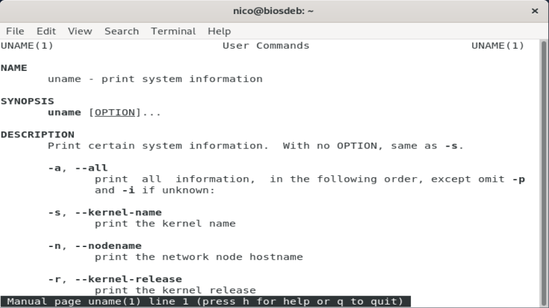
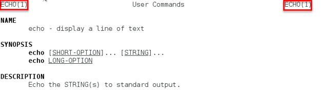

# Getting Help

Everyone needs some help from time to time. Basically thats what the man pages are for.

## Man pages

Man (`man` stands for manual) pages are used to describe the features of commands. They will provide you with a basic description of the purpose of the command, as well as provide details regarding the options of the command.



The man command uses a "pager" to display documents. Normally this pager is the `less` command. A pager is something that most administrators use frequently, to view files, read the results of long command output, and more. Common pager utils are `more` and `less`.

The most used commands inside the man pages are listed in the next table.

| Command | Description |
| ---- | ---- |
| `ENTER` | Go down a line |
| `SPACE` | Go down a page |
| `/keyword` | Search for keyword |
| `n` | Find next search item |
| `N` | Find previous search item |
| `g` | Goto beginning |
| `G` | Goto end |
| `h` | Show help |
| `q` | Quit man pages |

### Sections of a man page

Man pages are broken into **sections**. Each section is designed to provide specific information about a command.

* **NAME**: Name of command and brief description.
* **SYNOPSIS**: Provides examples.
* **DESCRIPTION**: More detailed description.
* **OPTIONS**: Lists the options for the command with a description.
* **FILES**: Lists the files that are associated with the command as well as a description of how they are used. These files may be used to configure the command's more advanced features.
* **AUTHOR**: The name of the person who created the man page and (sometimes) how to contact the person.
* **REPORTING BUGS**: Provides details on how to report problems with the command.
* **COPYRIGHT**: Provides basic copyright information.
* **SEE ALSO**: Provides you with an idea of where you can find additional information.This also will often include other commands that are related to this command.

Sometimes configuration files also have man pages. Configuration files (sometimes called system files) contain information that is used to store information about the Operating System or services.

### Sections of the man pages

There are thousands of man pages on a typical Linux distribution. To organize all of these man pages, the pages are **categorized by sections**, much like each individual man page is broken into sections.

1. Executable programs or shell commands
1. System calls (functions provided by the kernel)
1. Library calls (functions within program libraries)
1. Special files (usually found in /dev)
1. File formats and conventions, e.g. /etc/passwd
1. Games
1. Miscellaneous (including macro packages and conventions)
1. System administration commands (usually only for root)
1. Kernel routines [Non standard]

When you use the man` command, it searches each of these sections **in order** until it finds the first "match".

For example:

```bash
[bioboost@linux][~]$ man echo
```

To determine which section a specific man page belongs to, look at the numeric value on the first line of the output of the man page.



In some cases you will need to specify the section in order to display the correct man page. This is necessary because sometimes there will be man pages with the same name in different sections.

There is for example a man page about the `passwd` command (section 1) but also about the file `/etc/passwd` (section 5). To request a man page from a specific section, just add the number before the name of the man page.

```bash
[bioboost@linux][~]$ man 5 passwd
```

### Partial Matches

The `-f` option to the `man` command will display man pages that match, or partially match, a specific name and provide a brief description of each man page.

```bash
[bioboost@linux][~]$ man -f ip
```

::: output
<pre>
ip (7)               - Linux IPv4 protocol implementation
ip (8)               - show / manipulate routing, network devices, interfaces...
</pre>
:::

Note that on most Linux distributions, the `whatis` command does the same thing as `man -f`.

```bash
[bioboost@linux][~]$ whatis ip
```

::: output
<pre>
ip (7)               - Linux IPv4 protocol implementation
ip (8)               - show / manipulate routing, network devices, interfaces...
</pre>
:::

### Search by Keyword

You can search for a keyword in the man pages names and the short descriptions by using the `-k` option.

```bash
[bioboost@linux][~]$ man -k ssh
```

::: output
<pre>
authorized_keys (5)  - OpenSSH SSH daemon
rlogin (1)           - OpenSSH SSH client (remote login program)
</pre>
:::

The `apropos` command does the same thing as `man -k`.

```bash
[bioboost@linux][~]$ apropos ssh
```

::: output
<pre>
authorized_keys (5)  - OpenSSH SSH daemon
rlogin (1)           - OpenSSH SSH client (remote login program)
</pre>
:::

You can use the `apropos` command to find a specific command based on its description. This is especially helpfull when you know what you want to achieve but don't know what command to use.

## Info

The `info` command also provides documentation on operating system commands and features. The goal of this command is slightly different from the man pages.

Consider man pages to be more of a reference resource and info documents to be more of a learning guide.

You may need to install info: `sudo apt install info`

```bash
[bioboost@linux][~]$ info ls
```

The info command automatically redirects to man pages if no info exists.

Like the `man` command, you can get a listing of traverse keys by typing the letter `h` while reading the info documentation.

## Command help

Many commands will also provide you basic information, very similar to the SYNOPSIS found in man pages, when you apply the `--help`, `-h` or `-?` option to the command.

```bash
[bioboost@linux][~]$ passwd --help
```

::: output
<pre>
Usage: passwd [options] [LOGIN]

Options:
  -a, --all                     report password status on all accounts
  -d, --delete                  delete the password for the named account
  -e, --expire                  force expire the password for the named account
  -h, --help                    display this help message and exit
  -k, --keep-tokens             change password only if expired
  -i, --inactive INACTIVE       set password inactive after expiration
</pre>
:::

## Documentation

On most systems, there is a directory where additional documentation is found. This will often be a place where vendors who create additional (third party) software can store documentation files. These documentation files are often called readme files, since the files typically have names such as `README` or `readme.txt`.

Typical locations include `/usr/share/doc` and `/usr/doc`.

## Challenges

Find all the info you need in the man-pages. Make sure to comment the commands you used to find this information. No google!

Mark challenges using a ✅ once they are finished.

### ❌ The free command

*Describe in your own words what the `free` command does. Give an example and a partial output.*

### ❌ The id command

*Describe in your own words what the `id` command does. Give an example and a partial output.*

### ❌ The tree command

*Describe in your own words what the `tree` command does. How do you list all subdirectories too? How can you only include directories? If the `tree` command is not available on your system you can install it using `sudo apt install tree`*

### ❌ The which command

*Describe in your own words what the `which` command does. What is the result for `pwd` ?*

### ❌ The file command

*Describe in your own words what the `file` command does. What is the result for `~/.bashrc` ?*

### ❌ The type command

*Describe in your own words what the `type` command does. What is the result for `ls` and what is the result for `g++` ?*

### ❌ Counting lines and words

*What command can be used to count lines and words in text? Give an example and explain the output.*

### ❌ The wget command

*How can you download a file from the Internet using the command line?. Find a file online to use it on and demonstrate its usage.*

### ❌ The dmesg command

*Describe in your own words what the `dmesg` command does. Give an example and a partial output.*

### ❌ Checksums

*Go to the website of Raspberry Pi - [https://www.raspberrypi.org/software/operating-systems](https://www.raspberrypi.org/software/operating-systems) and download the Raspberry Pi OS image using the `wget` command line tool. Now check if the SHA-256 checksum complies with the one being advertised on the website.*

*What tool did you use to calculate the checksum? Demonstrate its usage.*

*What is the use of this hash?*

### ❌ The printenv command

*Describe in your own words what the `printenv` command does.*

### ❌ IP Address

*Find the IP address of your WiFi interface. What command did you use?*

### ❌ IP of Sivir Server

*What is the IP address of the internal server `sivir.devbit.be`? Make sure you are connected to the `Devbit` network.*