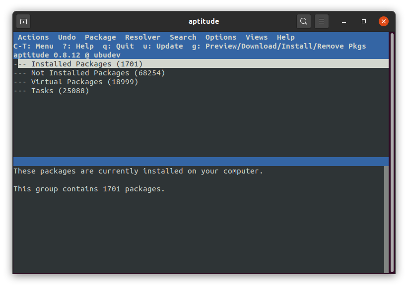

# Package Managers

Linux package managers allow software to be managed on your favorite distribution, that is installed, configured, updated and removed. Package managers do so by handling packages - archives that contain the binary files, configuration files, man/info pages, copyright information, information about dependencies, ...

Every Linux distribution is different in terms of how software is installed. Different Linux distributions use different installation file types, package managers, and commands for installation. Even within a single form of Linux, there are different types of package managers.

In this course the focus will lie on Debian based system's which typically use the package managers `dpkg`, `APT`, `aptitude`, `apt` and `snap`.

## Debian and it's Packages

Debian packages can either be downloaded manually or fetched automatically from a repository if the package manager supports this feature.

Packages generally contain all of the files necessary to implement a set of related commands or features. There are two types of Debian packages:

* **Binary packages**, which contain executables, configuration files, man/info pages, copyright information, and other documentation. These packages are distributed in a Debian-specific archive format; they are usually distinguished by having a `.deb` file extension. Binary packages can be unpacked using the Debian utility `dpkg` (possibly via a frontend like `aptitude`).
* **Source packages**, which consist of a `.dsc` file describing the source package (including the names of the following files), a `.orig.tar.gz` file that contains the original unmodified source in gzip-compressed tar format and usually a `.diff.gz` file that contains the Debian-specific changes to the original source. The utility `dpkg-source` packs and unpacks Debian source archives. (The program `apt-get` can be used as a frontend for `dpkg-source`.)

Debian files are usually downloaded by package managers from a software **repository**. A repository is a collection of Debian files that typically comes from a server or other location. Package managers access these repositories and download the requested Debian file. Then, the package manager installs the package. A package manager is software used to handle the installation, removal, configuration, and updating of programs and drivers on a computer system.

If a Debian file is not downloaded from a repository, then the user downloaded or created a Debian file. The local file can still be installed using a package manager such as `dpkg`; Debian files are not required to come from a repository, although most do.

Installation of software by the package system uses "dependencies" which are carefully designed by the package maintainers. These dependencies are documented in the control file associated with each package.

For example, the package containing the GNU C compiler `gcc` "depends" on the package `binutils` which includes the linker and assembler. If a user attempts to install `gcc` without having first installed `binutils`, the package management system `dpkg` will send an error message that it also needs `binutils`, and stop installing `gcc`.

There are multiple tools that are used to manage Debian packages, from graphic or text-based interfaces to the low level tools used to install packages. All the available tools rely on the lower level tools to properly work.

It is important to understand that the higher level package management tools such as `aptitude` rely on APT which, itself, relies on `dpkg` to manage the packages in the system.

## DPKG - Debian Package

`dpkg` (Debian Package) is the main package management program for debian based Linux distributions. `dpkg` is the software at the base of the package management system in the free operating system Debian and its numerous derivatives. `dpkg` is used to install, remove, and provide information about `.deb` packages.

`dpkg` itself is a low level tool and therefore does not handle things such as dependencies automatically. Installing packages that depend on multiple other packages makes using `dpkg` the less preferred choice.

`dpkg` was originally created by Ian Murdock in January 1994 as a Shell script, Matt Welsh, Carl Streeter and Ian Murdock then rewrote it in Perl, and then later the main part was rewritten in C by Ian Jackson in 1994.

Installing a package using `dpkg` can be achieved using the command `dpkg --install <packagefile>.deb`.

For example (after downloading the package file from [http://security.ubuntu.com/ubuntu/pool/universe/s/sl/](http://security.ubuntu.com/ubuntu/pool/universe/s/sl/)):

```bash
[bioboost@linux][~]$ dpkg --install sl_5.02-1_amd64.deb
```

::: codeoutput
```
Selecting previously unselected package sl.
(Reading database ... 223821 files and directories currently installed.)
Preparing to unpack sl_5.02-1_amd64.deb ...
Unpacking sl (5.02-1) ...
Setting up sl (5.02-1) ...
Processing triggers for man-db (2.9.1-1) ...
```
:::

::: tip sl
Feel free to test the `sl` command.
:::

Basically this was a walk in the park because the `sl` package has no uncommon dependencies. They are most likely already installed on your system. If not, `dpkg` will throw an error and you will need to solve the dependencies manually or use a more high-level package manager.

## APT

APT (Advanced Package Tool) is a set of tools that allow package management on a debian based system. It contains tools such as `apt-get` and `apt-cache`. `apt-get` provides a simple way to retrieve and install packages from multiple sources using the command line. Unlike `dpkg`, `apt-get` does not understand `.deb` files, it works with the packages proper name and can only install `.deb` archives from a source specified in /etc/apt/sources.list. `apt-get` will call `dpkg` directly after downloading the `.deb` archives from the configured sources in order to install the package.

APT, a higher level tool, is more commonly used than `dpkg` as it can fetch packages from remote locations and deal with complex package relations, such as dependency resolution.

Some common ways to use `apt-get` and `apt-cache` are:

* `apt-get update`: update the list of package known by your system.
* `apt-get upgrade`: upgrade all the packages on your system (without installing extra packages or removing packages).
* `apt-get install foo`: install the `foo` package and all its dependencies.
* `apt-get remove foo`: remove the `foo` package from your system but leave configuration files as is.
* `apt-get purge foo`: remove the `foo` package and its configuration files from your system.
* `apt-get dist-upgrade`: upgrade all the packages on your system, and, if needed for a package upgrade, install extra packages or remove packages.
* `apt-cache search foo`: search the repository (local cache) for a package called `foo` 
* `apt-cache show foo`: show detailed information about the `foo` package

## And then there was apt

The original APT (not the same as the `apt` command), has the problem that it has many low-level commands with many functionalities which are perhaps never used by an average Linux user. On the other hand, the most commonly used package management commands are scattered across `apt-get` and `apt-cache`.

The `apt` commands have been introduced to solve this problem. `apt` consists of some of the most widely used features from `apt-get` and `apt-cache` and even `dpkg`, leaving aside obscure and seldom used features. It can also manage the `apt.conf` file.

With `apt`, you don't have to fiddle your way from `apt-get` commands to `apt-cache`. `apt` is more structured and provides you with necessary options needed to manage packages.

Bottom line: `apt` = most common used command options from `apt-get` and `apt-cache`.

* To **list all the installed packages** on your system you can use the `apt list --installed` command. You can also list all packages or list packages that are upgradable by using the `--upgradable` flag.

```bash
[bioboost@linux][~]$ apt list --installed
```

::: codeoutput
```
Listing...
accountsservice/focal-security,now 0.6.55-0ubuntu12~20.04.4 amd64 [installed,automatic]
acl/focal,now 2.2.53-6 amd64 [installed,automatic]
acpi-support/focal,now 0.143 amd64 [installed,automatic]
acpid/focal,now 1:2.0.32-1ubuntu1 amd64 [installed,automatic]
adduser/focal,focal,now 3.118ubuntu2 all [installed,automatic]
adwaita-icon-theme/now 3.36.1-2ubuntu0.20.04.2 all [installed,local]
aisleriot/focal,now 1:3.22.9-1 amd64 [installed,automatic]
...
```
:::

* To **update** your local package cache, use the command `apt update`. It will also show the number of upgradable packages installed on your system.

```bash
[bioboost@linux][~]$ apt update
```

::: codeoutput
```
Hit:1 https://download.docker.com/linux/ubuntu focal InRelease
Hit:2 http://dl.google.com/linux/chrome/deb stable InRelease
Hit:3 http://ppa.launchpad.net/kicad/kicad-dev-nightly/ubuntu focal InRelease
Hit:4 http://be.archive.ubuntu.com/ubuntu focal InRelease
Get:5 http://security.ubuntu.com/ubuntu focal-security InRelease [114 kB]
Get:6 http://security.ubuntu.com/ubuntu focal-security/main amd64 DEP-11 Metadata [27,6 kB]
Get:7 http://security.ubuntu.com/ubuntu focal-security/universe amd64 DEP-11 Metadata [61,1 kB]
Get:8 http://security.ubuntu.com/ubuntu focal-security/multiverse amd64 DEP-11 Metadata [2.468 B]
Fetched 205 kB in 1s (186 kB/s)
Reading package lists... Done
Building dependency tree
Reading state information... Done
All packages are up to date.
```
:::

::: tip Take a Peek at the Package Repositories
Feel free to click the HTTP url of the package repositories and take a look at what you can find there. For example [http://ppa.launchpad.net/kicad/kicad-dev-nightly/ubuntu](http://ppa.launchpad.net/kicad/kicad-dev-nightly/ubuntu) and checkout the directory `pool/main/k/kicad/`.
:::

* To **search** for a package, use the `apt search <pkgname>` command.

```bash
[bioboost@linux][~]$ apt search cow
```

::: codeoutput
```
Sorting... Done
Full Text Search... Done
averell/focal,focal 1.2.5-1.1 all
  incredibly stupid web server

cowbell/focal 0.2.7.1-7build2 amd64
  An easy-to-use tag editor for your music files

cowbuilder/focal 0.88 amd64
  pbuilder running on cowdancer

...
```
:::

* To **install** a package, use the `apt install <pkgname>` command.

```bash
[bioboost@linux][~]$ apt install sl
```

::: codeoutput
```
Reading package lists... Done
Building dependency tree
Reading state information... Done
The following NEW packages will be installed:
  sl
0 upgraded, 1 newly installed, 0 to remove and 0 not upgraded.
Need to get 12,7 kB of archives.
After this operation, 60,4 kB of additional disk space will be used.
Get:1 http://be.archive.ubuntu.com/ubuntu focal/universe amd64 sl amd64 5.02-1 [12,7 kB]
Fetched 12,7 kB in 0s (110 kB/s)
Selecting previously unselected package sl.
(Reading database ... 223496 files and directories currently installed.)
Preparing to unpack .../archives/sl_5.02-1_amd64.deb ...
Unpacking sl (5.02-1) ...
Setting up sl (5.02-1) ...
Processing triggers for man-db (2.9.1-1) ...
```
:::

* To **remove** a package (leaving the configuration files in tact), use the `apt remove <pkgname>` command. To **purge** a package (also removing the configuration files), use the `apt purge <pkgname>` command.

```bash
[bioboost@linux][~]$ apt purge sl
```

::: codeoutput
```
Reading package lists... Done
Building dependency tree
Reading state information... Done
The following packages will be REMOVED:
  sl*
0 upgraded, 0 newly installed, 1 to remove and 0 not upgraded.
After this operation, 60,4 kB disk space will be freed.
Do you want to continue? [Y/n] y
(Reading database ... 223519 files and directories currently installed.)
Removing sl (5.02-1) ...
Processing triggers for man-db (2.9.1-1) ...
```
:::

Some other useful options might be:

* `show <pkgname>`: Show some detailed information about a package. Works like `apt-cache show` but hides some details that people are less likely to care about (like the hashes).
* `upgrade`: install available upgrades of all packages currently installed on the system. New packages will be installed if required to satisfy dependencies, but existing packages will never be removed.
* `full-upgrade`: upgrade all the packages on your system, and, if needed for a package upgrade, remove packages.
* `edit-sources`: edit `sources.list` using `$EDITOR`.

## Aptitude

Aptitude is a package manager for Debian GNU/Linux systems that provides a frontend to the apt package management infrastructure. Aptitude is a text-based interface using the `curses` library, it can be used to perform management tasks in a fast and easy way.

* aptitude offers easy access to all versions of a package.
* aptitude makes it easy to keep track of obsolete software by listing it under "Obsolete and Locally Created Packages".
* aptitude includes a fairly powerful system for searching particular packages and limiting the package display. Users familiar with mutt will pick up quickly, as mutt was the inspiration for the expression syntax.
* aptitude can be used to install the predefined tasks  available.
* aptitude in full screen mode has su functionality embedded and can be run by a normal user. It will call `su` (and ask for the root password, if any) when you really need administrative privileges

You can launch the *graphical* frontend by running it from the terminal:

```bash
[bioboost@linux][~]$ aptitude
```



Or you can use most `apt` options from the command line such as `aptitude search`, `aptitude install`, `aptitude purge` and so on.

## Snap

Snap is a software packaging and deployment system developed by Canonical for operating systems that use the Linux kernel. The packages, called snaps, and the tool for using them, `snapd`, work across a range of Linux distributions.

Some of the advantages of snap are that:

* It allows upstream software developers to distribute their applications directly to users.
* Snaps are self-contained applications running in a sandbox with mediated access to the host system.

The Snap Store allows developers to publish their applications directly to users. With traditional Linux package management approaches like `APT`, the applications are packaged and distributed as part of the operating system. This creates a delay between application development and its deployment for end-users. In contrast, application developers can publish their applications in the Snap Store and get them directly to users without any intervention from distribution maintainers.

All apps uploaded to the Snap Store undergo automatic testing, including a malware scan. However, Snap apps do not receive the same level of verification as software in the regular Ubuntu archives.

::: warning Only use thrusted Snap publishers
In one case in May 2018, two applications by the same developer were found to contain a cryptocurrency miner which ran in the background during application execution. When this issue was found, Canonical removed the applications from the Snap Store and transferred ownership of the Snaps to a trusted third-party which re-published the Snaps without the miner present. Although the Snap sandbox reduces the impact of a malicious app, Canonical recommends users only install Snaps from publishers trusted by the user.
:::

While snap was originally released for cloud applications, it was later ported to work for Internet of Things devices and desktop applications too.

Checkout the snap store at [https://snapcraft.io/](https://snapcraft.io/).

<!-- TODO - Inspect list of apt package repositories: /etc/apt/sources.list -->
<!-- TODO - Add another repository for apt to get packages. -->

## App Images

<!-- This will only be explainable when the chapter is move further. Students requested the chapter on filesystem to come quicker -->

There are ways to install software in Ubuntu or any other Linux distribution. Downloading `.deb` files, using package managers like `apt` or generating binaries from source. Recently, you might have noticed that some applications are downloadable with a `.AppImage` extension.

Some examples are:

* **Ultimaker Cura** which can be found at [ultimaker.com](https://ultimaker.com).
* **FreeCAD** which can be found at [freecadweb.org](https://www.freecadweb.org).
* **Insomnia** which can be found at [insomnia.rest](https://insomnia.rest/). 

Many AppImages can be found at [appimage.github.io](https://appimage.github.io/) or at [github.com/AppImage/AppImageKit/wiki/AppImages](https://github.com/AppImage/AppImageKit/wiki/AppImages).

::: warning Mainstream
AppImage is yet widely accepted. While it is a promising way of distributing software, many developers still see it as an extra burden to maintain a package recipe. We will have to wait and see what the future brings.
:::

### What is an AppImage

For years, DEB packages for Debian/Ubuntu based Linux distributions and RPM for Fedora/SUSE based Linux distributions have ruled the distro world.

While these packages provide a convenient way of installing software for their respective distribution users, it is not the most convenient solution for the application developer. The developers have to create multiple packages for multiple distributions. This is where AppImage comes into the picture.

AppImage is a universal software package format. By packaging the software in AppImage, the developer provides just one file for several distributions - if not all - most modern Linux distributions

A typical Linux application installation will create files at various places, requiring root permission to make these changes to the system.

AppImage doesn’t do that. In fact, AppImage doesn’t really install anything. It is a compressed image with all the dependencies and libraries needed to run the desired software.

You execute the AppImage file, you run the software. There is no extraction, no installation. You delete the AppImage file, the software is removed.

Some advantageous features of AppImage are:

* Distribution agnostic: Can run on various different Linux distributions
* No need of installing and compiling software: Just click and play
* No need of root permission: System files are not touched
* Portability: Can be run anywhere including live disks
* Apps are in read only mode
* Software are removed just by deleting the AppImage file
* Applications packaged in AppImage are not sandboxed by default.

### Running AppImages

One does not need to install anything to be able to run an AppImage. All you need to do is:

1. Download the AppImage file
2. Make it executable using `chmox u+x <appimage>`
3. Execute it `./<appimage>`

Download for example the latest release of the Insomnia client:

```bash
cd ~
mkdir apps
cd apps
wget https://github.com/Kong/insomnia/releases/download/core%402021.6.0/Insomnia.Core-2021.6.0.AppImage
chmod u+x Insomnia.Core-2021.6.0.AppImage
./Insomnia.Core-2021.6.0.AppImage
```
