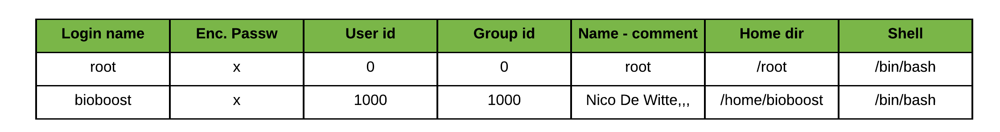

# Users and Groups

**Linux (and Unix) is a multi-user system**. This means that multiple users can access system and hardware resources like applications, file systems, cpu processing, networking, ... at the same time. Is has been developed as such from the beginning.

In order for this multi-user design to work properly, there needs to be decent user and group management available. An administrator needs to be able to restrict access to certain resources, protect users from one another, add users, delete users and so on.

User groups also play an important role on Linux systems. They provide an easy way of managing access and permissions to resources such as files. They also allow sysadmins to more effectively manage user privileges, since they can assign privileges to groups rather than individual users.

## Linux Users

In Linux, there are two types of users: **system users** and **regular users**. Traditionally, system users are used to run non-interactive or background processes on a system, while regular users are used for logging in and running processes interactively.

An easy way to view all of the users on a system is to look at the contents of the `/etc/passwd` file. Each line in this file contains information about a single user.

Output the `passwd` file content with the `cat` command:

```bash
[bioboost@linux][~]$ cat /etc/passwd
```

Rendering an output equivalent to:

::: output
<pre>
root:x:0:0:root:/root:/bin/bash
daemon:x:1:1:daemon:/usr/sbin:/usr/sbin/nologin
bin:x:2:2:bin:/bin:/usr/sbin/nologin
...
gdm:x:125:130:Gnome Display Manager:/var/lib/gdm3:/bin/false
bioboost:x:1000:1000:Nico De Witte,,,:/home/bioboost:/usr/bin/bash
</pre>

The `/etc/passwd` contains one entry per line for each user (user account) of the system. All fields are separated by a colon `:` symbol. It houses a total of seven fields for each user. Generally, an `/etc/passwd` entry consists of the following fields:



* **Username**: this is the actual login of the user.
* **Password**: an `x` character indicates that password is stored as a hashed string in the `/etc/shadow` file. An exclamation mark `!` here indicates a locked account.
* **User ID (UID)**: Although, most commands will usually show the user owner as a name, the operating system is actually associating the user ownership with the `UID` (user id) for that user name. Each user must be assigned a user ID. UID 0 (zero) is reserved for root and UIDs 1-99 are reserved for other predefined accounts. Further UID 100-999 are reserved by the system for administrative and system accounts.
* **Group ID (GID)**: The Group ID (GID) of the primary group of this user.
* **User ID Info**: This is the comment field. It contains the optional extra information about users such as their full name, location, phone number, ...
* **Home directory**: The absolute path to the home directory of user. This is also the default directory a user will be directed too once he/she logged in to the system.
* **Command / shell**: The absolute path to the user shell or command to execute on login. On most debian systems this will default to `/bin/bash`.

::: warning `/usr/sbin/nologin`
Some entries show `/usr/sbin/nologin` as a shell. This is actually not a shell but a command that displays a message that an account is not available after which is closes the connection. It is intended as a replacement shell field for accounts that have been disabled.

Do note that this on its own does not disable/lock the account. It only displays a message on a login attempt. Non-interactive logins are still available if no measures are taken to prevent this too. More on this topic later.
:::

### Super user

In addition to the two user types, there is the **root user** (also called the *superuser*), who has the ability to override any file ownership and permission restrictions. In practice, this means that the superuser has the rights to access anything on his/her own server. This user is used to make system-wide changes, and must be kept secure.

Opening a shell prompt as the superuser can be achieved by executing the command `su` (substitute user), after which you are required to provide the password of the root user. Once logged in as the root user, notice how the prompt changes from `$` to `#`.

Be careful because the root user has the **ability to do anything on the system**. When executing commands as the root user there are some disadvantages that need to be kept in mind:

* no record of system altering commands
* no record of the user that performed the system altering commands
* no access to your user shell environment (that is the environment variables from the user as which you were originally logged in)
* you have to enter the root password, meaning that everyone that requires this type of access, needs to know the password.

It is also possible to configure other user accounts with the ability to assume "superuser rights". Using the `sudo` prefix before the command, the user stays logged in with his/her own user account, but can apply system wide changes. In fact, creating a normal user that has `sudo` (superuser do) privileges for system administration tasks is considered to be best practice, as it counters the previously mentioned disadvantages of switching to the superuser account.

Take for example the action to view the `/etc/shadow` file. Trying this with a normal user accounts gives you a permission denied error.

```bash
cat /etc/shadow
```

::: output
<pre>
cat: /etc/shadow: Permission denied
</pre>
:::

By prefixing the command with `sudo`, we indicate that we want to execute the command with elevated administrator privileges (of course if the account is permitted to do so). Note that one will need to provide its user password before this will work.

```bash
sudo cat /etc/shadow
```

::: output
<pre>
root:!:18786:0:99999:7:::
...
bioboost:******************************************************************:18786:0:99999:7:::
</pre>
:::

::: warning Switching to root with sudo
Note that in many cases the super user account is disabled for login. In this case, a regular user with `sudo` rights can still switch to the root user using the `sudo su` command. The password that is required in this case is not that of the `root` user, but that of the current user. If the root user is disabled, one cannot directly login via a login prompt as the root user.
:::

## Linux Groups

Groups are collections of zero or more users. A user belongs to a default group (primary group), and can also be a member of any of the other groups on a server (secondary groups).

An easy way to view all the groups is to look in the `/etc/group` file.

```bash
[bioboost@linux][~]$ cat /etc/group
```

Which should output something like:

::: output
<pre>
root:x:0:
daemon:x:1:
bin:x:2:
sys:x:3:
adm:x:4:syslog,bioboost
...
dialout:x:20:bioboost
...
sudo:x:27:bioboost
...
bioboost:x:1000:
...
docker:x:998:bioboost
...
</pre>
:::

The fields of each entry are as follows:

* **Group name**: the textual name of the group.
* **password**: the (encrypted/hashed) group password. If this field is empty, no password is needed. If it contains `x`, the `/etc/shadow` file is used for the password.
* **Group ID (GID)**: The numeric Group ID (GID) which is actually used internally by the system.
* **User List**: a comma separated list of the usernames that are members of this group.

By executing the `id` command a user can also see to which groups his/her account belongs.

For example `id` would output:

::: output
<pre>
uid=1000(bioboost) gid=1000(bioboost) groups=1000(bioboost),4(adm),
24(cdrom),27(sudo),30(dip),46(plugdev),108(lpadmin),110(sambashare)
</pre>
:::

To checkout which groups another user belongs too, one can add the username as an argument after the `id` command. For example `id mark`.


## Adding a User

Adding users to the system can be achieved using the command line tools `adduser` followed by the username for the new user. The tool will then present a step by step wizard to set the new user information.

As an example, for adding a new user `mark` to the system one would issue the following command using:

```bash
[bioboost@linux][~]$ sudo adduser mark
```

::: output
<pre>
[sudo] password for bioboost:               
Adding user `mark' ...
Adding new group `mark' (1001) ...
Adding new user `mark' (1001) with group `mark' ...
Creating home directory `/home/mark' ...
Copying files from `/etc/skel' ...
Enter new UNIX password: 
Retype new UNIX password: 
passwd: password updated successfully
Changing the user information for mark
Enter the new value, or press ENTER for the default
	Full Name []: Mark Demeester
	Room Number []:
	Work Phone []:
	Home Phone []:
	Other []: 
Is the information correct? [Y/n] y
</pre>
:::

From this point on `mark` can log in to the system. Creating a new user using this approach will automatically also create a new group with the same name as the user and make it primary group for that user. A new home directory in `/home` is also automatically created for the user.

Since adding users is a dangerous and administrative task, a normal user is not allowed to do this. It would be a major security hole. For that reason, the command needs to be prefixed with `sudo`.

::: tip Switching Users
To switch to another user account, use the `su` command, for example `su mark`. However if not logged in as root, one will need to provide the password of the user account that is being switched to. When logged in as root, or when prefixing the `su` command with `sudo`, the switch can be made without having to enter the user account password. Example: `sudo su mark`
:::

You may also come across tutorials that use the `useradd` command for creating new users. Basically `useradd` is the native binary compiled with the system. `adduser` is a perl script which uses `useradd` binary in the back-end. `adduser` is more user friendly and interactive than its back-end `useradd`. There's no real difference in features provided.

If one were to execute the `useradd` command with just the username as an argument it would just create a new user with the default shell set to `/bin/sh`. No home directory would be created with the basic provided skeleton files (pre-created files and directories for a new user). Also the user account is created without a password, effectively disabling it until a password has been set using passwd`.

```bash
[bioboost@linux][~]$ sudo useradd dennis
```

However, the command options allow us to achieve the same result as `adduser` would:

```bash
[bioboost@linux][~]$ sudo useradd john -m -c "John Rambo,,," -s "/bin/bash"
[bioboost@linux][~]$ sudo passwd john
```

All changes can be viewed by checking out the `/etc/passwd` file using `cat`:

::: output
<pre>
bioboost:x:1000:1000:BioBoost,,,:/home/bioboost:/usr/bin/zsh
mark:x:1001:1001:Mark Demeester,,,:/home/mark:/bin/bash
dennis:x:1001:1001::/home/dennis:/bin/sh
john:x:1002:1002:John Rambo:/home/john:/bin/bash
</pre>
:::

Do note that the home directory of `dennis` is configured as `/home/dennis`, however if you were to check you would notice that the actual directory does not exist.

## Adding a group

<!-- TODO -->

## Adding a User to a Group

<!-- TODO -->

## Removing a User

<!-- TODO -->

<!-- TODO - Also discuss:  -->
<!-- userdel	Deletes a user account and related files.
usermod	Modifies a user account.
addgroup	Adds a group to the system. =>
delgroup	Removes a group from the system.
passwd	Changes user password.
Locking an account
Create group for example for 'students'
Add multiple accounts to the group users 

locking account
changing the shell

https://linuxize.com/post/how-to-add-user-to-sudoers-in-ubuntu/
-->


<!-- Challenges

Try to login to the `daemon` account. Use `sudo su daemon`. What does it display as a message ? What application is outputting this message ? Run it and prove it.

`/usr/sbin/nologin`

Some user entries are showing `/bin/false` as the shell command. Do some research and explain what the difference is with `/usr/sbin/nologin` -->