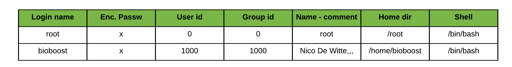

# Chapter 06 - Ownership and Permissions

Linux is a multi-user OS that is based on the Unix concepts of file ownership and permissions to provide security, at the file system level. It is essential that a linux user has a decent understanding of how ownership and permissions work.

## Linux Users

**Linux is a multi-user system**. A basic understanding of users and groups is required before ownership and permissions can be discussed, because they are the entities that the ownership and permissions apply to.

In Linux, there are two types of users: **system users** and **regular users**. Traditionally, system users are used to run non-interactive or background processes on a system, while regular users are used for logging in and running processes interactively.

An easy way to view all of the users on a system is to look at the contents of the `/etc/passwd` file. Each line in this file contains information about a single user.

Print the `passwd` file with the command:

```bash
cat /etc/passwd
```

Rendering an output equivalent to:

```bash
root:x:0:0:root:/root:/bin/bash
daemon:x:1:1:daemon:/usr/sbin:/usr/sbin/nologin
bin:x:2:2:bin:/bin:/usr/sbin/nologin
...
www-data:x:33:33:www-data:/var/www:/usr/sbin/nologin
nobody:x:65534:65534:nobody:/nonexistent:/usr/sbin/nologin
libuuid:x:100:101::/var/lib/libuuid:
...
syslog:x:101:104::/home/syslog:/bin/false
kernoops:x:106:65534:Kernel Oops Tracking
bioboost:x:1000:1000:Nico De Witte,,,:/home/bioboost:/bin/bash
vboxadd:x:999:1::/var/run/vboxadd:/bin/false
```



Although, most commands will usually show the user owner as a name, the operating system is actually associating the user ownership with the `UID` (user id) for that user name. This is also reflected in the `/etc/passwd` file.

### Super user

In addition to the two user types, there is the **root user** (also called the *superuser*), who has the ability to override any file ownership and permission restrictions. In practice, this means that the superuser has the rights to access anything on his/her own server. This user is used to make system-wide changes, and must be kept secure.

Opening a shell prompt as the superuser can be achieved by executing the command `su` (substitute user), after which you are required to provide the password of the root user. Once logged in as the root user, notice how the prompt changes from `$` to `#`.

Be careful because the root user has the **ability to do anything on the system**. When executing commands as the root user there are some disadvantages that need to be kept in mind:

* no record of system altering commands
* no record of the user that performed the system altering commands
* no access to your user shell environment (that is the environment variables from the user as which you were originally logged in)
* you have to enter the root password, meaning that everyone that requires this type of access, needs to know the password.

It is also possible to configure other user accounts with the ability to assume "superuser rights". Using the `sudo` prefix before the command, the user stays logged in with his/her own user account, but can apply system wide changes. In fact, creating a normal user that has `sudo` (superuser do) privileges for system administration tasks is considered to be best practice, as it counters the previously mentioned disadvantages of switching to the superuser account.

::: warning Switching to root with sudo
Note that in many cases the super user account is disabled for login. In this case, a regular user with `sudo` rights can switch still to the root user using the `sudo su` command. However, one cannot directly login via a login prompt as the root user.
:::

## Linux Groups

Groups are collections of zero or more users. A user belongs to a default group (primary group), and can also be a member of any of the other groups on a server (secondary groups).

An easy way to view all the groups is to look in the `/etc/group` file.

```bash
cat /etc/group
```

Which should output something like:

::: output
<pre>
root:x:0:
daemon:x:1:
bin:x:2:
sys:x:3:
adm:x:4:
tty:x:5:
...
bluetooth:x:116:
colord:x:117:
pulse:x:118:
pulse-access:x:119:
mdm:x:120:
nopasswdlogin:x:121:
rtkit:x:122:
saned:x:123:
bioboost:x:1000:
...
</pre>
:::

By executing the `id <username>` command a user can also see to which groups his/her account belongs.

For example `id bioboost` would output:

::: output
<pre>
uid=1000(bioboost) gid=1000(bioboost) groups=1000(bioboost),4(adm),
24(cdrom),27(sudo),30(dip),46(plugdev),108(lpadmin),110(sambashare)
</pre>
:::

Similar to user ownership, the association of a file with a group is not actually done internally by the operating system by name, but by the `GID` (group id) of the group.

## Adding Users to the System

<!-- Needs some refactoring later on -->

Adding users to the system can be achieved using the command line tools `useradd` or `adduser`.

`useradd` is native binary compiled with the system. `adduser` is a perl script which uses `useradd` binary in back-end. `adduser` is more user friendly and interactive than its back-end `useradd`. There's no difference in features provided.

To create a new user account named `mark` using the `adduser` command one would run:

```bash
nico@biosdeb:/tmp$ sudo adduser mark
```

::: output
<pre>
[sudo] password for nico:               
Adding user `mark' ...
Adding new group `mark' (1001) ...
Adding new user `mark' (1001) with group `mark' ...
Creating home directory `/home/mark' ...
Copying files from `/etc/skel' ...
Enter new UNIX password: 
Retype new UNIX password: 
passwd: password updated successfully
Changing the user information for mark
Enter the new value, or press ENTER for the default
	Full Name []: Mark Jenkins
	Room Number []: 101
	Work Phone []: 0
	Home Phone []: 0
	Other []: 
Is the information correct? [Y/n] Y
</pre>
:::

From this point on `mark` can log in to the system.

::: tip Switching Users
To switch to another user account, use the `su` command. However if not logged in as root, one will need to provide the password of the user account that is being switched to. When logged in as root, or when prefixing the `su` command with `sudo`, the switch can be made without having to enter the user account password. Example: `sudo su mark`
:::

## File Metadata

In Linux, each file and directory does not only contain its actual data, but is also accompanied by metadata. **Metadata is data about data**.

The most common way to view the metadata of a file is to use `ls` with the long listing option `-l`, e.g.

```bash
ls -l <somefile>
```

If you want to view the metadata of all of the files in your current directory, run the command without an argument, like this

```bash
ls -l
```

You can also list the content of another directory without traversing to it but by specifying it as an argument to the `ls` command.

For example `ls -l /etc/network` which outputs:

::: output
<pre>
total 24
drwxr-xr-x 2 root root 4096 Nov  3 13:25 if-down.d
drwxr-xr-x 2 root root 4096 Nov  3 13:25 if-post-down.d
drwxr-xr-x 2 root root 4096 Nov  3 13:25 if-pre-up.d
drwxr-xr-x 2 root root 4096 Nov  3 13:29 if-up.d
-rw-r--r-- 1 root root  240 Nov  3 13:52 interfaces
drwxr-xr-x 2 root root 4096 Jan 28  2019 interfaces.d
</pre>
:::

Running `ls -l` inside your home directory should result in a listing of all the **metadata** of all files in your home directory.

```bash
nico@biosdeb:~$ ls -l
```

::: output
<pre>
total 32
drwxr-xr-x 2 nico nico 4096 Nov  3 13:54 Desktop
drwxr-xr-x 2 nico nico 4096 Nov  3 13:54 Documents
drwxr-xr-x 2 nico nico 4096 Nov  3 13:54 Downloads
drwxr-xr-x 2 nico nico 4096 Nov  3 13:54 Music
drwxr-xr-x 2 nico nico 4096 Nov  3 13:54 Pictures
drwxr-xr-x 2 nico nico 4096 Nov  3 13:54 Public
drwxr-xr-x 2 nico nico 4096 Nov  3 13:54 Templates
drwxr-xr-x 2 nico nico 4096 Nov  3 13:54 Videos
</pre>
:::

Dissecting the above output a bit results in the next diagram.


1. The first character (prefixing the permissions) contains the **file type** and can be one of these:

   * `-`: regular file
   * `d`: directory (a file of a specific format that lists other files)
   * `l`: a hard or soft link (basically a shortcut to another file)
   * `c`: a character device file
   * `b`: a block device file
   * `p`: a pipe file
   * `s`: a socket file

2. The next ten characters display the **permissions** or **filemode** of the file. These determine the permissions the owner, group and others have on the file or directory.

3. Next is the **hard link count** field. This field counts how many links exist to this directory. This is at least two and one extra for each subdirectory.

   * Any object in the file system must have a directory entry that connects it into the file system. For example, if you have a directory like "/tmp", there's a pointer in the root directory ("/") that points to the "tmp" directory entry. So that gives you one link.
   * Every directory contains the "." link that points back to itself. So that gives the minimum value of 2 links per directory.
   * Every subdirectory has a ".." link that points back to its parent, incrementing the link count on the parent directory by one for each subdirectory created.

4. The following part contains the **user** that owns the file. By default, users will own the files that they create. While this ownership can be changed, this function requires administrative privileges.

5. Next is the **group** on which the group permissions are applied. Members of this group will have these permissions applied when they want to access the file/directory. By default, the primary group of the user who creates the file will be the group owner of any new files. Users are allowed to change the group owner of a file to any group that they belong.

6. After the group comes the **file size** in bytes (unless you provided the `-h` flag to `ls` to request human readable file sizes). For directories this does not actually describe the total size of the directory, but rather how many bytes are reserved to track the filenames in the directory.

7. The second to last field is the **modification timestamp** which indicates when the file was last modified. In case of a directory, this timestamp reflects the last time a file was added or deleted.

::: tip Directory Link Counts and Hidden Directories
Interesting dissection on where the link count comes from [Directory Link Counts and Hidden Directories](https://digital-forensics.sans.org/blog/2009/06/19/directory-link-counts-and-hidden-directories).
:::

Even more detailed information about a file can be obtained using the `stat` command.

```bash
nico@biosdeb:/tmp$ stat test.txt 
```

::: output
<pre>
  File: test.txt
  Size: 6         	Blocks: 8          IO Block: 4096   regular file
Device: 801h/2049d	Inode: 661187      Links: 1
Access: (0644/-rw-r--r--)  Uid: ( 1000/    nico)   Gid: ( 1000/    nico)
Access: 2019-11-26 09:45:19.271159998 +0100
Modify: 2019-11-26 09:45:16.124734000 +0100
Change: 2019-11-26 09:45:16.124734000 +0100
 Birth: -
</pre>
:::

## About Ownership and Permissions

As can be seen from the serious section, each and every file is owned by a single user and a single group, and has its own access permissions.

The following image shows a break down of the filemode column into its components.


The next 9 characters make up the permission classes, namely user (owner), group, and other. The order of the classes is consistent across all Linux distributions.

* **User**: The owner of a file belongs to this class
* **Group**: The members of the file's group belong to this class
* **Other**: Any users that are not part of the user or group classes belong to this class.

The next thing to pay attention to are the sets of three characters, or **triads**, as they **denote the permissions**, in **symbolic form**, that each class has for a given file.

In each triad, read, write, and execute permissions are represented in the following way:

* **Read**: Indicated by an `r` in the first position
* **Write**: Indicated by a `w` in the second position
* **Execute**: Indicated by an `x` in the third position.

A hyphen (-) in the place of one of these characters indicates that the respective permission is not available for the respective class.

Here is a quick breakdown of the access that the three basic permission types grant

* **Read**
  * For a normal file, read permission allows a user to **view the contents of the file**.
  * For a directory, read permission allows a user to **view the names of the files in the directory**.

* **Write**
  * For a normal file, write permission allows a user to **modify and delete the file**.
  * For a directory, write permission allows a user to **delete the directory or modify its contents (create, delete, and rename files in it)**.

* **Execute**
  * For a normal file, execute permission **allows a user to execute a file** (the user **must also have read permission**). As such, execute permissions must be set for executable programs and shell scripts before a user can run them.
  * For a directory, execute permission allows a user to access, or traverse, into (i.e. `cd`) and access metadata about files in the directory (the information that is listed in an `ls -l`).

<!-- ::: tip The s-bit
In some cases there may be an `s` instead of `x` for the execute permission of the user. This means that the file, when executed, is ran as the owner of that file and not the one executing it. When an `s` permission is placed on the group of a directory, files created inside of the directory are created with the group specified on the parent directory instead of the primary group of the user creating the file.
::: -->

Something to note is that even though many permissions combinations are possible, only certain ones make sense in most situations. For example, write or execute access is almost always accompanied by read access, since it's hard to modify, and impossible to execute, something you can't read.

Let's see some examples

| File Type | Permissions | User | Group | Description |
| ---- | ---- | ---- | ---- | ---- |
| `-` | `rw-------` | `mark` | `developers` | `mark` (the owner of the file) can read the file and write to it. The `developers` group and `others` have no permissions on the file. |
| `-` | `rwxr-x---` | `mark` | `developers` | `mark` (the owner of the file) has full control over the file (including execution). The users of the group `developers` can read and execute the file. `others` have no permissions on the file. |
| `d` | `rwxr-x---` | `mark` | `www-data` | `mark` (the owner of the directory) has full control. The `www-data` group users can read and traverse the directory but cannot create files in it. `others` have no permissions in this directory. |
| `d` | `rwx--x---` | `mark` | `developers` | `mark` (the owner of the file) has full control over the file (including execution). The users of the group `developers` can traverse to the directory using `cd` but cannot list the content of the directory using `ls`. |
| `d` | `rwx-wx---` | `mark` | `developers` | `mark` (the owner of the directory) has full control. The users of the group `developers` can traverse to the directory using `cd` but cannot list the content of the directory using `ls`. They can however create and delete files in the directory. `developers` can even delete files they do not have read or write access to, as long as the user knows the name of the file. |
| `d` | `rwxrw---` | `mark` | `developers` | `mark` (the owner of the directory) has full control. `developers` can list the directory content but cannot traverse to it using `cd` or access any of its files. |

::: warning Read but not Traverse
While a bit weird, the permissions `--x` do not allow the user to list the content of the directory, it does however not restrict access to existing files. Another example of this is an upload directory which is often given the permissions `-wx`. This allows you to traverse to the directory and create new files. However you can only access files you know of, because you can't list the existing files inside of the directory.
:::

As you may have noticed, the owner of a file usually enjoys the most permissions, when compared to the other two classes. Typically, you will see that the group and other classes only have a subset of the owner's permissions (equivalent or less).

## Changing Ownership

To change the ownership of files and directories the `chown` (change owner) and `chgrp` (change group) commands can be used. However many linux user will often use the `chown` command to do both these tasks.

To change the owner of a file, use the `chown` command followed by the new owner and the file you wish to change. For example to set `mark` as the owner of the file `/tmp/test.txt`, execute:

```bash
chown mark /tmp/test.txt
```

This command can also be used to change the group. In this case the name of the group needs to be prefixed with a color `:` as shown in the next example.

```bash
chown :teachers /tmp/test.txt
```

To change both the owner and group separate both using a colon `:`.

```bash
chown mark:teachers /tmp/test.txt
```

All these commands can also be executed recursively by adding `-R` as an argument. This will change the owner, group or mode (according to the issued command) for the given directory and all files and other directories inside that specified directory. Be careful when using the recursive argument as it can really mess up your day, especially in combination with the `sudo` prefix.

::: tip Temporary Files
If you wish to experiment with file permissions, feel free to create some files and directories below `/tmp`. No harm to experiment there. Restarting the system will remove all the files and reset the temporary filesystem.
:::

## Changing Permissions

On Linux and other Unix-like operating systems, there is a set of rules for each file which defines who can access that file, and how they can access it. These rules are called file permissions or file modes. The command `chmod` stands for "change mode", and it is used to define the way a file can be accessed.

In general, the `chmod` command take the following form:

```bash
chmod <options> <permissions> <filenames>
```

Permissions define the permissions for the owner of the file (the "user"), members of the group who own the file (the "group"), and anyone else ("others"). There are two ways to represent these permissions: with symbols (alphanumeric characters), or with octal numbers (the digits 0 through 7).

### Symbolic

The `chmod` has a really user friendly approach for changing user permissions. All you need to do is specify the class (user, group or others), the type of change (adding, removing or setting the permissions) and the permissions themselves (read, write or execute). This can all be done using a symbolic approach.

* The letters `u`, `g`, and `o` stand for "user", "group", and "other".
* The equals sign `=` means "set the permissions exactly like this"
* The equal sign can also be replaced by a plus sign `+` or a minus sign `-`. This respectively adds the permissions or removes permissions for the user, group or others.
* The letters `r`, `w`, and `x` stand for "read", "write", and "execute", respectively.
* The commas separate the different classes of permissions, and there are no spaces in between them.

The next table shows some examples.

| Command | Description |
| ---- | ---- |
| `chmod g+w /tmp/file` | Add write permissions for the group |
| `chmod g-x /tmp/file` | Remove executions permissions from the group |
| `chmod ugo+r /tmp/file` | Give the owner, group and others read permissions |
| `chmod u+rwx,g-x,o-rwx /tmp/file` | Give the owner all the permissions, take away the execute permissions for the group and give none to the rest. |
| `chmod u=rw,g=rw,o=r /tmp/file` | Give the owner read and write permissions, same as the group and leave other wist just read permissions |

<!-- Maybe add before and after to examples above -->

### Octal numbers

In this case an octal value specifies the permissions for each class. Here the digits `7`, `5`, and `4` each individually represent the permissions for the user, group, and others, in that order. Each digit is a combination of the numbers `4`, `2`, `1`, and `0`:

* `4` stands for "read",
* `2` stands for "write",
* `1` stands for "execute", and
* `0` stands for "no permission."

For example:

* `chmod 700 /tmp/file` will result in `rwx------`
* `chmod 744 /tmp/file` will result in `rwxr--r--`
* `chmod 664 /tmp/file` will result in `rw-rw-r--`

<!-- TODO: -->
<!-- Creation mode -->
