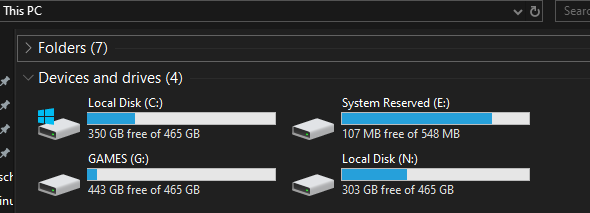
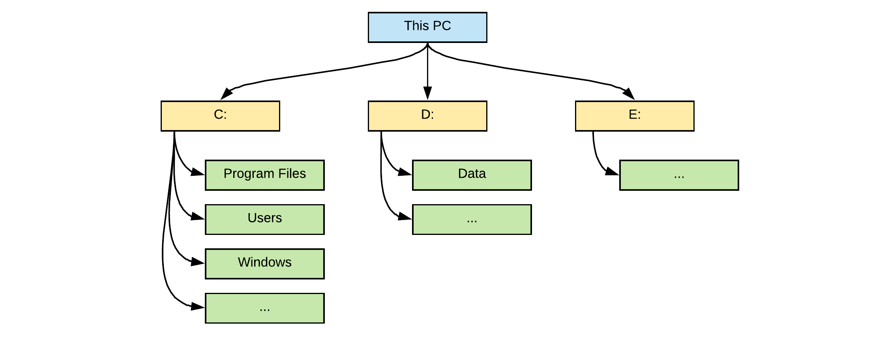
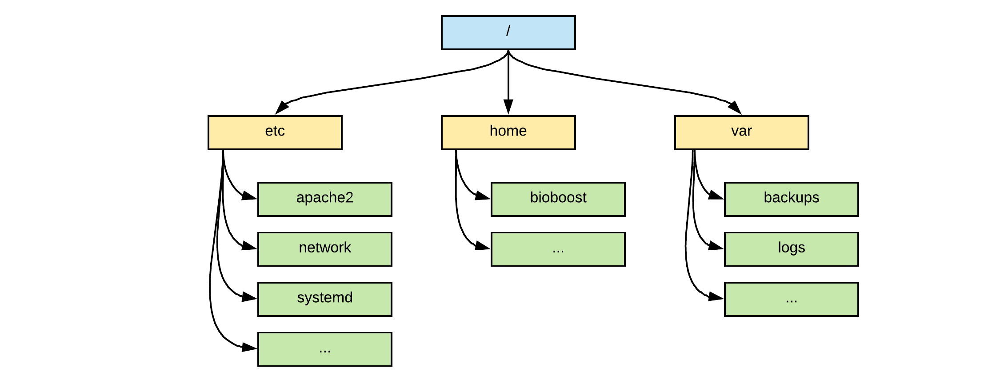
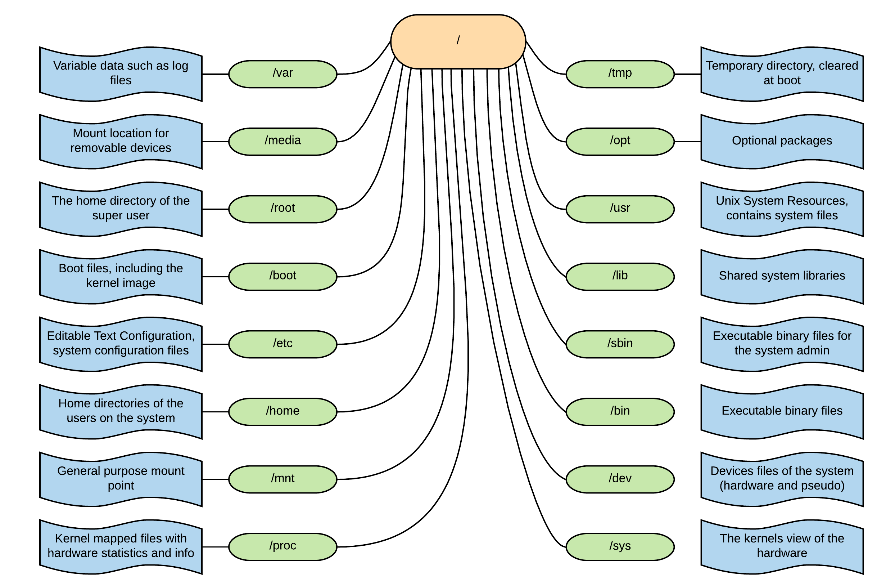
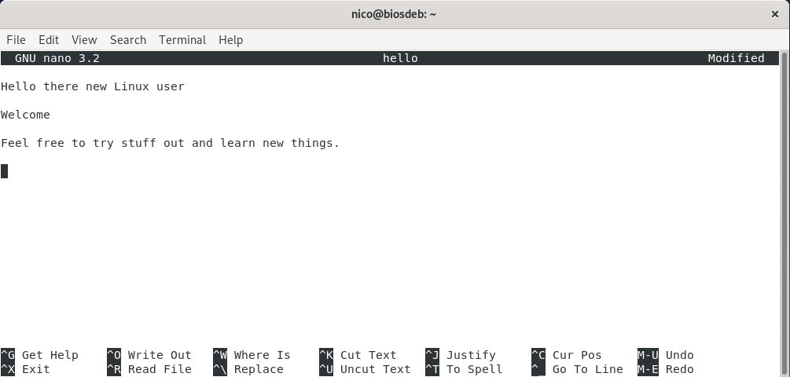

# The Filesystem

A filesystem typically allows us to store both files and directories. **Files are used to store data** such as text, graphics and programs. **Directories** (aka "folders") are used to provide a **hierarchical organization structure**. Next to our data, the filesystem also stores **metadata** such as who's the owner of the file, creation and modification timestamps, size information, ...

## On Windows

The way the linux filesystem is structured is quitte different from the way Windows handles it. On a Windows system, the top level of the directory structure is called `This PC`.



Each physical device (hard drive, DVD drive, USB thumb drive, network drive, etc.) shows up under `This PC`, each assigned a drive letter, such as `C:` or `D:`.



Each device may have a certain filesystem on it (examples are FAT, FAT32, NTFS, ...).

## On Linux

Like Windows, a Linux directory structure has a top level, however it is not called `My Computer`, but rather the **root directory** and it is symbolized by the `/` character.

There are also **no drives in Linux**. Each physical device is accessible under a directory, not a drive letter.



Linux inherits many of its concepts of filesystem organization from its Unix predecessors. As far back as 1979, Unix was establishing standards to control how compliant systems would organize their files.

The **Linux File system Hierarchy Standard** (checkout [Filesystem Hierarchy Standard](http://www.pathname.com/fhs/)), or FHS for short, is a prescriptive standard maintained by the Linux Foundation that establishes the organizational layout that Linux distributions should uphold for **interoperability**, **ease of administration**, and the **ability to implement cross-distro applications reliably**.

::: tip Everything is a File
One important thing to mention when dealing with these systems is that Linux implements just about **everything as a file**. This means that a text file is a file, a directory is a file (simply a list of other files), a printer is represented by a file (the device drivers can send anything written to the printer file to the physical printer), a serial port is a file, commands and applications are files, etc.

Although this is in some cases an oversimplification, it informs us of the approach that the designers of the system encouraged: passing text and bytes back and forth and being able to apply similar strategies for editing and accessing diverse components.
:::

## Finding your Way

Before actually delving into the file system layout, you need to know a few basics about how to navigate a file system from the command line. The next sections will cover the bare minimum to get you on your feet.

The first thing you need to do is orient yourself in the filesystem. There are a few ways to do this, but one of the most basic ways is with the `pwd` command, which stands for "print working directory":

```bash
[bioboost@linux][~]$ pwd
```

::: codeoutput
```
/home/bioboost
```
:::

This simply returns the **full path of the directory you are currently located in**, for example `/home/bioboost`.

To see what files are in the current directory, you can issue the `ls` command, which stands for "list".

```bash
[bioboost@linux][~]$ ls
```

::: codeoutput
```
Desktop   Documents  Downloads  Music
Pictures  Public     Templates  Videos
```
:::

This will give an overview of all (excluding hidden files and directories) directories and files in your current directory.

The `ls` command can be used to display the contents of a directory as well as detailed information about the files that are within a directory. The `ls` command can take some option flags. Flags modify the commands default behavior to either process or display the data in a different way.

The first most common option is probably `-l`, which forces the command to output information in long-form:

```bash
[bioboost@linux][~]$ ls -l
```

::: codeoutput
```
total 32
drwxr-xr-x 2 bioboost bioboost 4096 Nov  3 13:54 Desktop
drwxr-xr-x 2 bioboost bioboost 4096 Nov  3 13:54 Documents
drwxr-xr-x 2 bioboost bioboost 4096 Nov  3 13:54 Downloads
drwxr-xr-x 2 bioboost bioboost 4096 Nov  3 13:54 Music
drwxr-xr-x 2 bioboost bioboost 4096 Nov  3 13:54 Pictures
drwxr-xr-x 2 bioboost bioboost 4096 Nov  3 13:54 Public
drwxr-xr-x 2 bioboost bioboost 4096 Nov  3 13:54 Templates
drwxr-xr-x 2 bioboost bioboost 4096 Nov  3 13:54 Videos
```
:::

This produces output with one line for each file or directory (the name is on the far right). This has a lot of information that we are not interested in right now. One part we are interested in though is the very **first character**, which tells us what **kind of file** it is. The three most common types are:

* `-`: Regular file
* `d`: Directory (a file of a specific format that lists other files)
* `l`: A hard or soft link (basically a shortcut to another file on the system)

The second most important option to the `ls` command is the `-a` flag, which lists all files, **including hidden files**. In Linux, files are **hidden** automatically if they begin with a dot `.`:

```bash
[bioboost@linux][~]$ ls -a
```

::: codeoutput
```
.                           .npm
..                          .nuget
.bash_history               .oh-my-zsh
.bash_logout                .omnisharp
.bashrc                     .pam_environment
.bashrc.save                Pictures
.bzr.log                    .pki
.cache                      .profile
.config                     Public
Desktop                     snap
Documents                   .ssh
dotfiles                    .templateengine
.dotnet                     Templates
...
```
:::

::: tip .git directory
Hidden files always start with a `.`. That is why the `.git` directory in a git repo is also prefixed with a dot `.`.
:::

The first two entries, `.` and `..` have a special meaning. The `.` directory is a shortcut that means "the current directory". This is often used when executing shell scripts in the current directory. The `..` directory is a shortcut that means "the current directory's parent directory". In other words, one directory up.

### Recursive Listing

There will be times when you want to display all of the files in a directory as well as all of the files in all subdirectories under a directory. This is called a **recursive listing**. To perform a recursive listing, use the `-R` option to the `ls` command.

```bash
[bioboost@linux][~]$ ls -R
```

::: codeoutput
```
.:
Desktop  Documents  Downloads  Music  Pictures  Public  Templates  Videos
./Desktop:
./Documents:
./Downloads:
./Music:
./Pictures:
./Public:
./Templates:
./Videos:
```
:::

::: warning Recursive Listing Large Hierarchies
Try the command `ls -R /` to recursively list the whole filesystem. Use CTRL-C to stop the command.
:::

::: tip tree
A more visual tool for listing directories recursively is the `tree` tool. You can install it using the command `sudo apt install tree`.
:::

## Traversing the Filesystem

Now that you can find out where you are in the file system and see what is around you, it is time to learn how to move throughout the file system.

To **change to a different directory**, you issue the `cd` command, which stands for "change directory":

```bash
[bioboost@linux][~]$ cd /home
[bioboost@linux][/home]$
```

The first `/` character represents the **root directory** while each other `/` character is used to separate the directory names.

You can follow the `cd` command with either an absolute or a relative pathname.

* An **absolute path** is a file path that specifies the location of a directory from the top of the directory tree (the root of the filesystem `/`). Absolute paths begin with a "/", as can be seen in the example above.
* A **relative path** is a file path that is relative to the current working directory. This means that instead of defining a location from the top of the directory structure, it defines the location in relation to where you currently are.

For instance, if you want to move to the home directory of the user `bioboost`, while in the directory `/home`, you can issue the command:

```bash
[bioboost@linux][/home]$ cd bioboost
[bioboost@linux][~]$
```

The lack of the `/` from the beginning tells the shell to use the current directory as the base for looking for the path.

::: tip Home
Under this `/home` directory there will be a directory for most users on the system (normal users). The directory name will be the same as the login name of the user. This is called the home directory of the user.
:::

This is where the `..` directory link comes in handy. To **move to the parent directory of your current directory**, you can type:

```bash
[bioboost@linux][~]$ cd ..
[bioboost@linux][/home]$
```

This will jump 1 level up towards the root of the filesystem.

Your home directory is a very important directory. To begin with, when you open a shell, you should automatically be placed in your home directory.

```bash
[bioboost@linux][~]$
```

Additionally, your home directory is one of the few directories where you have the full control to create and delete additional files and directories. On most Linux distributions, the only users who can access any files in your home directory are you and the administrator on the system (the `root` user).

There is a shortcut to traverse to your home directory, and that is by issueing the `cd` command without any arguments.

```bash
[bioboost@linux][/]$ cd
[bioboost@linux][~]$
```

This brings you immediately to your home directory.

Another way to achieve this is to use the `~` symbol, which symbolizes the path to your home directory.

```bash
[bioboost@linux][/]$ cd ~
```

## An Overview of the Linux Filesystem Layout

The first thing you need to know when viewing a Linux file system is that the file system is contained within a single tree, regardless of how many devices are incorporated.

What this means is that all components accessible to the operating system are represented somewhere in the main file system. If you use Windows as your primary operating system, this is different from what you are used to. In Windows, each hard drive or storage space is represented as its own file system, which are labeled with letter designations (C: being the standard top-level directory of the system file hierarchy and additional drives or storage spaces being given other letter labels).

In Linux, every file and device on the system resides under the **root**, which is denoted by a starting `/`. This is not to be confused with the home directory of the *root* user which is located at `/root`.

Thus, if one wanted to go to the top-level directory of the entire operating system and see what is there, one could use the `cd` command followed by the root directory `/` to traverse to the root directory and then simply use the `ls` command to display the files and directories there.

```bash
[bioboost@linux][~]$ cd /
[bioboost@linux][/]$ ls
```

::: codeoutput
```
bin   dev   lib    libx32      mnt   root  snap  tmp
boot  etc   lib32  lost+found  opt   run   srv   usr
data  home  lib64  media       proc  sbin  sys   var
```
:::

Every file, device, directory, or application is located under this one directory. Under this, we can see the beginnings of the rest of the directory structure.

One of the principles guiding the organization of the file system is to allow it to be split across multiple disk partitions (or multiple disks) in a rational manner, and to allow appropriate pieces of it to be shared between machines. Key to this is the notion of the root partition (`/`, the parent of the entire file system).

When Linux boots, the kernel attaches a single file system partition all by itself. This is known as the **root partition**. Any other partitions that need to be attached are mounted by the `mount` command, usually under control of entries in the file `/etc/fstab`. Because in the early stages of startup, only the root file system is available, it **must contain everything needed for the system to function** and attach the other pieces of the file system.

Tools on the root partition include the `init` program (which starts all the other processes), a shell, `mount` and the `/etc/fstab` file. The File System Hierarchy standard specifies a number of directories that must lie within the root partition.

Below is a typical Linux file system hierarchy.



Let's take a closer look at the different directories which can be found under the root.

**/bin** - This directory contains basic commands and programs that are needed to achieve a minimal working environment upon booting. These are kept separate from some of the other programs on the system to allow you to boot the system for maintenance, even if other parts of the file system may be damaged or unavailable. If you search this directory, you will find that both `ls` and `pwd` reside here. The `cd` command is actually built into the shell we are using (bash), which is in this directory too.

**/boot** - This directory contains the actual files, images, and kernels necessary to boot the system. `/boot` contains the core components that actually allow the system to boot. If you need to modify the **bootloader** on your system, or if you would like to see the actual **kernel files** and **initial ramdisk** (`initrd`), you can find them here. This directory must be accessible to the system very early on.

**/dev** - This directory houses the **files that represent devices** on your system. Every hard drive, terminal device, input or output device available to the system is represented by a file here. Depending on the device, you can operate on the devices in different ways. For instance, for a device that represents a hard drive, like `/dev/sda`, you can mount it to the file system to access it. On the other hand, if you have a file that represents a line printer like `/dev/lpr`, you can write directly to it to send the information to the printer.

**/etc** - Originally stood for **"et cetera"**, as it was originally used for all the stuff that didn't fit into other directories. Nowadays the directory hosts configuration files and is often referred to as the **"Editable Text Configuration"** files directory. This is one area of the file system where you will spend a lot of time if you are working as a system administrator. This directory is basically a **configuration directory for various system-wide services**. By default, this directory contains many files and subdirectories. It contains the configuration files for most of the activities on the system, regardless of their function. In cases where multiple configuration files are needed, many times an application-specific subdirectory is created to hold these files. If you are attempting to configure a service or program for the entire system, this is a great place to look.

::: tip etc
As with many things in the Linux world, there have been some heated discussions on what `etc` actually stands for. Some say *et cetera*, *Editable Text Configuration*, or *Extended Tool Chest*.

However, on March 3, 2007, [Dennis Ritchie](https://wikipedia.org/wiki/Dennis_Ritchie), co-creator of Unix, made it very clear what "etc" initially stood for:

> I assure you that the original contents of /etc were the "et cetera" that didn't seem to fit elsewhere. Other variants might do their own etymologies differently.
>
> Regards,
> Dennis
:::

**/home** - This location contains the **home directories of the users on the system** (except for the administrative user, root and some user accounts that are for system services). If you have created other users, a directory matching their username will typically be created under this directory. Inside each home directory, the associated user has write access. Typically, regular users only have write access to their own home directory. This helps keep the file system clean and ensures that not just anyone can change important files. Within the home directory, there are often hidden files and directories (represented by a starting dot) that allow for user-specific configuration of tools. You can often set system defaults in the `/etc` directory, and then each user can override them as necessary in their own home directory.

**/lib** - This directory is used for all of the **shared system libraries** that are required by the `/bin` and `/sbin` directories. These files basically provide functionality to the other programs on the system. This is one of the directories that you will not have to access often.

**/lost+found** - This is a special directory that **contains files recovered** by `/fsck`, the Linux file system repair program. If the file system is damaged and recovery is undertaken, sometimes files are found but the reference to their location is lost. In this case, the system will place them in this directory. In most cases, this directory will remain empty. If you experience corruption or any similar problems and are forced to perform recovery operations, it's always a good idea to check this location when you are finished.

**/media** - This directory is typically empty at boot. Its real purpose is simply to provide a location to **mount removable media** (like a USB drive). If your Linux operating system ever mounts a media disk and you are unsure of where it placed it, this is a safe bet.

**/mnt** - This directory is similar to the `/media` directory in that it exists only to serve as an **organization mount point for file systems**. In this case, this location is usually used to **mount file systems like external hard drives or network area storage devices**, etc. This directory is often used in a VPS environment for mounting network accessible drives. If you have a file system on a remote system that you would like to mount on your server, this is a good place to do that.

**/opt** - This directory's **usage is rather ambiguous**. It is used by some distributions, but ignored by others. Typically, it is used to **store optional packages**. In the Linux distribution world, this usually means packages and applications that were not installed from the repositories. For instance, if your distribution typically provides the packages through a package manager, but you installed program X from source, then this directory would be a good location for that software. Another popular option for software of this nature is in the `/usr/local` directory.

**/proc** - The `/proc` directory is actually more than just a regular directory. It is actually a **pseudo-file system** of its own that is mounted to that directory. The proc file system does not contain real files, but is instead dynamically generated to **reflect the internal state of the Linux kernel**. This means that we can check and modify different information from the kernel itself in real time. For instance, you can get detailed information about the processor and its cores by displaying the content of `/proc/cpuinfo`.

**/root** - This is the **home directory of the administrative user** (called "root"). It functions exactly like the normal home directories, but is housed here instead.

**/run** - This directory is for the operating system to write **temporary runtime information** during the early stages of the **boot process**.

**/sbin** - This directory is much like the `/bin` directory in that it contains **programs deemed essential for using the operating system**. The distinction is usually that `/sbin` contains the more dangerous commands that are available to the **system administrator**, while the other directory contains programs for all of the users of the system. Examples of such binaries are `iptables`, `mkfs`, `lsmod`, `chroot`, ...

**/selinux** - This directory contains **information involving security enhanced Linux**. This is a kernel module that is used to provide access control to the operating system.

**/srv** - This directory is used to contain **data files for services provided by the system**. In most cases, this directory is not used too much because its functionality can be implemented elsewhere in the filesystem.

**/tmp** - This is a directory that is used to store **temporary files** on the system. It is **writable by anyone** on the computer and **does not persist upon reboot**. This means that any files that you need just for a little bit can be put here. They will be automatically deleted once the system shuts down.

**/usr**  - Originaly housed the user's home directories. Later these were moved to `/home` and `usr` became **Unix System Resources**. This directory is one of the largest directories on the system. It basically includes a set of folders that look similar to those in the root `/` directory, such as `/usr/bin` and `/usr/lib`, basically containing the same binaries and libraries as `/bin` and `/lib`. This location is used to store all **non-essential programs, their documentation, libraries, and other data** that are not required for the most minimal usage of the system. This is where most of the files on the system will be stored. Some important subdirectories are `/usr/local`, which is an alternative to the `/opt` directory for storing locally compiled programs. Another interesting thing to check out is the `/usr/share` directory, which contains documentation, configuration files, and other useful files.

**/var** - This directory is supposed to contain **variable data**. In practice, this means it is used to contain information or directories that you expect to grow as the system is used. For example, **system logs**, **email in-boxes** and **backups** are housed here. Another popular use of this directory is to store **web content if you are operating a web server**.

## Basic Filesystem Manipulation

While looking at files and directories is all nice, but in the end you will probable want to create your own directories and files. For this you will need to enlarge your command line toolset a bit more.

### Viewing File Content

To output the content of one or more files to the terminal, use the `cat` command. The general syntax is `cat file1 file2 ...`. The `cat` command actually **concatenates the content of the files specified** and outputs it to the terminal.

To view for example the file systems that are mounted on your current setup, you can view the file `/etc/fstab`.

```bash
[bioboost@linux][~]$ cat /etc/fstab
```

::: codeoutput
```
# /etc/fstab: static file system information.
#
# Use 'blkid' to print the universally unique identifier for a
# device; this may be used with UUID= as a more robust way to name devices
# that works even if disks are added and removed. See fstab(5).
#
# &lt;file system&gt;  &lt;mount point&gt;  &lt;type&gt;  &lt;options&gt;  &lt;dump&gt;  &lt;pass&gt;
PARTUUID=2fb1bb7c-ad70-4a31-8afb-0a585e9e61ac  /boot/efi  vfat  umask=0077  0  0
UUID=006b9140-c610-462d-9cd9-5e7cd59024d6  /  ext4  noatime,errors=remount-ro  0  0
/dev/mapper/cryptswap  none  swap  defaults  0  0
UUID=28E52BD11CEE95C6  /data  ntfs  defaults  0  0
```
:::

Or to display some information about the CPU of your system, check the kernel mapped file `/proc/cpuinfo`.

```bash
[bioboost@linux][~]$ cat /proc/cpuinfo
```

::: codeoutput
```
processor	: 0
vendor_id	: GenuineIntel
cpu family	: 6
model		: 142
model name	: Intel(R) Core(TM) i7-8665U CPU @ 1.90GHz
stepping	: 12
microcode	: 0xca
cpu MHz		: 800.106
cache size	: 8192 KB
physical id	: 0
siblings	: 8
core id		: 0
cpu cores	: 4
```
:::

Want to find out what shells are available on your system, then display the content of the file `/etc/shells` using the command `cat /etc/shells`.

```bash
[bioboost@linux][~]$ cat /etc/shells
```

::: codeoutput
```
# /etc/shells: valid login shells
/bin/sh
/bin/bash
/usr/bin/bash
/bin/rbash
/usr/bin/rbash
/bin/dash
/usr/bin/dash
/usr/bin/tmux
/bin/zsh
/usr/bin/zsh
```
:::

### Creating a File

There are several ways of creating a new file, including using a program designed to edit a file (a text editor).

One of the most common command line tools used to create an empty file, is the `touch` command.

```bash
[bioboost@linux][~]$ touch hello
[bioboost@linux][~]$ ls
```

::: codeoutput
```
Desktop  Documents  Downloads  hello
Music    Pictures   Public     Templates
Videos
```
:::

::: tip touch
`touch` is actually not intended to be used as a command to create files. It's primary use is to update the timestamps (creation and modification) on files to the current time. As a side-effect, if the file is non-existent, it is created.
:::

### Editing files

A file can be edited using a text-editor. Many command line editors exist. From basic usage to full blown programming tools.

Some beginner friendly editors are `nano` and `joe`. More common editors used for programming are `vim` and `emacs`.

`nano` should be pre-installed on your system. Use it to edit the content of a file in your home directory. If you specify a file that doesn't exist yet, nano will create it for you.

```bash
[bioboost@linux][~]$ nano hello
```



Some shortcuts in nano:

* `CTRL-x`: exit
* `CTRL-c`: cancel
* `CTRL-o`: write to filesystem
* `CTRL-k`: cut
* `CTRL-u`: uncut

### Creating Directories

To create a directory, one can use the `mkdir` command. Just specify the name of the directory after the command as an argument.

```bash
[bioboost@linux][~]$ mkdir files
[bioboost@linux][~]$ ls
```

::: codeoutput
```
Desktop   Documents  Downloads   files
hello     Music      Pictures    Public
Templates Videos
```
:::

When trying to create a directory with a name that already exists, linux will stop you in your tracks.

```bash
[bioboost@linux][~]$ mkdir projects
[bioboost@linux][~]$ mkdir projects
```

::: codeoutput
```
mkdir: cannot create directory ‘projects’: File exists
```
:::

Creating **nested directories** requires the `-p` flag, indicating that parent directories should be created as needed.

```bash
[bioboost@linux][~]$ mkdir this/is/a/deep/directory
mkdir: cannot create directory ‘this/is/a/deep/directory’: No such file or directory
[bioboost@linux][~]$ mkdir -p this/is/a/deep/directory
[bioboost@linux][~]$
```

### Copying Files

To copy files on a linux system, one can make use of the `cp` command. It's general syntax is `cp [OPTION] SOURCE DEST`.

It requires that you specify a source and a destination. When successful, the `cp` command will not have any output.

```bash
[bioboost@linux][~]$ cp hello hello.backup
[bioboost@linux][~]$
```

This can be changed by applying the `-v` option, which will cause the `cp` command to produce output if successful. The `-v` option stands for verbose.

```bash
[bioboost@linux][~]$ cp -v hello hello.backup
'hello' -> 'hello.backup'
```

When the destination is a directory, the resulting new file will have the same name as the original file. If you want the new file to have a different name, you must provide the new name as part of the destination.

The `cp` command **can be destructive to existing data if the destination file already exists**. In the case where the destination file exists, the `cp` command will overwrite the existing file's contents with the contents of the source file. With the `-i` (interactive) option, the `cp` will prompt before overwriting a file. If you want to automatically answer no to each prompt, use the `-n` option. It essentially stands for "no rewrite".

```bash
[bioboost@linux][~]$ cp -vi hello hello.backup
cp: overwrite 'hello.backup'? y
'hello' -> 'hello.backup'
```

::: warning Many commands can be destructive
Be warned that many commands in the linux shell can be destructive. This means that often these commands will not ask you if you are sure you wish to delete or overwrite certain data. Linux assumes if you are working via the command line, you know what you are doing.
:::

### Copy Directories

The `cp` command does not copy directories by default.

```bash
[bioboost@linux][~]$ ls files
hello  project.md
[bioboost@linux][~]$ cp files files_backups
cp: -r not specified; omitting directory 'files'
```

However, the `-r` option to the `cp` command will have it copy both files and directories. `-r` stands for recursive.

```bash
[bioboost@linux][~]$ cp -r files files_backups
[bioboost@linux][~]$ ls files_backups
hello  project.md
```

### Moving Files and Directories

To move a file, use the `mv` command. The syntax for the `mv` command is much like the `cp` command.

If the destination for the `mv` command is a directory, the file will be moved to the directory specified. The file name will change only if a destination file name is also specified.

```bash
[bioboost@linux][~]$ ls
Desktop  Documents  Downloads  files      linux-commands  
Music    Pictures   Public     Templates  this  Videos
[bioboost@linux][~]$ mv linux-commands files
[bioboost@linux][~]$ ls
Desktop  Documents  Downloads  files  Music
Pictures Public     Templates  this   Videos
[bioboost@linux][~]$ ls files
hello  linux-commands  project.md
```

Like the `cp` command, the `mv` command provides the following options:

* `-i` - Interactive move: ask if a file is to be overwritten.
* `-n` - Do not overwrite a destination files' contents
* `-v` - Verbose: show the resulting move

There is no `-r` option as the `mv` command will by default move directories!

When a file is moved, the file is removed from the original location and placed in a new location. This can be somewhat tricky in Linux because users need specific permissions to remove files from a directory. If you don't have the right permissions, you will receive a "Permission denied" error message.

### Renaming Files and Directories

Linux doesn't have a standard tool to rename files. Linux users use the `mv` command for this.

### Removing Files

To delete a file, use the `rm` command.

The files are **permanently deleted**. There is **no command to undelete a file** and no "trash can" from which to recover deleted files.

::: tip
It is not entirely true that all Linux distro's do not have a Trash can. Ubuntu systems have a `Trash` directory located at `~/.local/share/Trash`. However, not all distro's have this feature.
:::

```bash
[bioboost@linux][~]$ ls
Desktop  Documents  Downloads  files  hello  Music  Pictures  Public  Templates  this  Videos
[bioboost@linux][~]$ rm hello
[bioboost@linux][~]$ ls
Desktop  Documents  Downloads  files  Music  Pictures  Public  Templates  this  Videos
```

Use `-i` for interactive mode and `-v` for verbose mode.

```bash
[bioboost@linux][~]$ rm -iv hello
rm: remove regular empty file 'hello'? y
removed 'hello'
```

To delete a directory the `-r` recursive flag is required.

```bash
[bioboost@linux][~]$ ls
Desktop  Documents  Downloads  files  Music  Pictures  Public  Templates  this  Videos
[bioboost@linux][~]$ rm -r files
[bioboost@linux][~]$ ls
Desktop  Documents  Downloads  Music  Pictures  Public  Templates  this  Videos
```

When you delete a directory, all of the files and subdirectories are deleted without any question confirmation unless interactive mode is enabled.

Empty directories can also be deleted using the `rmdir` command. This command can be a bit of a safe-guards if you wish to make sure no files are left in the directory before you delete it. Use `-v` for verbose mode and `-p` for also deleting the specified parent directories.

```bash
[bioboost@linux][~]$ mkdir -p this/is/a/nested/dir
[bioboost@linux][~]$ rmdir -pv this/is/a/nested/dir/
rmdir: removing directory, 'this/is/a/nested/dir/'
rmdir: removing directory, 'this/is/a/nested'
rmdir: removing directory, 'this/is/a'
rmdir: removing directory, 'this/is'
rmdir: removing directory, 'this'
```

## Core Principles of Linux

This is a good time to talk about the philosophy behind the Linux kernel, basically its core principles:

* **Everything is a file**: Basically Linux implements everything as a file, making devices, applications, configuration files, hardware, ... accessible in a similar way. This is especially handy for developers. If your programming language allows you to open, read and write files, the whole Linux system can be accessed. Also the configuration of the kernel and all the services running on your system are accessible as configuration files.
* **Avoid captive user interfaces**: By focussing on terminal access instead of fancy GUI control, the user maintains greater control  over the operating system.
* **Small single-purpose applications**: By keeping tools and applications small and single-purpose, they can focus more on a single well-done job. It also makes them less prone to error and more maintainable. This is basically the single responsibility principle as taught in programming courses.
* **Perform complexer tasks by chaining applications**: Allow programs to be chained together to perform more complex tasks. The integration and combination of different tools enable more complex tasks to be performed.

## Quick Recap on Filesystem Commands

The most used commands to traverse and manipulate the file system of a Linux system are listed in the table below. You can always use the man-command to get a more detailed description.

| Command | Common Options | Arguments | Description |
| ---- | ---- | ---- | ---- |
| `pwd` |  |  | Print working dir |
| `ls` | `-l` (long format), `-a` (all), `-h` (human readable), `-R` (recursive) | absolute path / relative path / `~`, `..` or `.` | List files and directories |
| `cd` |  | absolute path / relative path / `~`, `..` or `.` | Change working dir |
| `cat` |  | FILE(S) | Concatenate files and output to terminal |
| `touch` |  | FILE(S) | Update timestamps of existing file or create an empty file |
| `mkdir` | `-p` (create parents as needed) | DIRS | Create directories |
| `cp` | `-v` (verbose output), `-i` (interactive), `-r` (recursive) | SOURCE DESTINATION | Copy files/directories |
| `mv` | `-v` (verbose output), `-i` (interactive) | SOURCE DESTINATION | Move files/directories |
| `rm` | `-i` (interactive), `-v` (verbose), `-r` (recursive) | FILE(S)/DIR(S) | Remove files/directories |
| `rmdir` | `-p` (parents), `-v` (verbose) | DIR(S) | Remove empty directories |
