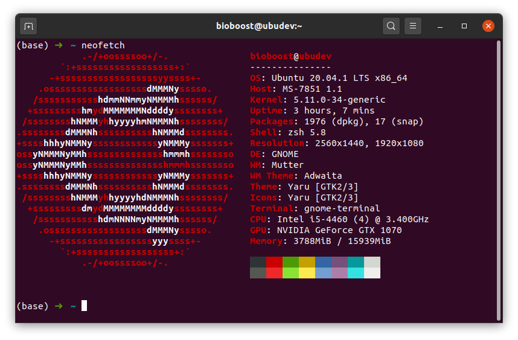

# Making Linux Your Own

<!-- Personal prompt ? http://bashrcgenerator.com/ -->

## Dotfiles

Dotfiles are used to customize your system. The *dotfiles* name is derived from the configuration files in Unix-like systems that start with a dot (e.g. `.bashrc` and `.gitconfig`). For normal users, this indicates these are not regular documents, and by default are hidden in directory listings. For power users, however, they are a core tool belt.

There is a large dotfiles community. And with it comes a large number of repositories and registries containing many organized dotfiles, advanced installation scripts, dotfile managers, and mashups of things people collect in their own repositories.

A good place to store your dotfiles is GitHub. It's allows you to easily backup, restore, and sync the preferences and settings for your toolbox. Your dotfiles might be the most important files on your machine. Learn from the community. Discover new tools for your toolbox and new tricks for the ones you already use.

### Bootstrap your Dotfiles with dotbot

A customized set of dotfiles can vastly increase your command-line productivity and happiness. Having your dotfiles in a git repository allows you to take your configuration anywhere.

While it can be tempting for some to script dotfiles configuration and installation yourself, it is a hard route take. You would constantly run into edge-cases leading to constant modification of the scripts. With a framework, most of the use-cases have been thought of, so it is very low friction in comparison.

Dotbot is a tool that bootstraps your dotfiles (it's a [Dot]files [bo]o[t]strapper, get it?). It does less than you think, because version control systems do more than you think.

Dotbot is designed to be lightweight and self-contained, with no external dependencies and no installation required. Dotbot can also be a drop-in replacement for any other tool you were using to manage your dotfiles, and Dotbot is VCS-agnostic -- it doesn't make any attempt to manage your dotfiles.

Some of the features that set dotbot apart from other tools out there are:

* Single configuration file
* Single command to install on a new machine via symbolic links
* Can be added as a git submodule
* Python is the only dependency (standard for almost all distros)

Find out more at [github.com/anishathalye/dotbot](https://github.com/anishathalye/dotbot).

::: error ssh-keys
Make sure to never add your private ssh key to your dotfiles. This seems tempting but should not be done !
:::

The next sections provide a step-by-step guide on how to setup a basic dotfiles repository with dotbot.

### Repository Setup

Start by setting up a new repository. Typically a directory called `dotfiles` is used. Create one in your home directory.

```bash
mkdir dotfiles
cd dotfiles
```

Now let us initialize it as a git repository and add `dot` as a git submodule.

```bash
git init
git submodule add https://github.com/anishathalye/dotbot
```

::: tip git submodule
Often a code repository will depend upon external code. This external code can be incorporated in a few different ways. One of these ways is by incorporating it as a git submodule. A git submodule is a record within a host git repository that points to a specific commit in another external repository. Submodules are very static and only track specific commits. Submodules do not track git refs or branches and are not automatically updated when the host repository is updated. When adding a submodule to a repository a new `.gitmodules` file will be created. The `.gitmodules` file contains meta data about the mapping between the submodule project's URL and local directory.
:::

Now we can copy the install script and setup a new configurations file:

```bash
cp dotbot/tools/git-submodule/install .
touch install.conf.yaml
```

### Configuring dotbot

Dotbot can be configured by modifying the `install.conf.yaml` file using nano:

```bash
nano install.conf.yaml
```

Start by adding the following content:

```yaml
- defaults:
    link:
      relink: true

- clean: ['~']

- link:
    ~/.gitconfig: configs/git/gitconfig
    ~/.bashrc: configs/bash/bashrc

- shell:
  - [git submodule update --init --recursive, Installing submodules]
```

Let's take a look at some of the configuration options:

* `defaults`: Controls what default action will be taken for everything in the link section.
  * `relink` removes the old target if it is a symlink.
* `clean`: defines what directory should be inspected for dead links which are then automatically removed.
* `link`: Here we define what symlinks are defined and what file they are targetting in our dotfiles.
  * The key is the place where the symlink should be created.
  * The value is the file the symlink targets, the actual config file in our dotfiles.
* `shell`: This section contains any raw shell commands that you’d like to run upon running your install script. In this case, it installs any submodules.

More information about these options and other options can be found at [github.com/anishathalye/dotbot#directives](https://github.com/anishathalye/dotbot#directives).

### Structuring Config Files

It's important to put some structure into your dotfiles. Placing all config files inside the root of your dotfiles is probable not a good approach.

A better approach is to create a `configs` dir with subdirectories for each tool you wish to a store a configuration of. Than add the actual config files of that tool inside that subdirectory.

```bash
mkdir -p configs/bash
mkdir -p configs/git
```

Now let's move the actual configuration files inside these directories. Once that is achieved, we can call the installation script of our dotfiles.

```bash
mv ~/.gitconfig configs/git/gitconfig
mv ~/.bashrc configs/bash/bashrc
```

Note that the config file is renamed to a filename without a dot `.` in front. This makes the file standard visible. While not strictly necessary it's just more convenient here.

### Installing the Dotfiles

We can test out if everything works properly by running `./install` within the root of the repository.

```bash
cd ~/dotfiles
./install
```

::: output
<pre>
Submodule 'lib/pyyaml' (https://github.com/yaml/pyyaml) registered for path 'dotbot/lib/pyyaml'
Cloning into '/home/bioboost/dotfiles/dotbot/lib/pyyaml'...
Submodule path 'dotbot/lib/pyyaml': checked out '2f463cf5b0e98a52bc20e348d1e69761bf263b86'

All targets have been cleaned
Creating link ~/.gitconfig -> /home/bioboost/dotfiles/configs/git/gitconfig
Creating link ~/.bashrc -> /home/bioboost/dotfiles/configs/bash/bashrc
All links have been set up
Installing submodules [git submodule update --init --recursive]
All commands have been executed

==> All tasks executed successfully
</pre>
:::

Once you are satisfied with how you dotfiles install, be sure to commit your changes and push to a remote repository. Typically a `dotfiles` repository is created.

### Installing Your Dotfiles on Another Machine

Once you you have a basic dotfiles repository set up, you can push this to a public repository in order to use on multiple machines. On any machine, you can now simply run the following commands to install your dotfiles:

```bash
git clone git@github.com:username/dotfiles.git --recursive
cd dotfiles && ./install
```

### Base for an Installation Script for WSL

If you wish to take this whole automation process a step further you can also add installation scripts to your dotfiles. You can tailor different scripts based on their targets. For example one for WSL, one for the Raspberry Pi, one for a server, ...

Start by creating a `scripts` directory and add for example a script called `wsl` which we can use to setup a development environment on Linux.

```bash
cd ~/dotfiles
mkdir scripts
touch scripts/wsl
chmod u+x scripts/wsl
```

Feel free to use the following script as a start for installing some tools, libraries, ...

```bash
#!/usr/bin/env bash

function pause() {
   read -p "$* [ENTER TO CONTINUE]"
}

pause "Ready to install some tools, libraries, ... for a development machine ?"

# Just add the commands below to start installing tools, dependencies, ...
sudo apt update
sudo apt install git -y
sudo apt install snapd -y
sudo apt install curl -y
sudo snap install node --classic --channel=16
sudo apt install build-essential -y

# The end
pause "All done - best to reboot after rest is done"
```

You can then run the script using the following commands:

```bash
cd ~/dotfiles
./scripts/wsl
```

You can also setup a base script that installs all common tools to your different environment. Doesn't mean cause we a re scripting, that we can't keep it all DRY.

Have fun dotting !

Want to get some inspiration or use another dotfiles manager than take a look at [dotfiles.github.io](https://dotfiles.github.io/).

## NeoFetch

<!-- Source: https://www.youtube.com/watch?v=QAaT6BTUnPg -->

Neofetch is a command-line system information tool written in bash 3.2+. Neofetch displays information about your operating system, software and hardware in an aesthetic and visually pleasing way.

Installing `neofetch` is a walk in the park:

```bash
sudo apt update
sudo apt install neofetch
```

You can try it out by executing the `neofetch` command.



Next edit `~/.bashrc` (or `~/.zshrc` if you have already installed zsh):

```bash
nano ~/.bashrc
```

::: tip .bashrc
`.bashrc` is a shell script that Bash runs whenever it is started interactively. It initializes an interactive shell session. You can put any command in that file that you could type at the command prompt. You put commands here to set up the shell for use in your particular environment, or to customize things to your preferences. A common thing to put in `.bashrc` are aliases that you want to always be available.
:::

And launch neofetch every time you open a terminal by adding this to the botton of the script:

```bash
# Run neofetch every time we launch a terminal
neofetch
```

You can find more information about how to customize neofetch at its wiki [github.com/dylanaraps/neofetch/wiki](https://github.com/dylanaraps/neofetch/wiki).

## Zsh and OhMyZsh

The Z shell (Zsh) is a Unix shell that can be used as an interactive login shell and as a command interpreter for shell scripting. Zsh is an extended Bourne shell with many improvements, including some features of Bash, ksh, and tcsh.

Features of zsh include:

* **Programmable command-line completion** that can help the user type both options and arguments for most used commands, with out-of-the-box support for several hundred commands
* **Sharing of command history** among all running shells
* **Spelling correction and autofill of command names** (and optionally arguments, assumed to be file names)
* **Various compatibility modes**, e.g. Zsh can pretend to be a Bourne shell when run as /bin/sh
* **Themeable prompts**, including the ability to put prompt information on the right side of the screen and have it auto-hide when typing a long command
* **Loadable modules**, providing among other things: full TCP and Unix domain socket controls, an FTP client, and extended math functions.
* and much much more ...

### Installing zsh

```bash
sudo apt update
sudo apt install zsh -y
```

You can now test the new shell by executing the `zsh` shell in the terminal (type exit to close the zsh shell). Once you are satisfied you can change your default shell to zsh using the `chsh` (change login shell) command line tool.

```bash
chsh -s /bin/zsh
```

You can find all the available shells on your system in the file `/etc/shells`.

::: tip Configuration
If you login to a new terminal now you will be presented with the new-user configuration setup of zsh. You can select the `q` option and ignore this. oh-my-zsh will come with a nice config to get you started.
:::

### Oh My Zsh

A user community website known as [ohmyz.sh](https://ohmyz.sh/) collects third-party plug-ins and themes for the Z shell. As of 2021, their GitHub repository has over 1900 contributors, over 300 plug-ins, and over 140 themes, of varying quality. It also comes with an auto-update tool that makes it easier to keep installed plug-ins and themes updated.

Oh-my-zsh can be easily installed using the following install script:

```bash
sh -c "$(curl -fsSL https://raw.github.com/ohmyzsh/ohmyzsh/master/tools/install.sh)"
```

This will install a load of plugins, themes, ... and also generate a nice default config which can be found as a dotfile at `~/.zshrc`.

All available themes can be found at [github.com/ohmyzsh/ohmyzsh/wiki/Themes](https://github.com/ohmyzsh/ohmyzsh/wiki/Themes).

Some of my favorites are:

* agnoster
* bira
* xiong-chiamiov-plus
* powerlevel10 (needs to be installed separately - see [github.com/romkatv/powerlevel10k](https://github.com/romkatv/powerlevel10k))

If you really want to go crazy you can select `random` as a theme and create a list of random themes to choose from:

```bash
# Set name of the theme to load --- if set to "random", it will
# load a random theme each time oh-my-zsh is loaded, in which case,
# to know which specific one was loaded, run: echo $RANDOM_THEME
# See https://github.com/ohmyzsh/ohmyzsh/wiki/Themes
ZSH_THEME="random"

# Set list of themes to pick from when loading at random
# Setting this variable when ZSH_THEME=random will cause zsh to load
# a theme from this variable instead of looking in ~/.oh-my-zsh/themes/
# If set to an empty array, this variable will have no effect.
ZSH_THEME_RANDOM_CANDIDATES=( "robbyrussell" "agnoster" "bira" "xiong-chiamiov-plus")
```

## Aliasses

An alias can be used to map longer commands to shorter key sequences. When the shell sees an alias being executed, it substitutes the longer sequence before proceeding to interpret commands.

### Existing Aliases

You can determine what aliases are set on your shell with the alias command.

```bash
alias
```

::: output
<pre>
...
alias ls='ls --color=auto'
alias ll='ls -lh'
...
</pre>
:::

### Creating an Alias

New aliases can be created by typing `alias name=command` where `name` is the name you want to give the alias and `command` is the command you want to have executed when you run the alias.

<!-- TODO - Maybe good idea to check if you are not overriding existing command/alias. -->

### Alias Example

```bash
alias shell='echo "You are using the $0 shell"'
```

Now you can use the alias `shell` to check which shell you are running.

```bash
shell
```

::: output
<pre>
You are using the zsh shell
</pre>
:::

The cool thing about aliasses is, is that they can also take arguments and options (depending on the commands used in the alias). For example the alias `ll='ls -lh' will list files and directories in long format and human readable sizes. When using this alias, we can actually still pass arguments and options, for example:

```bash
ll -aS /
```

Where `-a` requests to show all files and directories and `-S` request them be ordered by size.

::: output
<pre>
total 92K
drwx------   2 root root  16K Jan 26 23:09 lost+found
drwxr-xr-x 138 root root  12K Feb  7 10:24 etc
drwxrwxrwt  23 root root  12K Feb  9 12:59 tmp
drwxr-xr-x  19 root root 4.8K Feb  9 10:35 dev
drwxr-xr-x  20 root root 4.0K Jan 27 13:52 .
drwxr-xr-x  20 root root 4.0K Jan 27 13:52 ..
drwxr-xr-x   3 root root 4.0K Jan 26 23:22 boot
drwxrwxrwx   1 root root 4.0K Feb  3 12:03 data
drwxr-xr-x   3 root root 4.0K Jan 26 23:17 home
drwxr-xr-x   2 root root 4.0K Dec 20 17:09 media
drwxr-xr-x   2 root root 4.0K Dec 20 17:09 mnt
drwxr-xr-x   3 root root 4.0K Jan 28 08:39 opt
drwx------   3 root root 4.0K Dec 20 17:27 root
drwxr-xr-x  14 root root 4.0K Jan 31 09:10 snap
...
</pre>
:::

### Making Aliasses Permanent

If you use the `alias` command at the shell, your alias will not be permanent. Once the terminal is closed, the alias is "forgotten".

To make it stick, we need to place it inside one of the startup scripts such as `.bashrc` or `.zshrc`, depending on the shell you are using.

To add your alias permanently, use nano to edit your `.bashrc` file and place the alias as you typed in the shell at the bottom of the script. You can also add a comment to the alias as shown in the next example.

```bash
nano ~/.bashrc
```

Place this at the bottom of the script to make the `shell` alias available when opening a shell:

```bash
# Add alias to show me current shell
alias shell='echo "You are using the $0 shell"'
```

Save the file using `CTRL-o` and exit using `CTRL-x`.

Launch a new terminal and check if the alias is available.

## Challenges

Try to solve the challenges without using google. Better to use the man-pages to find the information you need.

Mark challenges using a ✅ once they are finished.

### ❌ Dotfiles

*Setup your own dotfiles. Make the repo public.*

### ❌ Installation Script

*Create an installation script for the tools and libraries you use most. Add the script to your dotfiles.*

### ❌ neofetch

*Add neofetch to your install script.*

### ❌ @vue/cli

*Add @vue/cli as a global install to your script.*

### ❌ Conda

*Add conda and mbed to your installation script. Setup an mbed environment from the installation script.*

You can download and extract the GNU Arm Embedded Toolchain using the following commands:

```bash
cd ~
wget https://developer.arm.com/-/media/Files/downloads/gnu-rm/10-2020q4/gcc-arm-none-eabi-10-2020-q4-major-x86_64-linux.tar.bz2
tar -xf gcc-arm-none-eabi-10-2020-q4-major-x86_64-linux.tar.bz2
mv gcc-arm-none-eabi-10-2020-q4-major gnu-arm-embedded
rm gcc-arm-none-eabi-10-2020-q4-major-x86_64-linux.tar.bz2
sudo mv gcc-arm-embedded /opt
```

*You can set the path of the compiler using the command `mbed config -G GCC_ARM_PATH /opt/gnu-arm-embedded/bin`*

*Make sure to add the `~/.mbed/.mbed` config file to your dotfiles.*

### ❌ Alias for mbed
 
*Create an alias `mbedc` that compiles an mbed project, flashes the target and starts up the serial terminal at a baudrate of 115200.*
