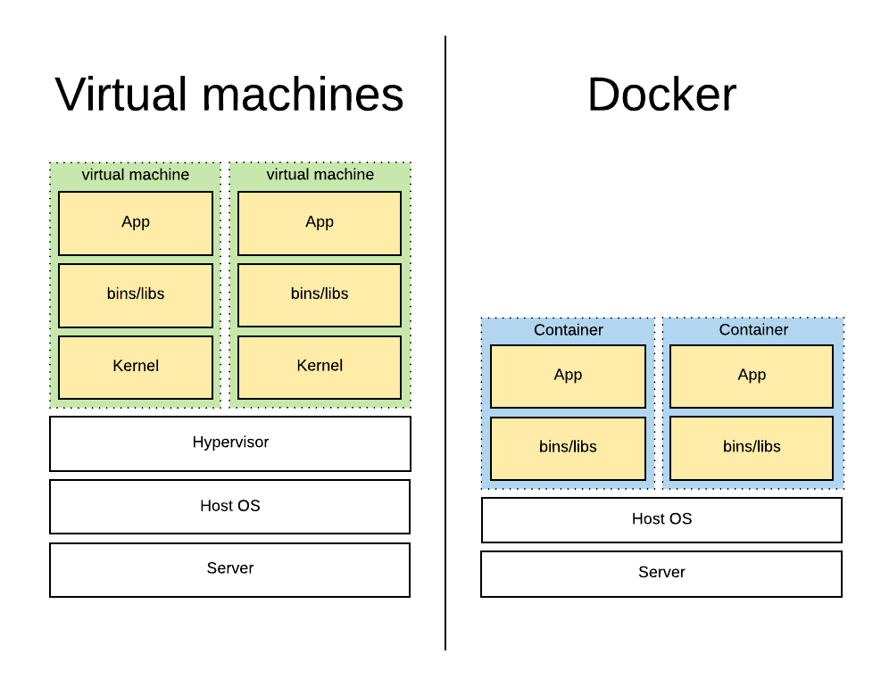
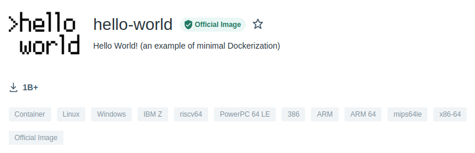

# Docker for Linux


Docker is a tool for running software in an isolated environment. Docker uses a technique called containerization to create separate environments. Docker in its self is nothing new. Docker is just a collection of readily available features that are present in Linux.

## Containers are not virtualization

Containers provide similar features as virtualization, but with less overhead. Containers share the same Linux kernel, removing the need to provide an OS for every instance. Containers don't add an extra layer. The applications run directly on the hosts system.



The reduced overhead, and the fact that containers run directly on the host system, result in the fact that containers start up in seconds. Use less resources, and less memory. They are very light weight.

## Containers

A container is **a running instance of an image**. How an image is built, is described using a `Dockerfile`. These files contain the steps needed to create the image. The images mainly contain the files that are needed to run the container. Additional information is provided such as what command to execute when the container is started.

An image is a template of a system you want to run. It isolates only the minimal and necessary applications and dependencies to run a particular application. The kernel is provided by the host system, and isolation is done using existing kernel features.

### Installing Docker on a Raspberry Pi

Start by updating the apt repository and installing the latest packages:

```bash
sudo apt update
sudo apt upgrade
```

Fetch a nice docker installation script and execute it

```bash
curl -sSL https://get.docker.com | sh
```

The script will run with root privileges and will therefore request your password.

To allow the `pi` user (or your own user) to run docker commands, you will need to add the user to the `docker` group:

```bash
sudo adduser pi docker
```

After making this change, log out and login to a new session.

Next we need to auto-start docker so the daemon starts when the system is booted.

```bash
sudo systemctl enable docker
```

You can now reboot your Raspberry Pi or you can start the Docker daemon with:

```bash
sudo systemctl start docker
```

### Verifying the Installation

The docker installation can be easily verified by requesting the current installed version:

```bash
docker --version
```

### Running Hello World

[hub.docker.com](https://hub.docker.com/) hosts a `hello-world` docker image that just outputs a hello world message. This image is intended to test your setup.

Docker images can support multiple architectures, which means that a single image may contain variants for different architectures, and sometimes for different operating systems, such as Windows.

When running an image with multi-architecture support, docker automatically selects the image variant that matches your OS and architecture.

Most of the Docker Official Images on Docker Hub provide a variety of architectures. For example, the `busybox` image supports `amd64`, `arm32v5`, `arm32v6`, `arm32v7`, `arm64v8`, `i386`, `ppc64le`, and `s390x`. When running this image on an *x86_64 / amd64 machine*, the `x86_64` variant is pulled and run.

The architecture of the Raspberry is ARM. Some years ago many images were primarily build for x86 and could therefore not be run on a Raspberry Pi. However, as of 2016 Docker officially started to support Raspberry Pi. This resulted in many images starting to support the ARM architecture.

Just make sure the image has an `ARM` / `ARM64` tag.



Let's run a container based on this image.

```bash
docker run hello-world
```

On successful execution, you should see a similar output:

::: output
<pre>
Unable to find image 'hello-world:latest' locally
latest: Pulling from library/hello-world
9b157615502d: Pull complete 
Digest: sha256:cc15c5b292d8525effc0f89cb299f1804f3a725c8d05e158653a563f15e4f685
Status: Downloaded newer image for hello-world:latest

Hello from Docker!
This message shows that your installation appears to be working correctly.

To generate this message, Docker took the following steps:
 1. The Docker client contacted the Docker daemon.
 2. The Docker daemon pulled the "hello-world" image from the Docker Hub.
    (arm32v7)
 3. The Docker daemon created a new container from that image which runs the
    executable that produces the output you are currently reading.
 4. The Docker daemon streamed that output to the Docker client, which sent it
    to your terminal.

To try something more ambitious, you can run an Ubuntu container with:
 $ docker run -it ubuntu bash

Share images, automate workflows, and more with a free Docker ID:
 https://hub.docker.com/

For more examples and ideas, visit:
 https://docs.docker.com/get-started/
</pre>
:::

## Running Containers

Running a container from an image with Docker can be done using the `docker run` command. The command can take many attributes that supply information on how to run the container. It also allows you to override all defaults set by the image developer, as well as those set by the docker runtime.

To run the well-known `hello-world` image, we can use the following command.

```bash
docker run hello-world:latest
```

Here `hello-world` is the name of the image and `latest` is the version tag, which allows you to pick a specific version to run a container from.

This will pull the latest image from Docker Hub and spawn a container from it. The container will execute the binary which generates the output. This output is then redirected via the Docker client to your current terminal.

If you wish to know what docker containers are running or have run on your system, you can accomplish this using the `docker ps -a` command. The `-a` flag instructs to show all containers, even those that are not running.

## Stopping Containers

Stopping containers can be done with the following command:

```bash
docker stop <container_id_or_name>
```

## Removing Containers

Containers can be removed by issuing the command

```bash
docker rm <container_name_or_id>
```

## Building Images Locally

Not all docker images can be found ready-to-use on DockerHub. You will often come across a git repository of a project that contains the instructions on how to build the image so you can do that locally.

When building such images to create containers from, one could start from scratch; compiling, building, configuring and installing all the dependencies by our self. This would be feasible but tedious task. A better idea is to start *from* an already existing image that provides the basis and build on top of that.

All this is specified inside a special file called a `Dockerfile`.

Let's use a demonstrational repository that contains a basic Node.js Express API: [https://github.com/BioBoost/linux-essentials-docker-hello-node-api](https://github.com/BioBoost/linux-essentials-docker-hello-node-api).

Clone this project in your home directory:

```bash
git clone https://github.com/BioBoost/linux-essentials-docker-hello-node-api.git
cd linux-essentials-docker-hello-node-api
```

### Building the image

The `Dockerfile` only describes how an image is created. The next step is to build the image. Building the image will execute the commands in the `Dockerfile`. Building the image needs to be done with the `docker build` command in the terminal.

The docker build command needs some extra information to be able to build the image correctly.

The first argument is a tag (basically a name for our image). This can be provided with the `-t` or `--tag` argument followed by the name of the tag. Lets tag our image with the name `hello-api`. The last argument should be the directory where the `Dockerfile` is located. In our case this is the current directory and can be notated with a dot `.`.

```bash
docker build --tag hello-api .
```

If all goes well, the output should be similar to:

::: output
<pre>
Sending build context to Docker daemon    130kB
Step 1/6 : FROM node:16.13.0-alpine3.14
 ---> 44e24535dfbf
Step 2/6 : WORKDIR /app
 ---> Using cache
 ---> a8ad4516a56d
Step 3/6 : COPY package*.json ./
 ---> Using cache
 ---> 4b902cfa88aa
Step 4/6 : RUN npm install --production
 ---> Using cache
 ---> 2d886f673983
Step 5/6 : COPY . .
 ---> Using cache
 ---> a72e0fc600a6
Step 6/6 : CMD npm start
 ---> Using cache
 ---> 25caaa0cd526
Successfully built 25caaa0cd526
Successfully tagged hello-api:latest
</pre>
:::

### The hello-api image

You can list the installed images using the following command:

```bash
docker images
```

This command will list all installed images on the computer. The `hello-api` image should be visible in that list.

```bash
REPOSITORY       TAG         IMAGE ID       CREATED         SIZE
hello-api        latest      6ff2fd8544e9   9 seconds ago   104MB
```

You have now build a Docker image.

### Running the Container

Running a container from this image is pretty straightforward now.

To run a detached container:

```bash
docker run -d --name hello-from-node -p 3000:3000 hello-api
```

Note that the port needs to be mapped to a port on the host machine, so it can be accessed from outside of the docker environment.

You can check the running containers using:

```bash
docker ps
```

And you can check the container logs using:

```bash
docker logs hello-from-node
```

## Challenges

Try to solve the challenges without using google. Better to use the man-pages to find the information you need.

Mark challenges using a ✅ once they are finished.

### ❌ Docker on the Pi

*Install docker and your raspberry pi and make sure the hello-world runs*.

### ❌ Hello API from RPi
 
*Setup the hello-node-api on the Raspberry Pi as a docker container. Make sure it runs on port 8000.*

*You can find the repository at [https://github.com/BioBoost/linux-essentials-docker-hello-node-api](https://github.com/BioBoost/linux-essentials-docker-hello-node-api)*.

### ❌ Node-RED on RPi

*Setup a node-red service on your Raspberry Pi using docker. At what port is it available?*

*Use the image [https://hub.docker.com/r/nodered/node-red](https://hub.docker.com/r/nodered/node-red)*.
