# Linux as a Virtual Machine

A virtual machine (VM) is an emulation of a particular computer system. This system can be based on an existing or hypothetical machine. As a user we can create such virtual machines and install an operating system of choice on them. This allows us to run a Linux distribution while working on a Windows machine and vice versa.

Several software packages are available to create and run virtual machines. Examples are VMware, Hyper-V which comes with Windows 8, Oracle VirtualBox, ... For our labs we will be using VirtualBox as this is free, lightweight, easy to use and available for Windows, Linux, Mac and Solaris.

::: tip Hyper-V
Hyper-V, codenamed Viridian and formerly known as Windows Server Virtualization, is a native hypervisor; it can create virtual machines on x86-64 systems. Starting with Windows 8, Hyper-V supersedes Windows Virtual PC as the hardware virtualization component of the client editions of Windows NT.
:::

<!-- Some more info: https://www.serial-server.net/virtual-machine/ -->

## Installing Virtual Box

Start by surfing to the download section of the website of VirtualBox ([https://www.virtualbox.org](https://www.virtualbox.org)). Download the VirtualBox platform package for your system. At the moment of this writing the current version of VirtualBox is 6.1.2. When running the installer package make sure to install VirtualBox with all features enabled as shown in the next figure.

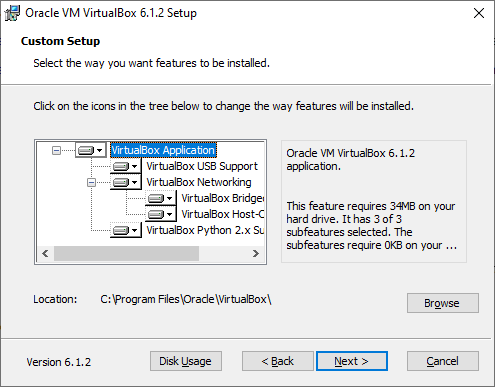

The installer of VirtualBox should also have created virtual network adapters (such as can be seen in the figure below) which are used for private networking between the host machine and the virtual machine.

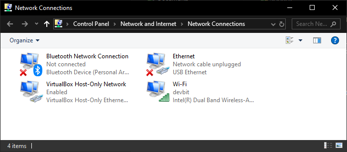

::: warning Virtual Box Network Adapters
In some cases these network adapters may interfere with the correct working of your physical network. For example for LAN-games that use UDP broadcasting to discover each other. In this case you can just disable the adapters. Make sure to re-enable them before using VirtualBox.
:::

Once finished you can start the VirtualBox client and you should get the interface shown next.

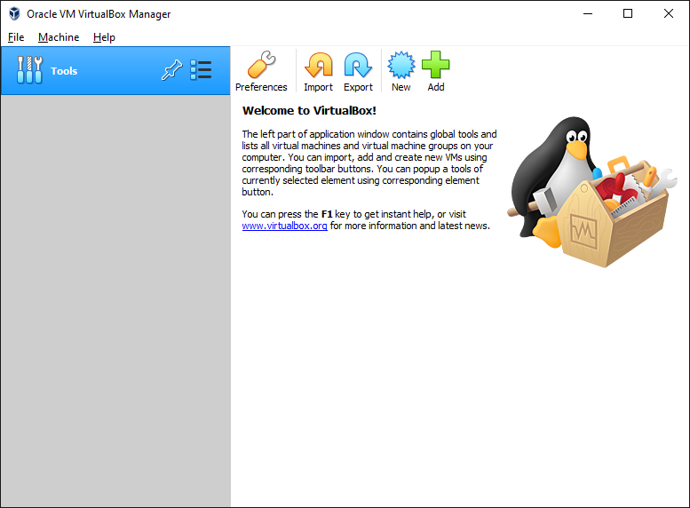

Under `Files => Preferences => General` you can change the default path for your virtual machines. Do take note that **you will need about 25GB of free space for each VM**. For these labs you will most likely only need 1 VM.

Under `Files => Preferences => Language` you can also change the default interface language if you wish.

## Creating a Virtual Machine

Creating a virtual machine is very simple as it is just following the steps presented to you by the wizard. To start the process of creating a VM hit the `New` button on the main interface of VirtualBox.

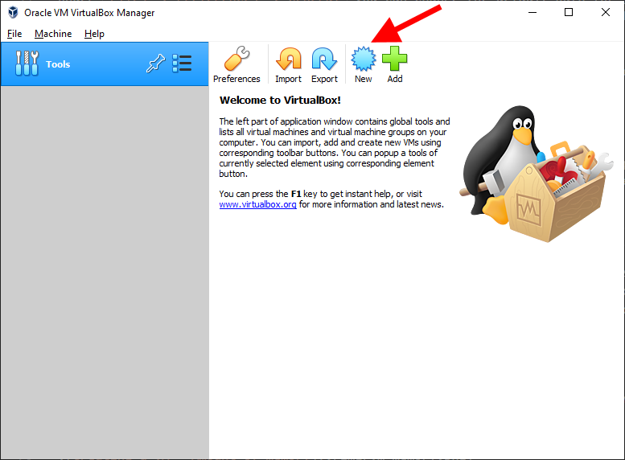

The first step consist of giving your VM a name and selecting the operating system you will be running on the VM as shown in the next figure. Since Linux Mint is a good beginners distribution, it the perfect starting point for this course. In our case we will use **Linux Mint 19.3 Tricia - Cinnamon (64-bit)**. Select **Linux** as type and **Ubuntu (64-bit)** as version.

Next one needs to select the **amount of memory** can be assigned to the virtual machine. The **recommended amount is 1024MB**. However if you have more than 4GB, select 2048MB, which will improve the responsiveness and performance of the VM.

Next we need to choose if we want to **create a new** or use an existing **virtual hard drive**. Pick the option to create one now as depicted in the following screenshot.

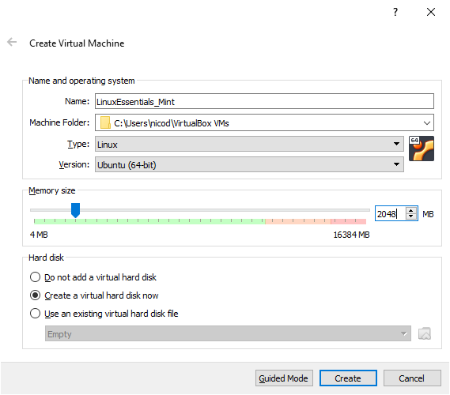

Clicking `Create` will launch another wizard which will lead us through the creation process of a virtual drive.

First one can select the location of the virtual hard drive file. However in this case leave it as-is.

Next the size of the drive needs to be determined. Make sure to select **at least 20GB for the size** as shown in the next figure. Hitting create will finish the process of creating a VM.

One also has to choose between a **dynamically allocated image** or a fixed size image. A fixed size image is faster but will take up the full space we select for the size of the virtual drive. A dynamically allocated image is "slower" but will only grow in size when needed. You will need to decide this for yourself based on the free space available on your host system. However the default option is probable the best as these days most laptops are equipped with SSD's.

::: warning Image resize
If you chose to create a dynamically allocated image you can make it even bigger as it will only use as much space as needed. Resizing an existing image can be a real pain and can also corrupt your image so make sure you don't have to do this.
:::

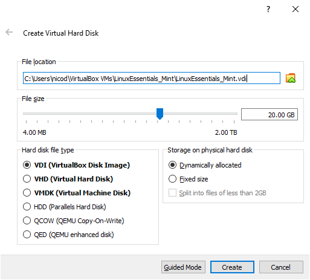

Now hit the `Create` button to create your virtual machine.

Your **new VM should now appear in the list** of VM's on the left side of the VirtualBox main interface. Selecting a VM in the list also displays some basic information about the VM.

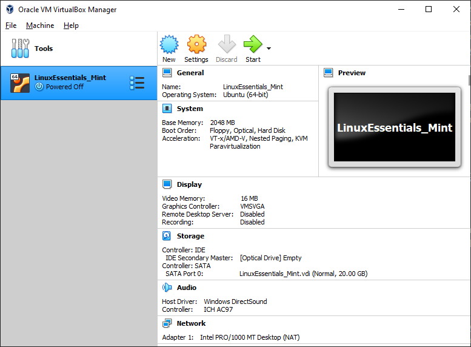

## Configuring the Virtual Machine

Before installing an operating system on the newly created VM, it is necessary to make a few configuration changes. Select the new VM and hit the `Settings` button on the main interface. You will be presented with the configuration settings of your VM.

### ClipBoard

Start by traversing to `General => Advanced` and enabling the *bidirectional shared clipboard*. This allows text to be copied to the clipboard in the VM and pasted in your host OS and vice versa. Also enable *bidirectional Drag'n Drop*. The resulting configuration is shown in the next figure.

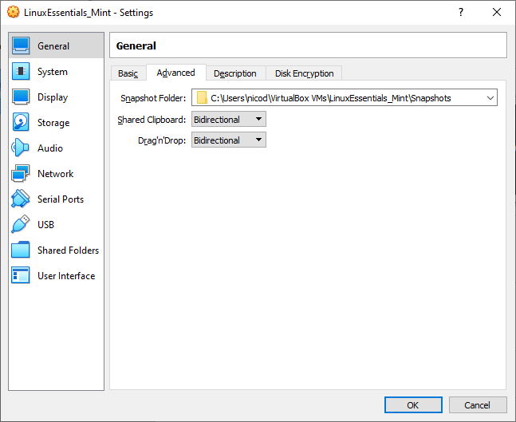

### Description

If you have multiple virtual machines it is also a **good idea to add a description the VM**. This may come in handy later when you do a cleanup of virtual machines. This can be done via `General => Description`

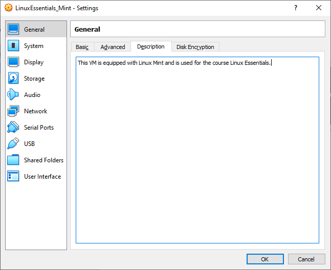

### Display

Standard Virtual Box will assign 16MB of Video Memory to the VM. If your system has some extra to spare, it is a good idea to provide some more (32MB or 64MB). This will make the desktop environment run a little smoother. This setting can be changed in `Display => Screen`.

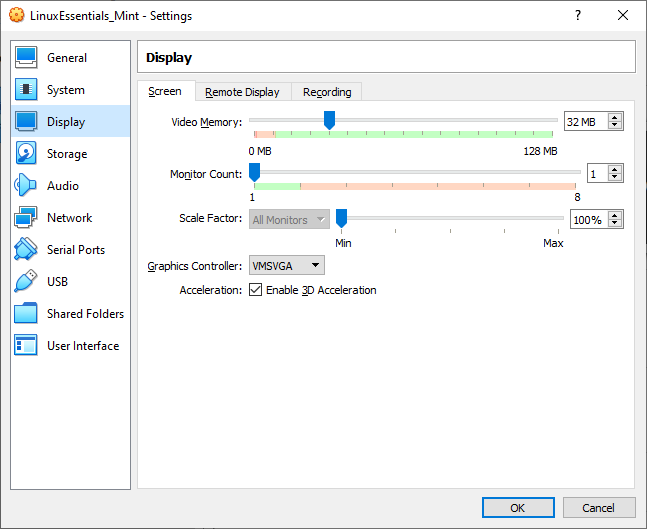

Make sure to check the box to `Enable 3D Acceleration`. This is required for the graphical desktop environment of Mint if you wish to have a more smooth experience.

#### What about the Graphics Controller

So shine some light on the configuration options of the graphics controller, these are the characteristics of the different modes.

* **VBoxVGA** This emulates a graphics adapter specific to VirtualBox, the same as in previous versions (<6.0.0).
  * Default for images created for previous versions of VirtualBox (<6.0.0).
  * Has some form of 3D passthrough (insecure approach that just lets the guest dump any and all commands to the host GPU).
  * Require guest additions to be installed.
  * Only supports OpenGL 1.1 on 64bit Windows 10 and all Linux guests.
  * This option likely exists just to provide continuity – after upgrading to 6.0, all old VMs have this mode selected automatically so there's no unexpected change in behavior; you don't lose whatever acceleration you previously had.

* **VMSVGA** This emulates the VMware Workstation graphics adapter with the "VMware SVGA 3D" acceleration method.
  * Currently the default for Linux guests.
  * Supposed to provide better performance and security than the old method.
  * Supported by the mainline Linux kernel using the SVGA driver (so no guest additions required).
  * Supports OpenGL 2.1 on all Windows and Linux guests.
  * It might also have the advantage of supporting old operating systems which had VMware guest additions available but not VirtualBox guest additions. (I plan to test this with Windows 9x, which is otherwise a massive pain to get even VESA graphics working with VirtualBox)

* **VBoxSVGA**
  * This provides a hybrid device that works like VMSVGA (including its new 3D acceleration capabilities), but reports the same old PCI VID:PID as VBoxVGA.
  * This is the default for Windows guests.
  * The advantage of this mode is that you can upgrade existing VMs (which previously used VBoxVGA and had the VirtualBox Video driver installed) and they don't lose their graphics in the process – they still see the same device, until you upgrade the "guest additions" at any later time to enable 3D acceleration.
  * Also, because it's still VMware SVGA emulated by VirtualBox, choosing this option and using the VirtualBox driver may still have advantages over the VMware one, e.g. allow to make use of VirtualBox-specific additional features.

* **None**
  * This is, obviously, no emulated graphics at all. Only use it if you provide a real GPU via PCI passthrough, or if your system absolutely doesn't need a GPU.

Source: [superuser - What are differences between VBoxVGA, VMSVGA and VBoxSVGA in VirtualBox?](https://superuser.com/questions/1403123/what-are-differences-between-vboxvga-vmsvga-and-vboxsvga-in-virtualbox)

In other words for our case this can be left to its default option, namely **VMSVGA**.

### Shared Folder

Some files can be dragged and dropped between your host machine and the VM. However this does not seem to be possible for all file types. For these instances it is more convenient to create a shared directory which can be accessed from your host and the VM.

Navigate to `Settings => Shared Folders` of your virtual machine and select the little blue map with the plus-symbol to add a new shared folder.

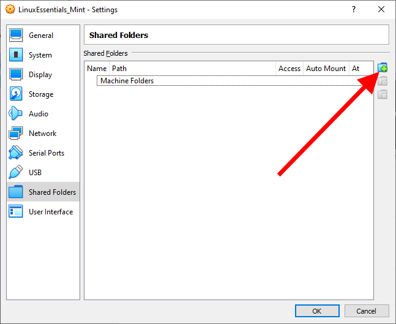

First specify a folder on your Windows system to share (best to create a new one somewhere).

Next make sure to select the **Auto-mount** option and **not Read-only**.

Last, you also need to specify where the folder should be mounted (made available) on your Linux system. In this case use the mount point `/data_share`. Do not deviate from this unless you know what you are doing.

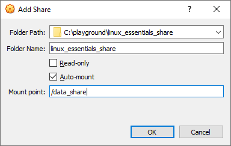

The folder should now be automatically mounted under `/data_share` in your VM on your next reboot and should also be available on the Desktop of Linux Mint.

## Mounting an Installation Image

<!-- TODO - Fix missing images -->

Before we can install an operating system on our virtual machine, it is necessary to download an installation image for the Linux distribution we will be using. This image can then be mounted on our VM allowing us to boot from it. In our case we will use **Linux Mint 19.3 Tricia - Cinnamon (64-bit)**, which can be downloaded from [https://www.linuxmint.com/download.php](https://www.linuxmint.com/download.php). Make sure to select the 64-bit Desktop edition. Linux Mint is derivative of Ubuntu, but with a less intrusive graphical desktop environment and is a very newbie friendly Linux distro.

<!--  -->

One downloaded, the image will need to be made available to the VM so the operating system can be installed. This can be achieved by selecting `Storage => Optical Drive => Choose a disk file ...`

<!--  -->

A browse window will open; select the image file you downloaded from the Linux Mint website and hit `OK`.

<!--  -->

Ready? Then hit the start button of the VM and follow the steps for installing the Linux Mint operating system.

If you click inside the VM window your mouse cursor will automatically be captured. Releasing your cursor can be achieved using the `R-CTRL` key (this is called the host key).

::: tip Host Key
You can change the host key if needed inside virtual box by navigating to `File => Preferences => Input => Virtual Machine` and changing the `Host Key Combination` shortcut.
:::

## Installing Linux Mint

If you see the automatic boot screen shown in the next screenshot do nothing and let it pass.

<!--  -->

Linux Mint will automatically boot in Live mode and allow you to start the install process from that point on.

<!--  -->

To start the installation process just double click the 'Install Linux Mint' icon on the desktop.

### Installation Steps

Select `English` as the language for your system and installation procedure. Click `Continue`.

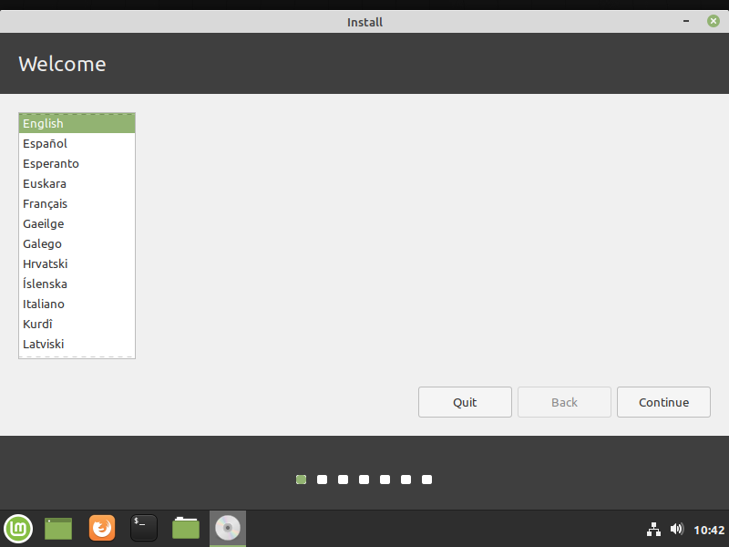

Next pick the correct keyboard layout. Select `Belgian` for azerty or `English (US)` for qwerty.

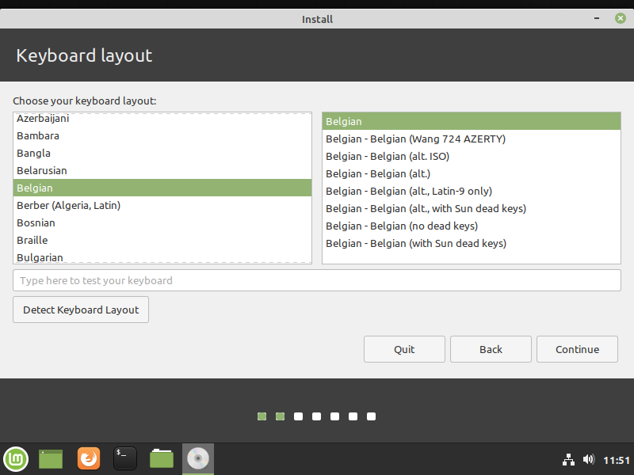

Next select the box to `Install third-party software for graphics and Wi-Fi hardware, Flash, MP3 and other media`.

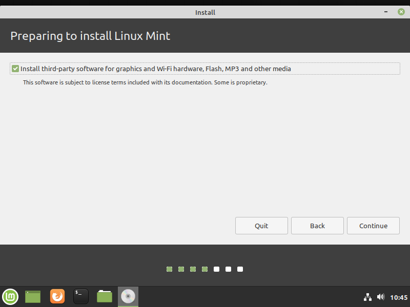

The next screen allows you to modify the installation (create partitions and such). However since this is a virtual machine, we can just let the installer create the required partitions. So leave the default selection `Erase Disk and Install Linux Mint` be.

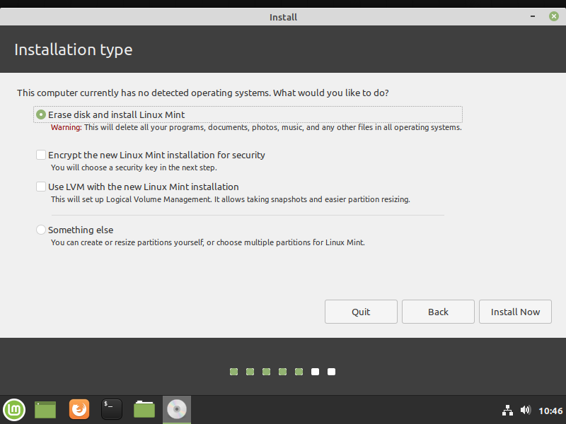

For the confirmation dialogue you can select `Continue`.

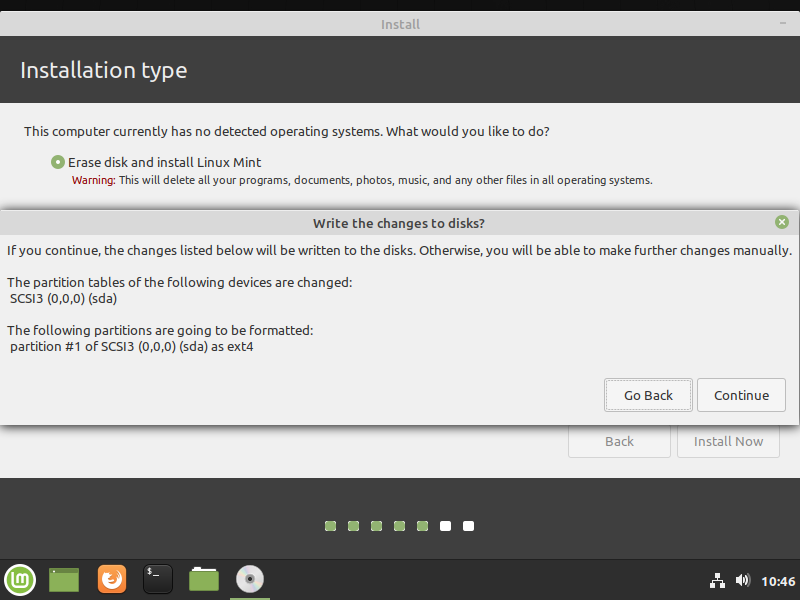

Up next is the configuration of your timezone. Normally this should be automatically set to `Brussels`.

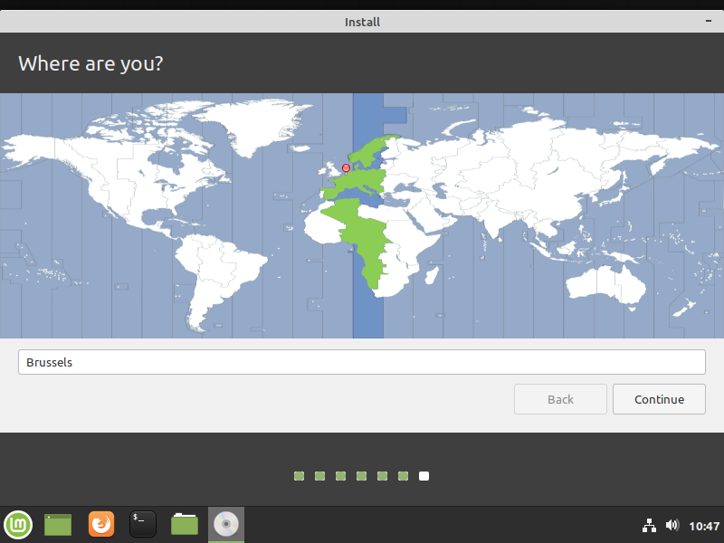

As a last step you will need to create a user account. Make sure to enter a **decent password** (no spaces or blanks and such crap).

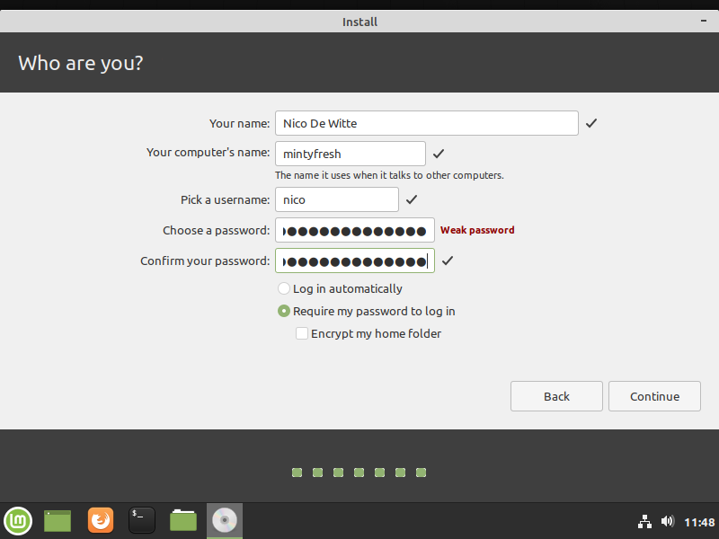

Once the installation is completed, its time to restart the system.

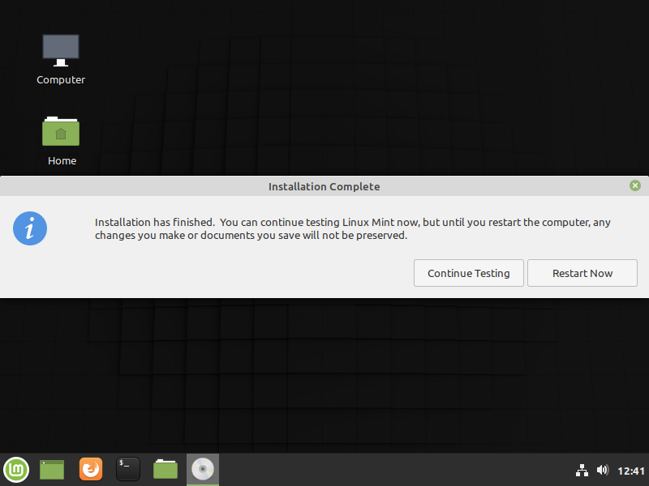

Mint will display the message `Please remove the installation media, then press ENTER`. Just press `ENTER`. Virtual Box has already done this for you.

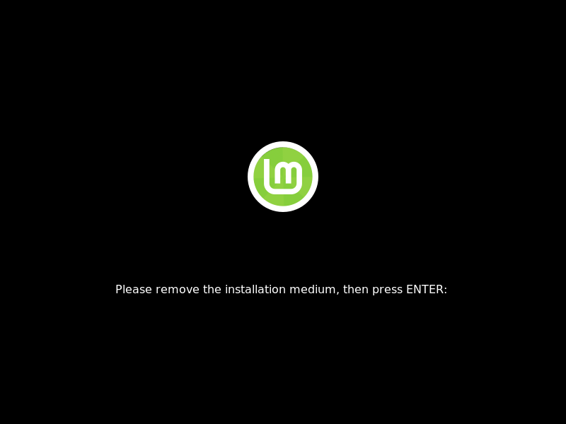

Once the system is rebooted, you should have an operational Mint installation. The first thing you will see will be the login screen.

<!--  -->

Login using your username and password. This will bring you to the desktop environment of Mint.

<!--  -->

::: warning Check your video drivers
If you get the message `Check you video drivers`, you most likely forgot to enable 3D hardware acceleration.
:::

## Updating the System

Before we change anything to the system it's best to upgrade the OS and install the latest updates.

Open a terminal window by hitting the key combination `CTRL-ALT-t` or by selecting the black terminal icon on the bottom taskbar. A terminal window as shown in the next screenshot should open. Here you can type commands.

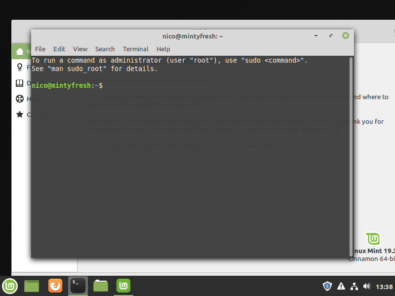

To update the system use the following command (each line is terminated by pressing ENTER). You will be asked for the `[sudo] password for ...:`. Enter your account password to continue.

```bash
sudo apt update
sudo apt upgrade -y
```

This will take a while. Time for a break? Once finished it's probable best to reboot the virtual machine.

## Installing Guest Additions

Some functionality of Virtual Box will not work until we have installed the guest additions of Virtual Box.

Open the **Devices** menu which can be found at the top of the VM window. Next select `Insert Guest Additions CD image ...` as shown in the next screenshot.

<!--  -->

A window in Linux will open asking if you'd wish to run the package. Hit run and enter your user password.

<!--  -->

Once finished, remove the image from the virtual drive (by right clicking the icon on the Desktop of Linux Mint and choosing `Eject`). Restart the virtual machine.

You should now be able to resize the guest window. Or you can switch to full screen by hitting `RCTRL-F`. Same key-combination to switch back to windowed mode.

## Creating a shared folder

While we did instruct VirtualBox to mount a shared folder from Windows to Linux, it is not yet accessible. If you try to open the folder you will get a permission error. To fix this it is necessary to add your current user to the group `vboxsf`. You can achieve this by opening up a terminal (`CTRL-ALT-T`) and entering the command below.

```bash
sudo adduser $(id -un) vboxsf
```

Next logout from the current session and log back in. Open up a new terminal and enter the `id` command to get a list of all the groups your user belongs to. `129(vboxsf)` should be one of them.

```bash
id
```

::: codeoutput
<pre>
uid=1000(nico) gid=1000(nico) groups=1000(nico),4(adm),24(cdrom),27(sudo),30(dip),46(plugdev),112(lpadmin),128(sambashare)
</pre>
:::

## Backups and snapshots

It is always a good idea to backup your project files. You can now easily copy them to the shared folder and put them on OneDrive, DropBox or a USB stick.

Another good idea is to create periodical snapshots of your virtual machine. This snapshot will contain all the delta's compared to the previous state of the VM. Just select the VM, in Virtual Box, and click the options icon to get a menu. Choose `Snapshots` to open the snapshot tool.

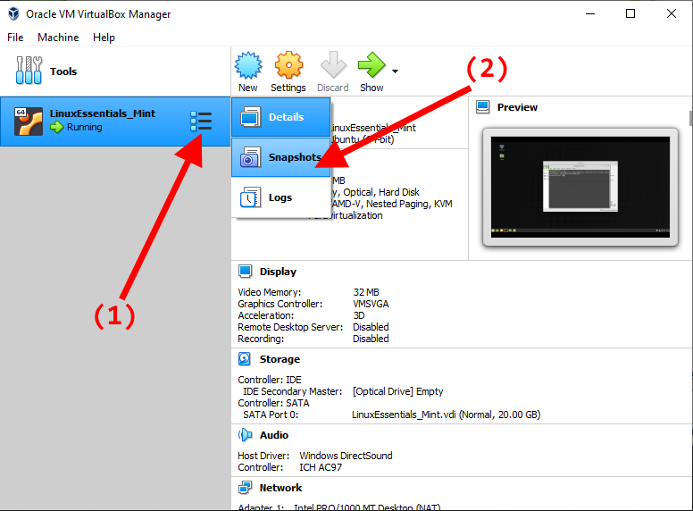

Next click the left icon with the label `Take`to create a snapshot. Fill in the name and description as shown in the next figure.

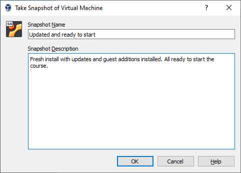

Adding a decent description will save you the misery of having to search through the snapshots for the correct state if your VM should fail.

You could even do this after every LAB session.

<!-- ## Networking -->

<!-- Default the VM is configured with a single network adapter with NAT (Network Address Translation) enabled (Network tab). This means that the VM has access to the network and also has access to the Internet. However because of NAT we will not be able to connect to the VM from another machine without configuring port forwarding. -->

<!-- This will basically create a network bridge between the VM's network adapter and your physical host adapter making your VM's directly available on your network. This may be a security issue but can also simplify working with your VM. This option also implies that your VM will get its IP address from the same DHCP (Dynamic Host Configuration Protocol) server as your host machine if you have a DHCP enabled network. -->
