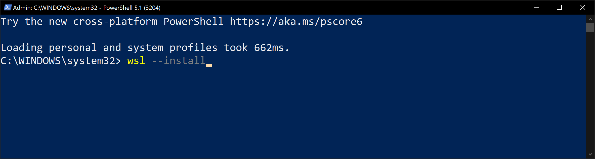
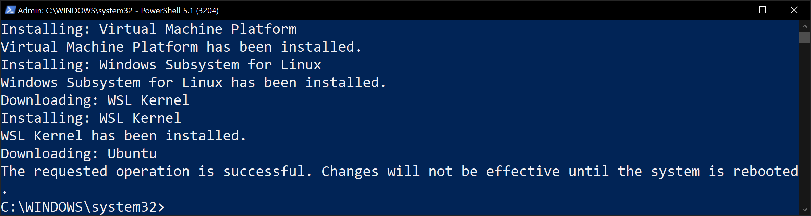
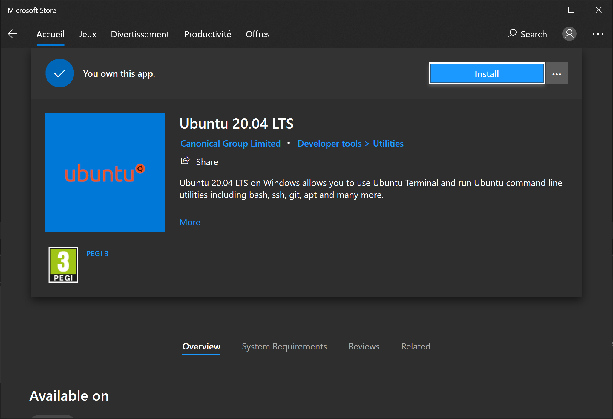
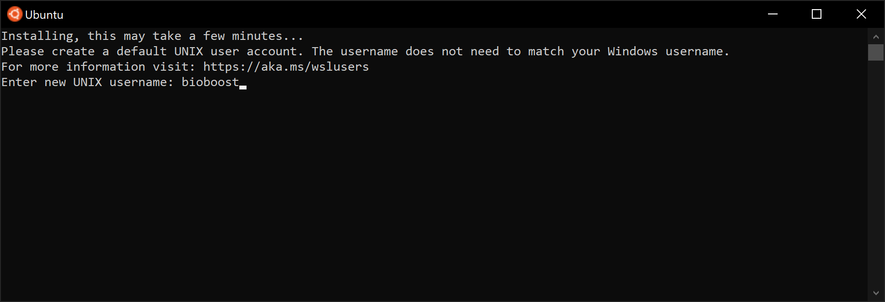
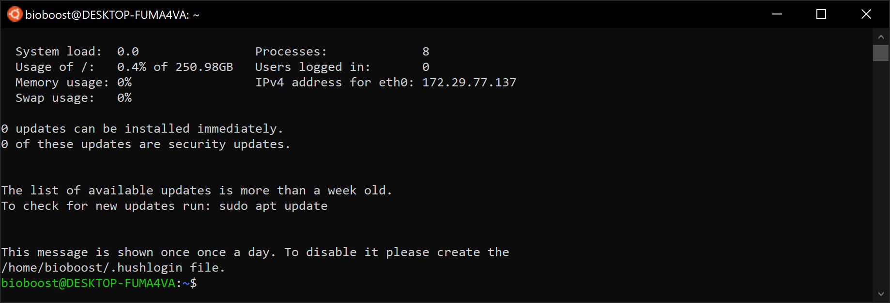

# Windows Subsystem for Linux

Windows Subsystem for Linux (WSL) is a compatibility layer for running Linux binary executables (in ELF format) natively on Windows 10, Windows 11, and Windows Server 2019.

In May 2019, WSL 2 was announced, introducing important changes such as a real Linux kernel, through a subset of Hyper-V features. Since June 2019, WSL 2 is available to Windows 10 customers through the Windows Insider program, including the Home edition. WSL is not available to all Windows 10 users by default. It can be installed either by joining the Windows Insider program or manual install.

You can:

* Choose your favorite GNU/Linux distributions from the Microsoft Store.
* Run common command-line free software such as grep, sed, awk, or other ELF-64 binaries.
* Run Bash shell scripts and GNU/Linux command-line applications including:
  * Tools: vim, emacs, tmux
  * Languages: Javascript/node.js, Ruby, Python, C/C++, C# & F#, Rust, Go, etc.
  * Services: sshd, MySQL, Apache, lighttpd
* Install additional software using own GNU/Linux distribution package manager.
* Invoke Windows applications using a Unix-like command-line shell.
* Invoke GNU/Linux applications on Windows.

More info about this can be found at [Windows Subsystem for Linux Installation Guide for Windows 10](https://docs.microsoft.com/en-us/windows/wsl/install-win10).

## Installing WSL

Start by opening an elevated Powershell window. To install WSL just enter the following command:

```bash
wsl --install
```



Once finished you will need to restart your computer.



## Install Ubuntu

To install an Ubuntu machine, just open the Microsoft Store and search for `Ubuntu`. Now you can choose between `18.04 LTS` or `20.04 LTS`.



Once installed you will be requested to enter a username and password.



You are now running Linux on Windows.


